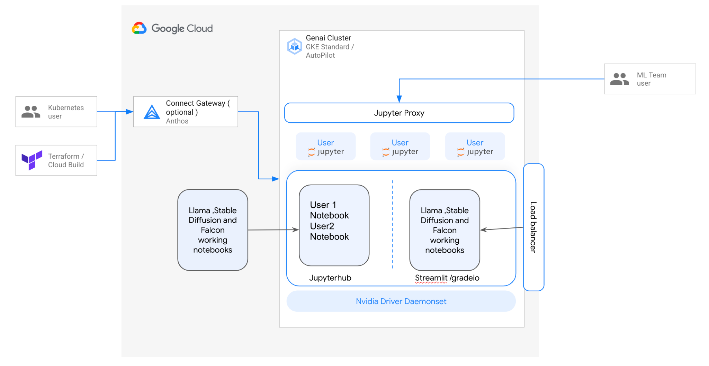
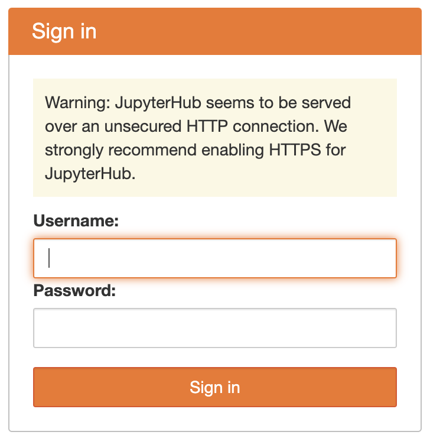
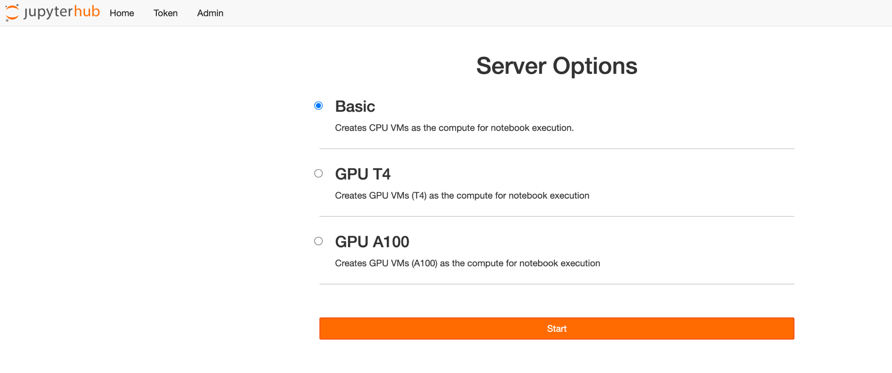
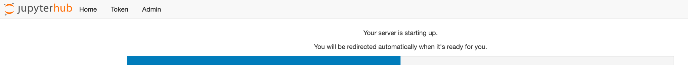

---
# [Falcon](https://falconllm.tii.ae/) on [GKE](https://cloud.google.com/kubernetes-engine?hl=en)

---


# Objectives

Tooling, automation and documentation to quick provisioning and
deployment of AI infrastructure and applications. The solution is
designed to help AI customers discover reference architecture, guidance,
and best practices for building or migrating workloads to GKE. Allowing
customers to quickly serve, experiment and benchmark AI training and
inferencing on GKE.

# Architecture



## Products used

The solution uses the following Google Cloud products:

-   [GKE](https://cloud.google.com/kubernetes-engine/docs/concepts/kubernetes-engine-overview):
    > A managed environment for deploying, managing, and scaling
    > containerized applications using Google infrastructure.

-   [Cloud LoadBalancing](https://cloud.google.com/load-balancing):
    > A service that provides high performance, scalable load balancing
    > on Google Cloud.

-   [Cloud Storage](https://cloud.google.com/storage):
    > A service that provides low-cost, no-limit object storage for
    > diverse data types. Data is accessible from within and outside of
    > Google Cloud and is replicated geo-redundantly.

-   [Cloud Build](https://cloud.google.com/build?hl=en):
    > A fully managed continuous integration, delivery & deployment
    > platform that lets you run fast, consistent, reliable automated
    > builds.

Since the solution is to demonstrate open source LLM deployment on GKE,
the solution uses the following falcon model from Hugging
Face marketplace

-   [falcon-7b-instruct](https://huggingface.co/tiiuae/falcon-7b-instruct):
    > Falcon-7B-Instruct is a 7B parameters causal decoder-only model built by TII based on Falcon-7B and finetuned on a mixture of chat/instruct datasets. It is made available under the Apache 2.0 license.

# Cost

For an estimate of the cost of the Google Cloud, see [GKE Pricing](https://cloud.google.com/kubernetes-engine/pricing#google-kubernetes-engine-pricing).

Please use [Cost calculator](https://cloud.google.com/products/calculator/?utm_source=google&utm_medium=cpc&utm_campaign=japac-IN-all-en-dr-BKWS-all-cloud-trial-PHR-dr-1605216&utm_content=text-ad-none-none-DEV_c-CRE_634266788848-ADGP_Hybrid+%7C+BKWS+-+PHR+%7C+Txt+~+GCP_General_google+cloud_price-KWID_43700074200842427-aud-970366092687:kwd-333429931385&userloc_1007788-network_g&utm_term=KW_google+cloud+price&gad_source=1&gclid=CjwKCAiA8sauBhB3EiwAruTRJvNfYHmhx5bKdyYdrRNIJu0kJq3YTd_muXyS5XLP1M8qE2Mj6OoHcBoCp10QAvD_BwE&gclsrc=aw.ds&hl=en) to get the estimated cost

# Deploy the solution

The following sections guide you through the process of deploying the
solution.

## Create or choose a Google Cloud project

When you deploy the solution, you choose the [Google Cloud project](https://cloud.google.com/resource-manager/docs/creating-managing-projects) where the resources are deployed. When you\'re deciding whether to use
an existing project or to create a new project, consider the following
factors:

-   If you create a project for the solution, then when you no longer need the deployment, you can delete the project and avoid
continued billing. If you use an existing project, you must delete
the deployment when you no longer need it.

-   Using a new project can help avoid conflicts with previously provisioned resources, such as resources that are used for production workloads.

If you want to deploy the solution in a new project, create the project
*before* you begin the deployment.

To create a project, complete the following steps:

1.  In the Google Cloud console, go to the project selector page.\
    > [Go to project
    > selector](https://console.cloud.google.com/projectselector2/home/dashboard)

2.  To begin creating a Google Cloud project, click **Create project**.

3.  Name your project. Note the generated project ID.

4.  Edit the other fields as needed.

5.  To create the project, click **Create**.

## Get the required IAM permissions

To start the deployment process, you need the Identity and Access
Management (IAM) permissions that are listed in the following table. If
you have the roles/owner [basic role](https://cloud.google.com/iam/docs/understanding-roles#basic) for the project in which you plan to deploy the solution, then you
already have all the necessary permissions. If you don\'t have the
roles/owner role, then ask your administrator to grant these permissions
(or the roles that include these permissions) to you.

- [Service Usage Admin](https://cloud.google.com/iam/docs/understanding-roles#serviceusage.serviceUsageAdmin)
- [Service Account Admin](https://cloud.google.com/iam/docs/understanding-roles#iam.serviceAccountAdmin)
- [Project IAM Admin](https://cloud.google.com/iam/docs/understanding-roles#resourcemanager.projectIamAdmin)
- [Cloud infrastructure Manager Admin](https://cloud.google.com/iam/docs/understanding-roles#config.admin)
- [Kubernetes Engine Cluster Admin](https://cloud.google.com/iam/docs/understanding-roles#container.clusterAdmin)
- [Kubernetes Engine Admin](https://cloud.google.com/iam/docs/understanding-roles#container.admin)

###

### Service account created for the solution

When you initiate the deployment process, a [service
account](https://cloud.google.com/iam/docs/service-accounts)
is created to deploy the solution on your behalf (and to delete the
deployment later if you choose). This service account is assigned
certain IAM permissions *temporarily*; that is, the permissions are
revoked automatically after the solution deployment and deletion
operations are completed. Google recommends that after you delete the
deployment, you delete the service account, as described later in this
guide.

These roles are listed here in case an administrator of your Google
Cloud project or organization needs this information.

-   roles/storage.objectAdmin

-   roles/serviceusage.serviceUsageAdmin

-   roles/compute.networkUser

-   roles/iam.serviceAccountAdmin

-   roles/iam.workloadIdentityUser

-   roles/container.admin

-   roles/container.clusterAdmin

## Choose a deployment method

The following architecture steps will be followed as part of this setup

-   Defaults:

    -   Creates a new VPC & subnet (can be disabled)

    -   Creates Private Clusters with external endpoints disabled

    -   Registers the cluster with fleet in current project

    -   Solution uses Anthos Connect Gateway to connect to private clusters

-   You\'ll be performing the following activities:

    -   Set project-id for gcloud CLI

    -   Update terraform variable values to create infrastructure

    -   Update terraform variable values to provide workload configuration

    -   Create a GCS bucket to store terraform state

    -   Create GKE Cluster with Fleet Membership Enabled

    -   Created Jupyternotebook K8s Object to spin Notebooks

    -   Deploy Demo falcon workload

There are two ways to deploy the falcon workloads on GCP

-   Using shell editor tutorial

-   Using manual approach

## Deploy using shell editor tutorial

Click button below to get started
#
[](https://ssh.cloud.google.com/cloudshell/editor?cloudshell_git_repo=https://github.com/GoogleCloudPlatform/ai-on-gke.git&git_branch=genai-on-gke&cloudshell_tutorial=falcon/tutorial.md&cloudshell_workspace=applications/genai-on-gke)

## Deploy using the Terraform CLI

To help you deploy this solution with minimal effort, a Terraform
configuration is provided in GitHub. The Terraform configuration defines
all the Google Cloud resources that are required for the solution.

This section describes how you can customize the solution or automate
the provisioning and management of the solution by using the Terraform
CLI. Solutions that you deploy by using the Terraform CLI are not
displayed in the **Solution deployments** page in the Google Cloud
console.

## Set up the Terraform client

You can run Terraform in Cloud Shell or your localhost. This guide
describes how to run Terraform in Cloud Shell, which has Terraform
preinstalled and configured to authenticate with Google Cloud.

The Terraform code for this solution is available in a GitHub
repository.

1.  Clone the GitHub repository to Cloud Shell.

> [https://github.com/GoogleCloudPlatform/ai-on-gke.git](https://github.com/GoogleCloudPlatform/ai-on-gke)
>
> A prompt is displayed to confirm downloading the GitHub repository to
> Cloud Shell.

2.  Click **Confirm**.\
    > Cloud Shell is launched in a separate browser tab. The Terraform
    > code is downloaded to the \$HOME/ai-on-gke directory of your Cloud
    > Shell environment.

3.  In Cloud Shell, check whether the current working directory is
    > \$HOME/ai-on-gke/applications/genai-on-gke/platform. This is the directory
    > containing Terraform config files for the solution. If you need to
    > change to that directory, run the following command:
```bash

cd \$HOME/ai-on-gke/applications/genai-on-gke/platform

```
4.  initialize Terraform by running the following command:
```bash
terraform init
```

5.  Wait until you see the following message:

Terraform has been successfully initialized!


## Configure the Terraform variables

The Terraform code that you downloaded includes variables that you can
use to customize the deployment based on your requirements. For example,
you can specify the Google Cloud project and the region where you want
the solution to be deployed.

Update the terraform tfvars file (located in .platform/terraform.tfvars) to provide the input parameters to allow terraform code execution to provision GKE resources. This will include input parameters as key value pairs. Update the values as per your requirements.
Open terraform.tfvars (located in .platform/terraform.tfvars)
Update all values where required.

## Configure Terraform GCS backend

You can also configure the GCS bucket to persist the terraform state file for further use. To configure the terraform backend you need to have a GCS bucket already created.

### Create GCS Bucket

In case you don\'t have a GCS bucket already, you can create using
terraform or gcloud command as well. Refer below for the gcloud command
line to create a new GCS bucket.
```bash
gcloud storage buckets create gs://BUCKET_NAME
```
### Modify Platform Terraform State Backend

Modify the ./platform/backend.tf and uncomment the code and update the
backend bucket name. Open ./platform/backend.tf

After changes file will look like below:

terraform {
backend \"gcs\" {
bucket = \"BUCKET_NAME\"
prefix = \"terraform/state\"}}

Refer
[here](https://cloud.google.com/docs/terraform/resource-management/store-state)
for more details.

## Validate and review the Terraform configuration

1.  Ensure the current working directory is, If it isn\'t, go to that directory
    > \$HOME/ai-on-gke/applications/genai-on-gke/platform.

2.  Verify that the Terraform configuration has no errors:
```bash
terraform validate
```
3.  If the command returns any errors, make the required corrections in the configuration and then run the terraform validate command again. Repeat this step until the command returns the following
    > message:
      Success! The configuration is valid.

4.  Review the resources that are defined in the configuration:
```bash
terraform plan
```
If you didn\'t create the terraform.tfvars file correctly, Terraform
prompts you to enter values for the variables that don\'t have default
values. Enter the required values.\
The output of the terraform plan command is a list of the resources that
Terraform provisions when you apply the configuration. If you want to
make any changes, edit the configuration and then run the terraform
validate and terraform plan commands again.

## Provision the resources

When no further changes are necessary in the Terraform configuration,
deploy the resources.

1.  Ensure the current working directory is,If it isn\'t, go to that directory
    > \$HOME/ai-on-gke/applications/genai-on-gke/platform

2.  Apply the Terraform configuration:
```bash
terraform apply
```
3.  If you didn\'t create the terraform.tfvars file as described earlier, Terraform prompts you to enter values for the variables that don\'t have default values. Enter the required values.Terraform displays a list of the resources that will be created.

4.  When you\'re prompted to perform the actions, enter `yes`.\
    > Terraform displays messages showing deployment progress.\
    > If the deployment can\'t be completed, Terraform displays the
    > errors that caused the failure. Review the error messages and
    > update the configuration to fix the errors. Then run the terraform
    > apply command again. For help with troubleshooting Terraform
    > errors, see [Errors when deploying the solution using the Terraform CLI](https://cloud.google.com/architecture/application-development/stateful-app-zero-downtime-deploy-gke#tf-deploy-errors).\
    > After all the resources are created, Terraform displays the
    > following message:
    Apply complete!

## Install NVIDIA Drivers

Run the following command to install the nvidia drivers
```bash
kubectl apply -f https://raw.githubusercontent.com/GoogleCloudPlatform/container-engine-accelerators/master/nvidia-driver-installer/cos/daemonset-preloaded.yaml
```


This might few minutes to complete the driver installation

## Get GKE Cluster Credentials

List the container list to list down the cluster that you just created.
```bash
gcloud container fleet memberships list
```


Copy the name and acquire the credentials using the following
```bash
gcloud container fleet memberships get-credentials
\[container-fleet-membership-name\]
```
## Provision Jupyter Notebook Workloads

Let\'s setup the Jupyter Notebook cluster on the GKE

Navigate to \~/ai-on-gke/applications/genai-on-gke/jupyternotebook

cd \~/ai-on-gke/applications/genai-on-gke/jupyternotebook


-   **Update Terraform Variables for Jupyter**: Update the terraform variable file (located in ./jupyternotebook/variables.tf) to provide the input parameters (project_id, location and cluster name) to allow terraform code execution to provision Jupyternotebook.

-   **Update Jupyter Config**: Review and update (if required) the helm values for changing the resource allocation or the image used in the file (located in ./jupyternotebook/jupyter_config/config.yaml)

-   **Update the bucket name in the Terraform Backend for Jupyter**: Update the bucket name in the file ./jupyternotebook/backend.tf


Run Terraform Plan and Apply

Run Terraform init & plan and check the resources to be created , please
make changes if any required to terraform files as required and then run
terraform apply

```bash
cd \~/ai-on-gke/applications/genai-on-gke/jupyternotebook

terraform init

terraform plan

terraform apply
```
## Running Jupyter Notebook

1.  To view your clusters, go to the **Google Kubernetes Engine** page in the Google Cloud console.

> [Go to Google Kubernetes
> Engine](https://console.cloud.google.com/kubernetes/list)

2.  Select **Gateways, Services & Ingress** under the **Networking Section**

3.  Click on the **External load balancer** type **proxy-public** **ip address** listed under the endpoint to launch the Jupyter Notebook

4.  Type in the user credentials as defined in the Jupyter Config yaml

> 

5.  Once you login, you will be prompted to select appropriate compute instance for the Jupyter Notebook. It is recommended to select GPU T4 for this solution, as GPU A100 availability is limited.



> This would take a few minutes to provision the resources for the
> notebook. (Note: This also depends on the region and availability of
> GPU clusters in the region )
>
> 

## Executing the model

6. Execute the **falcon.ipynb** notebooks cell by cell to see the model executing on the cluster deployed on GKE.

Also there is a Dockerfile alng with code [`dockerfile`](./docker_image/Dockerfile) which can be built and deployed on GKE clusters

pre-requisite for building image would be to have hugging face api token created with necessary permissions

Image can be built by running below command  

```bash
docker build -t falconimage .
```

here the name 'falconimage' can be replaced by the artifact repository name and the image name you want to provide and then can be deployed onto the GKE cluster which is already running with gpu nodes enabled or can be deployed on new GKE clusters.


## Delete the deployment

**Note** : Avoid deleting through console if created using terraform

### Delete using the Terraform CLI

You can now delete the resources by running below command in the
\~/ai-on-gke/applications/genai-on-gke/jupyternotebook and then in \~/ai-on-gke/applications/genai-on-gke/platform/
folders

```bash
terraform destroy
```


## Optional: Delete the project

If you deployed the solution in a new Google Cloud project, and if you
no longer need the project, then delete it by completing the following
steps:

**Caution:** If you delete a project, all the resources in the project
are permanently deleted.

1.  In the Google Cloud console, go to the **Manage resources** page.\
    > [Go to Manage
    > resources](https://console.cloud.google.com/iam-admin/projects)

2.  In the project list, select the project you want to remove, then
    > click **Delete**.

3.  At the prompt, type the project ID, and click **Shut down**.

If you decide to retain the project, then delete the service account
that was created for this solution, as described in the next section.

## Optional: Delete the service account

If you deleted the project you used to solve, skip this section.

As mentioned earlier in this guide, when you deployed the solution, a
service account was created on your behalf. The service account was
assigned certain IAM permissions *temporarily*; that is, the permissions
were revoked automatically after the solution deployment and deletion
operations were completed, but the service account isn\'t deleted.
Google recommends deleting this service account.

-   If you deployed the solution through the Google Cloud console, go to the [Solution deployments](https://console.cloud.google.com/products/solutions/deployments) page. (If you\'re already on that page, refresh the browser.) A process is triggered in the background to delete the service account. No further action is necessary.

-   If you deployed the solution by using the Terraform CLI, complete the following steps:

    1.  In the Google Cloud console, go to the **Service accounts**
        [Go to Service accounts](https://console.cloud.google.com/iam-admin/serviceaccounts)

    2.  Select the project that you used for the solution.

    3.  Select the service account that you want to delete. The email ID of the service account that was created for the solution is in the following format:
    >    goog-sc-*DEPLOYMENT_NAME*-*NNN*@*PROJECT_ID*.iam.gserviceaccount.com

4.  The email ID contains the following values:

    -   DEPLOYMENT_NAME: the name of the deployment.

    -   NNN: a random 3-digit number.

    -   PROJECT_ID: the ID of the project where you deployed the solution.

5.  Click **Delete**.

# Troubleshoot errors

## Errors when deploying using the Terraform CLI

If the deployment fails when you use Terraform, the output of the
terraform apply command includes error messages that you can review to
diagnose the problem.

The examples in the following sections show deployment errors that you
might encounter when using Terraform.

##API not enabled error

If you create a project and then immediately attempt to deploy the
solution in the new project, the deployment might fail with an error
like the following:

Error: Error creating Network: googleapi: Error 403: Compute Engine API
has not been used in project *PROJECT_ID* before or it is disabled.
Enable it by visiting

https://console.developers.google.com/apis/api/compute.googleapis.com/overview?project=*PROJECT_ID*

then retry. If you enabled this API recently, wait a few minutes for the
action to propagate to our systems and retry.

If this error occurs, wait a few minutes and then run the terraform
apply command again.
