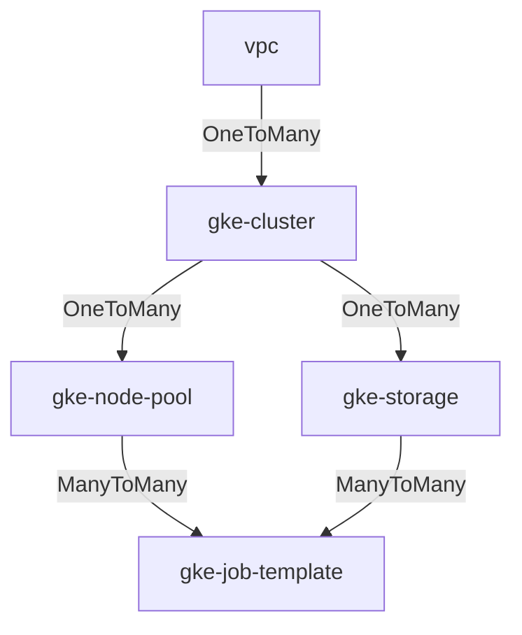

## Description

This module creates Kubernetes Storage Class (SC) that can be used by a Persistent Volume Claim (PVC)
to dynamically provision GCP storage resources like Parallelstore.

### Example

The following example uses the `gke-storage` module to creates a Parallelstore Storage Class and Persistent Volume Claim,
then use them in a `gke-job-template` to dynamically provision the resource.

```yaml
  - id: gke_cluster
    source: modules/scheduler/gke-cluster
    use: [network]
    settings:
      enable_parallelstore_csi: true

  - id: private_service_access
    source: community/modules/network/private-service-access
    use: [network]
    settings:
      prefix_length: 24

  - id: gke_storage
    source: modules/file-system/gke-storage
    use: [ gke_cluster, private_service_access ]
    settings:
      storage_type: Parallelstore
      access_mode: ReadWriteMany
      sc_volume_binding_mode: Immediate
      sc_reclaim_policy: Delete
      sc_topology_zones: [$(vars.zone)]
      pvc_count: 2
      capacity_gb: 12000

  - id: job_template
    source: modules/compute/gke-job-template
    use: [gke_storage, compute_pool]
```

See example
[gke-managed-parallelstore.yaml](../../../examples/README.md#gke-managed-parallelstoreyaml--) blueprint
for a complete example.

### Authorized Network

Since the `gke-storage` module is making calls to the Kubernetes API
to create Kubernetes entities, the machine performing the deployment must be
authorized to connect to the Kubernetes API. You can add the
`master_authorized_networks` settings block, as shown in the example above, with
the IP address of the machine performing the deployment. This will ensure that
the deploying machine can connect to the cluster.

### Connecting Via Use

The diagram below shows the valid `use` relationships for the GKE Cluster Toolkit
modules. For example the `gke-storage` module can `use` a
`gke-cluster` module and a `private_service_access` module, as shown in the example above.



## License

<!-- BEGINNING OF PRE-COMMIT-TERRAFORM DOCS HOOK -->
Copyright 2024 Google LLC

Licensed under the Apache License, Version 2.0 (the "License");
you may not use this file except in compliance with the License.
You may obtain a copy of the License at

     http://www.apache.org/licenses/LICENSE-2.0

Unless required by applicable law or agreed to in writing, software
distributed under the License is distributed on an "AS IS" BASIS,
WITHOUT WARRANTIES OR CONDITIONS OF ANY KIND, either express or implied.
See the License for the specific language governing permissions and
limitations under the License.

## Requirements

| Name | Version |
|------|---------|
| <a name="requirement_terraform"></a> [terraform](#requirement\_terraform) | >= 1.0 |

## Providers

No providers.

## Modules

| Name | Source | Version |
|------|--------|---------|
| <a name="module_kubectl_apply"></a> [kubectl\_apply](#module\_kubectl\_apply) | ../../management/kubectl-apply | n/a |

## Resources

No resources.

## Inputs

| Name | Description | Type | Default | Required |
|------|-------------|------|---------|:--------:|
| <a name="input_access_mode"></a> [access\_mode](#input\_access\_mode) | The access mode that the volume can be mounted to the host/pod. More details in [Access Modes](https://kubernetes.io/docs/concepts/storage/persistent-volumes/#access-modes)<br/>Valid access modes:<br/>- ReadWriteOnce<br/>- ReadOnlyMany<br/>- ReadWriteMany<br/>- ReadWriteOncePod | `string` | n/a | yes |
| <a name="input_capacity_gb"></a> [capacity\_gb](#input\_capacity\_gb) | The storage capacity with which to create the persistent volume. | `number` | n/a | yes |
| <a name="input_cluster_id"></a> [cluster\_id](#input\_cluster\_id) | An identifier for the GKE cluster in the format `projects/{{project}}/locations/{{location}}/clusters/{{cluster}}` | `string` | n/a | yes |
| <a name="input_labels"></a> [labels](#input\_labels) | GCE resource labels to be applied to resources. Key-value pairs. | `map(string)` | n/a | yes |
| <a name="input_mount_options"></a> [mount\_options](#input\_mount\_options) | Controls the mountOptions for dynamically provisioned PersistentVolumes of this storage class. | `string` | `null` | no |
| <a name="input_private_vpc_connection_peering"></a> [private\_vpc\_connection\_peering](#input\_private\_vpc\_connection\_peering) | The name of the VPC Network peering connection.<br/>If using new VPC, please use community/modules/network/private-service-access to create private-service-access and<br/>If using existing VPC with private-service-access enabled, set this manually follow [user guide](https://cloud.google.com/parallelstore/docs/vpc). | `string` | `null` | no |
| <a name="input_project_id"></a> [project\_id](#input\_project\_id) | The project ID to host the cluster in. | `string` | n/a | yes |
| <a name="input_pv_mount_path"></a> [pv\_mount\_path](#input\_pv\_mount\_path) | Path within the container at which the volume should be mounted. Must not contain ':'. | `string` | `"/data"` | no |
| <a name="input_pvc_count"></a> [pvc\_count](#input\_pvc\_count) | How many PersistentVolumeClaims that will be created | `number` | `1` | no |
| <a name="input_sc_reclaim_policy"></a> [sc\_reclaim\_policy](#input\_sc\_reclaim\_policy) | Indicate whether to keep the dynamically provisioned PersistentVolumes of this storage class after the bound PersistentVolumeClaim is deleted.<br/>[More details about reclaiming](https://kubernetes.io/docs/concepts/storage/persistent-volumes/#reclaiming)<br/>Supported value:<br/>- Retain<br/>- Delete | `string` | n/a | yes |
| <a name="input_sc_topology_zones"></a> [sc\_topology\_zones](#input\_sc\_topology\_zones) | Zone location that allow the volumes to be dynamically provisioned. | `list(string)` | `null` | no |
| <a name="input_sc_volume_binding_mode"></a> [sc\_volume\_binding\_mode](#input\_sc\_volume\_binding\_mode) | Indicates when volume binding and dynamic provisioning should occur and how PersistentVolumeClaims should be provisioned and bound.<br/>Supported value:<br/>- Immediate<br/>- WaitForFirstConsumer | `string` | `"WaitForFirstConsumer"` | no |
| <a name="input_storage_type"></a> [storage\_type](#input\_storage\_type) | The type of [GKE supported storage options](https://cloud.google.com/kubernetes-engine/docs/concepts/storage-overview)<br/>to used. This module currently support dynamic provisioning for the below storage options<br/>- Parallelstore<br/>- Hyperdisk-balanced<br/>- Hyperdisk-throughput<br/>- Hyperdisk-extreme | `string` | n/a | yes |

## Outputs

| Name | Description |
|------|-------------|
| <a name="output_persistent_volume_claims"></a> [persistent\_volume\_claims](#output\_persistent\_volume\_claims) | An object that describes a k8s PVC created by this module. |
<!-- END OF PRE-COMMIT-TERRAFORM DOCS HOOK -->
