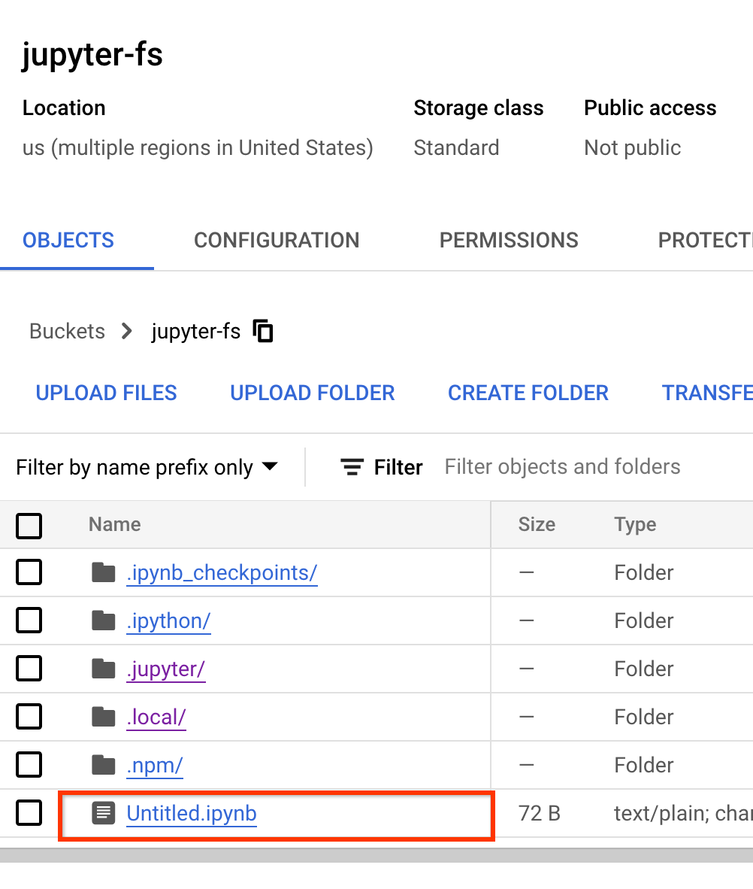

# Persistent Storage

## GCSFuse

**Important Note:** To use option, a GCS bucket must already be created within the project with the name in the format of `gcsfuse-{username}`

GCSFuse allow users to mount GCS Buckets as their local filesystem. This option allows ease of access on Cloud UI:

Since this bucket in GCS, there is built in permission control and access outside of the clutser.
