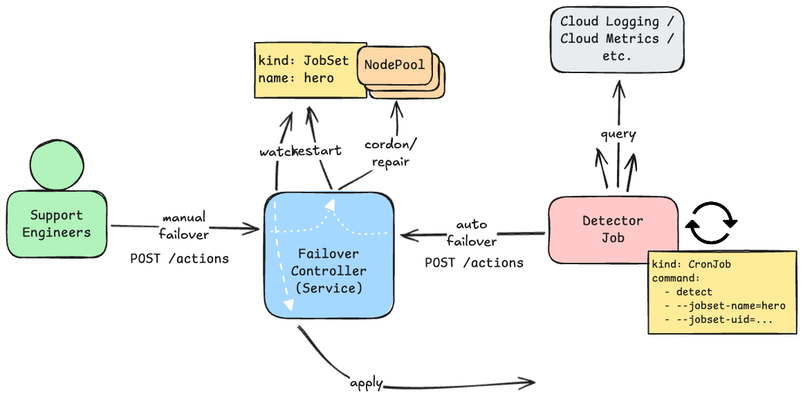

# Controller

A Kubernetes controller and HTTP API for managing node pools during automated metric-based failover scenarios.

The failover controller provides a HTTP API for managing node pools running JobSets in Kubernetes clusters, particularly focused on GKE node pools. It enables automated actions like cordoning node pools, repairing node pools, and restarting JobSets.



## Testing

```bash
make test-unit
make test-integration
```

## Deploy to a cluster

Setup GCP IAM Service Account.

```bash
gcloud iam service-accounts create autometric-failover-controller

export PROJECT_ID=$(gcloud config get project)

# Bind Kubernetes Service Account to GCP Service Account.
gcloud iam service-accounts add-iam-policy-binding autometric-failover-controller@${PROJECT_ID}.iam.gserviceaccount.com \
    --role roles/iam.workloadIdentityUser \
    --member "serviceAccount:${PROJECT_ID}.svc.id.goog[autometric-failover-system/controller]"

# Create a custom role for the service account.
gcloud iam roles create autometricFailoverController --project=${PROJECT_ID} \
    --file=gcp-role.yaml
  

gcloud projects add-iam-policy-binding $PROJECT_ID \
  --member="serviceAccount:autometric-failover-controller@${PROJECT_ID}.iam.gserviceaccount.com" \
  --role=projects/${PROJECT_ID}/roles/autometricFailoverController
#  --role="roles/compute.instanceAdmin"
```

Build and push the container image.

```sh
make docker-build docker-push CONTAINER_TOOL=podman IMG=us-docker.pkg.dev/${PROJECT_ID}/default/autometric-failover-controller:$(git rev-parse --short HEAD)
```

Update images in `./config/${PROJECT_ID}/kustomization.yaml`.

Deploy.

```bash
kubectl apply --server-side -k ./config/${PROJECT_ID}
```

### Access using port-forward

```bash
kubectl port-forward -n autometric-failover-system service/controller 8080:8080
```

## Deploy locally

### Set up a local Kind cluster

Create a Kind cluster and set up a node with the required GKE TPU node pool labels for testing:

```sh
# Create a new kind cluster
kind create cluster
# Install JobSet controller
kubectl apply --server-side -f https://github.com/kubernetes-sigs/jobset/releases/download/v0.8.0/manifests.yaml

# Get the node name
NODE=$(kubectl get nodes -o jsonpath='{.items[0].metadata.name}')

# Label the node to mimic a GKE TPU node pool
kubectl label node $NODE \
  cloud.google.com/gke-nodepool=test-pool \
  cloud.google.com/gke-accelerator-count=4 \
  cloud.google.com/gke-tpu-topology=8x8x8
```

Run the controller locally.

```bash
go run ./cmd/main.go
```

OR run the controller in the local cluster.

```bash
skaffold dev --cache-artifacts=false
```

### Test the API

Apply an example JobSet:

```bash
kubectl apply -f hack/example-jobset.yaml
```

In a new terminal, test the API by sending a request to cordon the node pool:

```sh
curl -X POST http://localhost:8080/actions \
  -H 'Content-Type: application/json' \
  -d '{
    "requestor": "test-user",
    "type": "cordon_nodepool_and_restart_jobset",
    "jobset_name": "example-jobset",
    "node_pool": "test-pool",
    "preflight_checks": {
      "expected_node_counts": false
    },
    "reason": "High error rate detected in node pool"
  }'
# Should succeed
```

Verify the node was cordoned:
```sh
kubectl get node $NODE -o jsonpath='{.spec.unschedulable}'
# Should output: true
```

Uncordon the Node to reset:

```sh
kubectl uncordon $NODE
```

## API Documentation

The controller exposes a REST API endpoint (`POST /actions`) that supports various node pool management operations. All requests must be POST requests with JSON payloads.

### Request Format

All requests should follow this general structure:

```json
{
  "id": "string",           // Optional: Unique identifier for the action request. Will be auto-generated if not provided.
  "dry_run": false,         // Optional: If true, only logs and publishes events without taking action.
  "requestor": "string",    // Required: User or system requesting the action.
  "reason": "string",       // Required: Human-readable reason for the action.
  "type": "string",         // Required: Type of action to perform.
  "namespace": "string",    // Optional: Namespace for the action. Defaults to "default".
  "jobset_name": "string",  // Required for certain actions: Name of the Kubernetes JobSet.
  "node_pool": "string",    // Required for certain actions: Name of the node pool.
  "node_name": "string",    // Required for certain actions: Name of the specific node.
  "preflight_checks": {     // Optional: Preflight validation checks.
    "expected_node_counts": false  // Optional: Verify expected node counts based on TPU topology.
  }
}
```

### Supported Actions

#### 1. Cordon Node Pool
Marks all nodes in a node pool as unschedulable.

```sh
curl -X POST http://localhost:8080/actions \
  -H 'Content-Type: application/json' \
  -d '{
    "requestor": "user@example.com",
    "type": "cordon_nodepool",
    "node_pool": "my-node-pool",
    "reason": "Node pool showing degraded performance",
    "preflight_checks": {
      "expected_node_counts": true
    }
  }'
```

#### 2. Cordon Node Pool and Restart JobSet
Cordons a node pool and triggers a JobSet restart by deleting its leader pod.

```sh
curl -X POST http://localhost:8080/actions \
  -H 'Content-Type: application/json' \
  -d '{
    "requestor": "user@example.com",
    "type": "cordon_nodepool_and_restart_jobset",
    "jobset_name": "my-jobset",
    "node_pool": "my-node-pool",
    "reason": "Node pool showing degraded performance",
    "preflight_checks": {
      "expected_node_counts": true
    }
  }'
```

#### 3. Cordon and Repair Node Pool
Cordons a node pool and triggers a repair by deleting a single GKE compute instance.

```sh
curl -X POST http://localhost:8080/actions \
  -H 'Content-Type: application/json' \
  -d '{
    "requestor": "user@example.com",
    "type": "cordon_and_repair_nodepool",
    "node_pool": "my-node-pool",
    "reason": "Node pool showing degraded performance",
    "preflight_checks": {
      "expected_node_counts": true
    }
  }'
```

#### 4. Repair Node Pool
Repairs a node pool by deleting a single GKE compute instance without cordoning the node pool.

```sh
curl -X POST http://localhost:8080/actions \
  -H 'Content-Type: application/json' \
  -d '{
    "requestor": "user@example.com",
    "type": "repair_nodepool",
    "node_pool": "my-node-pool",
    "reason": "Node pool showing degraded performance",
    "preflight_checks": {
      "expected_node_counts": true
    }
  }'
```

### Response Format

```json
{
  "id": "string",     // Request ID (provided or auto-generated)
  "error": "string"   // Error message if request failed (omitted on success)
}
```