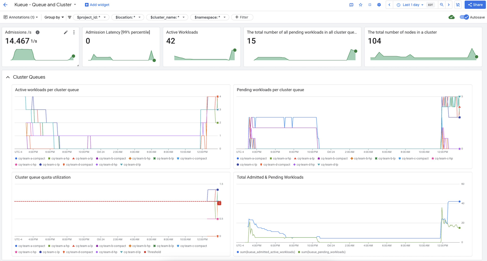
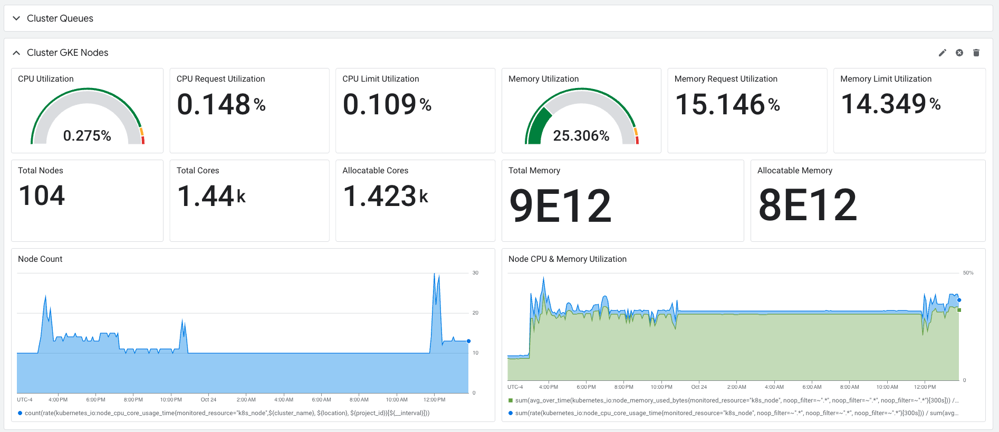

# Monitoring Kueue with Google Managed Prometheus and Cloud Monitoring

This document describes how to monitor Kueue metrics using Google Managed Prometheus and Cloud Monitoring.

## Overview

Kueue metrics are automatically collected by Google Managed Prometheus using managed collection. This means Prometheus-based collectors run as a Daemonset, ensuring scalability by only scraping targets on colocated nodes. The collected metrics are then exported and made available in Google Cloud's Monitoring service.

## Viewing the Dashboard

The Kueue dashboard is available in Google Cloud Monitoring. This dashboard provides a visual representation of key Kueue metrics, allowing you to quickly assess the health and performance of your Kueue system.




## Configuring Managed Collection and Creating the Dashboard

The following command will configure Managed Collection for Kueue and Create the Dashboard in Cloud Monitoring. 

```bash
./install-gmp.sh
```

## Querying Metrics

You can also query Kueue metrics directly using the [Google Cloud Monitoring - Metrics explorer](https://console.cloud.google.com/monitoring/metrics-explorer) interface. Both PromQL and MQL are supported for querying.

For more information, refer to the [Cloud Monitoring Documentation](https://cloud.google.com/monitoring/charts/metrics-explorer).

### Example Queries

Here are some sample PromQL queries to help you get started with monitoring your Kueue system:

#### Job Throughput

```promql
sum(rate(kueue_admitted_workloads_total[5m])) by (cluster_queue)
```

This query calculates the per-second rate of admitted workloads over 5 minutes for each cluster queue. Summing them provides the overall system throughput, while breaking it down by queue helps pinpoint potential bottlenecks.

#### Resource Utilization (`requires metrics.enableClusterQueueResources`)

```promql
sum(kueue_cluster_queue_resource_usage{resource="cpu"}) by (cluster_queue) / sum(kueue_cluster_queue_nominal_quota{resource="cpu"}) by (cluster_queue)
```

This query calculates the ratio of current CPU usage to the nominal CPU quota for each queue. A value close to 1 indicates high CPU utilization. You can adapt this for memory or other resources by changing the resource label.

>__Important__: This query requires the metrics.enableClusterQueueResources setting to be enabled in your Kueue manager's configuration.  To enable this setting, follow the instructions in the Kueue installation documentation: [https://kueue.sigs.k8s.io/docs/installation/#install-a-custom-configured-released-version](https://kueue.sigs.k8s.io/docs/installation/#install-a-custom-configured-released-version)

#### Queue Wait Times
```promql
histogram_quantile(0.9, kueue_admission_wait_time_seconds_bucket{cluster_queue="QUEUE_NAME"})
```
This query provides the 90th percentile wait time for workloads in a specific queue. You can modify the quantile value (e.g., 0.5 for median, 0.99 for 99th percentile) to understand the wait time distribution. Replace `QUEUE_NAME` with the actual name of the queue you want to monitor.