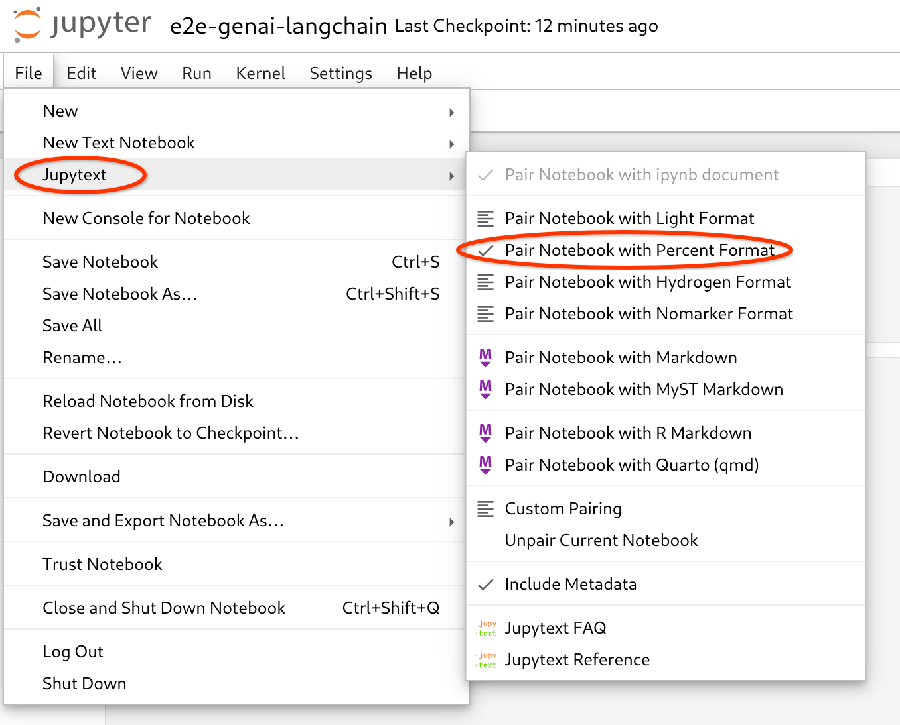
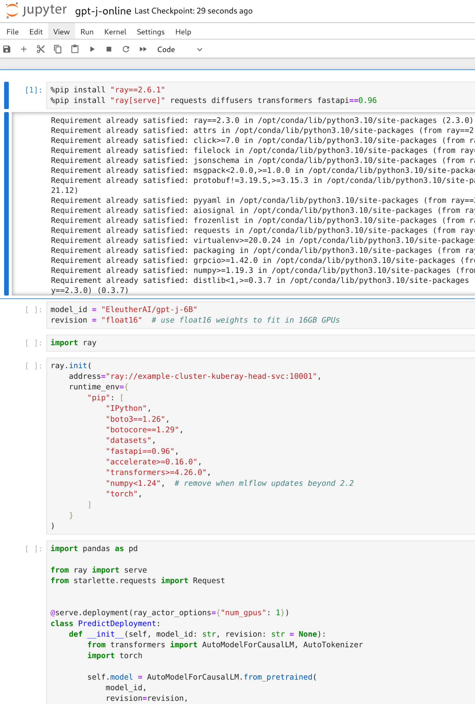
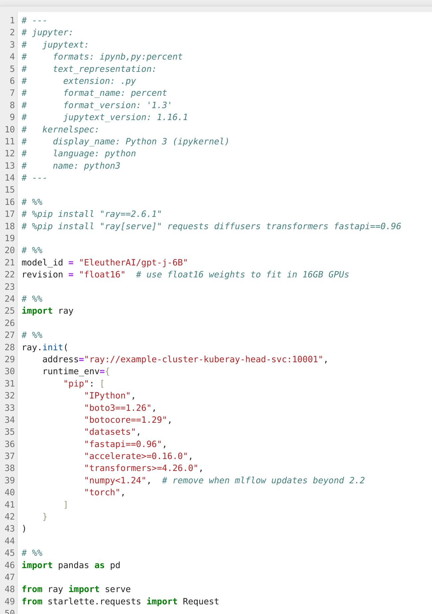
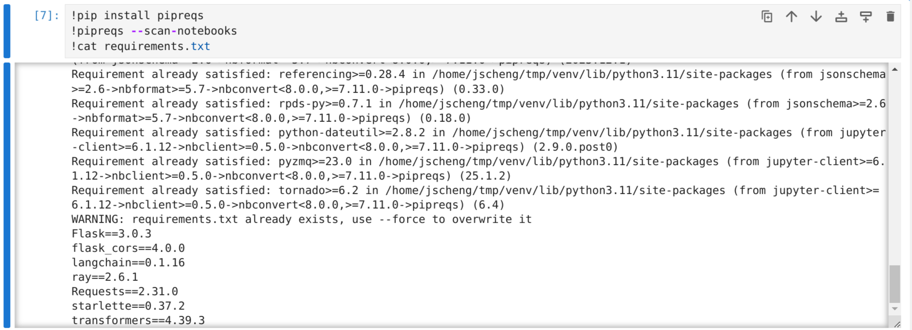
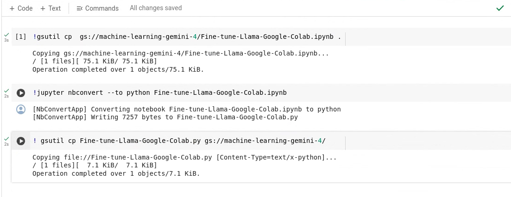

# Packaging Jupyter notebook as deployable code

Jupyter notebook is widely used by data scientists and machine learning experts in their day to day work to interactively and iteratively develop. However, the `ipynb` format is typically not used as a deployable or packagable artifact. There are two scenarios that notebooks are converted to deployable/package artifacts: 
  1. Model training tasks needed to convert to batch jobs to scale up with more computational resources
  1. Model inference tasks needed to convert to an API server to serve the end-user requests

In this guide we will showcase two different tools which may help faciliate converting your notebook to a deployable/packageable raw python library.

This process can also be automated utilizing Continuous Integration (CI) tools such as [Cloud Build](https://cloud.google.com/build/).

## Use jupytext to convert notebook to raw python and containerize

1. Update the notebook to `Pair Notebook with Percent Format`

    Jupytext comes with recent jupyter notebook or jupyter-lab. In addition to just converting from `ipynb` to python, it can pair between the formats. This allows for updates made in `ipynb` to be propagated to python and vice versa.

    To pair the notebook, simply use the pair function in the File menu:

    

    In this example we use the file [gpt-j-online.ipynb](https://github.com/GoogleCloudPlatform/ai-on-gke/blob/main/ray-on-gke/examples/notebooks/gpt-j-online.ipynb):

1. After pairing, we get the generated raw python:

    

    **NOTE**: This conversion can also be performed via the `jupytext` cli with the following command:

    ```sh
    jupytext --set-formats ipynb,py:percent \
        --to py gpt-j-online.ipynb
    ```

1. Extract the module dependencies

    In the notebook environment, users typically install required python modules using `pip install` commands, but in the container environment, these dependencies need to be installed into the container prior to executing the python library.

    We can use the `pipreqs` tool to generate the dependencies. Add the following snippet in a new cell of your notebook and run it:

    ```sh
    !pip install pipreqs
    !pipreqs --scan-notebooks
    ```

    The following is an example output:

    
    **NOTE**: (the `!cat requirements.txt` line is an example of the generated `requirements.txt`)

1. Create the Dockerfile

    To create the docker image of your generated raw python, we need to create a `Dockerfile`, below is an example. Replace `_THE_GENERATED_PYTHON_FILE_` with your generated python file:

    ```Dockerfile
    FROM nvidia/cuda:12.2.0-runtime-ubuntu22.04

    RUN apt-get update && \
        apt-get -y --no-install-recommends install python3-dev gcc python3-pip git && \
        rm -rf /var/lib/apt/lists/*

    RUN pip3 install --no-cache-dir -r requirements.txt

    COPY _THE_GENERATED_PYTHON_FILE_ /_THE_GENERATED_PYTHON_FILE_

    ENV PYTHONUNBUFFERED 1

    CMD python3 /_THE_GENERATED_PYTHON_FILE_
    ```

1. [Optional] Lint and remove unused code

    Using `pylint` to validate the generated code is a good practice. Pylint can detect unordered `import` statements, unused code and provide code readability suggestions.   

    To use `pylint`, create a new cell in your notebook, run the code below and replace `_THE_GENERATED_PYTHON_FILE_` to your filename:

    ```sh
    !pip install pylint
    !pylint _THE_GENERATED_PYTHON_FILE_
    ```

## Use nbconvert to convert notebook to raw python

We can convert a Jupyter notebook to python script using nbconvert tool.  
The nbconvert tool is available inside your Jupyter notebook environment in Google Colab Enterprise. If you are in another environment and it is not available, it can be found [here](https://pypi.org/project/nbconvert/)

1. Run the nbconvert command in your notebook. In this example, we are using `gsutil` to copy the notebook to the Colab Enterprise notebook.

    ```sh
    !jupyter nbconvert --to python Fine-tune-Llama-Google-Colab.ipynb
    ```

    Below is an example of the commands
    