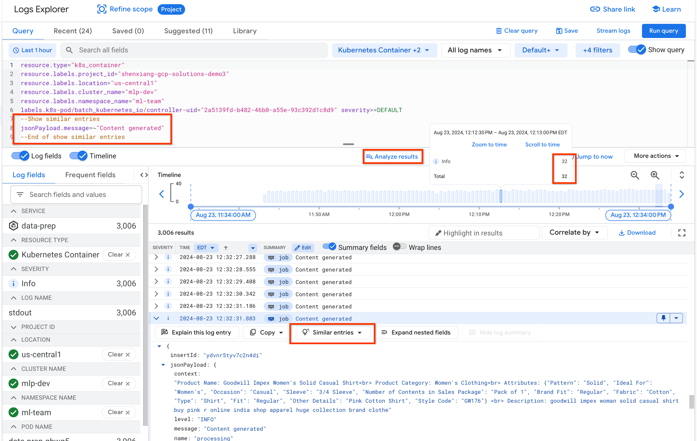
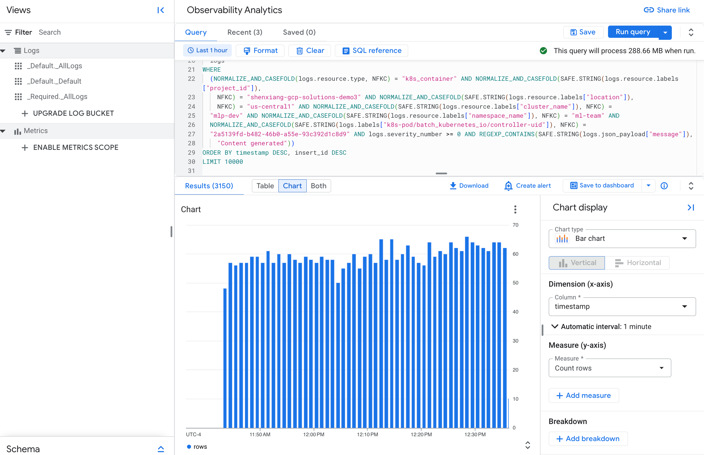

# Data Preparation

A processed flipkart product catalog data is used as input data to generate prompts in preparation for fine-tuning.
The prompts are generated using Vertex AI's Gemini Flash model. The output is a data set that can be used for fine-tuning
the base model.

## Prerequisites

- This guide was developed to be run on the [playground machine learning platform](/best-practices/ml-platform/examples/platform/playground/README.md). If you are using a different environment the scripts and manifest will need to be modified for that environment.
- A bucket containing the processed data from the [Data Processing example](../../data-processing/ray)

## Preparation

- Clone the repository and change directory to the guide directory

  ```sh
  git clone https://github.com/GoogleCloudPlatform/ai-on-gke && \
  cd ai-on-gke/best-practices/ml-platform/examples/use-case/data-preparation/gemma-it
  ```

- Ensure that your `MLP_ENVIRONMENT_FILE` is configured

  ```
  cat ${MLP_ENVIRONMENT_FILE} && \
  source ${MLP_ENVIRONMENT_FILE}
  ```

  > You should see the various variables populated with the information specific to your environment.

### Vertex AI variables

- Set `REGION` to Google Cloud region to use for the Vertex AI API calls

  ```
  REGION=us-central1
  ```

## Build the container image

- Build the container image using Cloud Build and push the image to Artifact Registry

  ```
  cd src
  gcloud builds submit --config cloudbuild.yaml \
  --project ${MLP_PROJECT_ID} \
  --substitutions _DESTINATION=${MLP_DATA_PREPARATION_IMAGE}
  cd ..
  ```

## Run the job

- Get credentials for the GKE cluster

  ```sh
  gcloud container fleet memberships get-credentials ${MLP_CLUSTER_NAME} --project ${MLP_PROJECT_ID}
  ```

- Configure the job

  | Variable            | Description                                                                                                   | Example                       |
  | ------------------- | ------------------------------------------------------------------------------------------------------------- | ----------------------------- |
  | DATASET_INPUT_PATH  | The folder path of where the preprocessed flipkart data resides                                               | flipkart_preprocessed_dataset |
  | DATASET_INPUT_FILE  | The filename of the preprocessed flipkart data                                                                | flipkart.csv                  |
  | DATASET_OUTPUT_PATH | The folder path of where the generated output data set will reside. This path will be needed for fine-tuning. | dataset/output                |
  | PROMPT_MODEL_ID     | The Vertex AI model for prompt generation                                                                     | gemini-1.5-flash-001          |

  ```sh
  DATASET_INPUT_PATH="flipkart_preprocessed_dataset"
  DATASET_INPUT_FILE="flipkart.csv"
  DATASET_OUTPUT_PATH="dataset/output"
  PROMPT_MODEL_ID="gemini-1.5-flash-001"
  ```

  ```sh
  sed \
  -i -e "s|V_IMAGE_URL|${MLP_DATA_PREPARATION_IMAGE}|" \
  -i -e "s|V_KSA|${MLP_DATA_PREPARATION_KSA}|" \
  -i -e "s|V_PROJECT_ID|${MLP_PROJECT_ID}|" \
  -i -e "s|V_DATA_BUCKET|${MLP_DATA_BUCKET}|" \
  -i -e "s|V_DATASET_INPUT_PATH|${DATASET_INPUT_PATH}|" \
  -i -e "s|V_DATASET_INPUT_FILE|${DATASET_INPUT_FILE}|" \
  -i -e "s|V_DATASET_OUTPUT_PATH|${DATASET_OUTPUT_PATH}|" \
  -i -e "s|V_PROMPT_MODEL_ID|${PROMPT_MODEL_ID}|" \
  -i -e "s|V_REGION|${REGION}|" \
  manifests/job.yaml
  ```

- Create the job

  ```sh
  kubectl --namespace ${MLP_KUBERNETES_NAMESPACE} apply -f manifests/job.yaml
  ```

- Once the Job is completed, the prepared datasets are stored in Google Cloud Storage.

  ```sh
  gcloud storage ls gs://${MLP_DATA_BUCKET}/${DATASET_OUTPUT_PATH}
  ```
## Observability

By default, both GKE and the workloads you run expose metrics and logs in Google Cloud's Observability suite. You can view this information either from the Cloud Observability console or the GKE Observability page.

For more information about infrastructure and application metrics, see [View observability metrics](https://cloud.google.com/kubernetes-engine/docs/how-to/view-observability-metrics).

Specifically for the data preparation use case described in this example, you may want to perform the following tasks.

### Monitor the job

In the Google Cloud console, go to the [Kubernetes Engine](https://console.cloud.google.com/kubernetes) page. Under the `Resource Management` menu on the left side, click `Workloads`. From there, you can filter the workloads by cluster name and namespaces. The `Observability` tab provides system level metric views such as `Overview`, `CPU`, and `Memory`. If you click the job name like `data-prep`, you can see the job details like the following page:


At the bottom of the page, you can see the status of the managed pods by the job. If your job has troubles running, the `EVENTS` and `LOGS` tabs will provide more insight. You can also adjust the time windows or open the `Container logs` and `Audit logs` for additional information.

### View the logs

To gain insight into your workload quickly, you may want to filter and tweak the log queries to view only the relevant logs. You can do so in the `Logs Explorer`. One fast way to open the Logs Explorer and have the query pre-populated is to click the `View in Logs Explorer` button on the right side of the `LOGS` tab once you are in the `Job details` page.

When the link is opened, you should see something like the following:



The Logs Explorer provides many nice features besides tweaking your log query in the `Query` field. For example, if you want to know which steps the job has completed, you can run the following query based on [the source code](src/dataprep.py#L318):

```shell
resource.type="k8s_container"
resource.labels.project_id="gkebatchexpce3c8dcb"
resource.labels.location="us-central1"
resource.labels.namespace_name="ml-team"
resource.labels.cluster_name="mlp-rueth-gpu"
jsonPayload.message = (
"***Job Start***" OR
"Configure signal handlers" OR
"Prepare context for Gemini Flash's prompt" OR 
"Generate Q & A according" OR
"Generate Prompts for Gemma IT model" OR
"Upload prepared dataset into GCS" OR
"***Job End***")
```


As another example, if you want to know how many prompts are generated in a specific time window, you can do something like the following:

1. From the code, look for the log entries that associate with the prompt generation. In this example, the `Content generated` log entry is produced each time a prompt is generated.

2. You can click the `Similar entries`, which automatically updates the log query for you and list all `Content generated` entries. 

3. Adjust the timeline in the middle of the page and zoom in/out. You will see during a specific time window, such as 30 seconds, how many log entries are ingested. That number should be the same as the number of prompts generated by the code.

### Log Analytics

You can also use [Log Analytics](https://cloud.google.com/logging/docs/analyze/query-and-view) to analyze your logs. After it is enabled, you can run SQL queries to gain insight from the logs. The result can also be charted. For example, you can click the `Analyze results` link on the Logs Explorer page and open the Log Analytics page with a converted SQL query. The chart and table you view can also be added to a dashboard.


