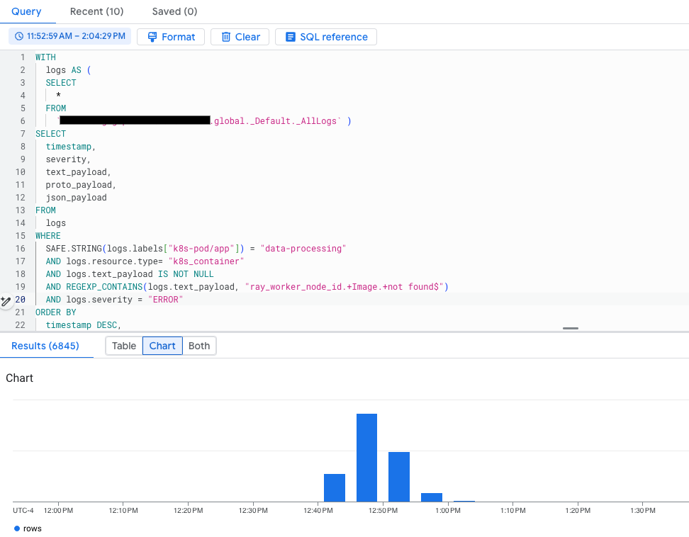

# Distributed Data Processing with Ray on GKE

## Dataset

[This](https://www.kaggle.com/datasets/PromptCloudHQ/flipkart-products) is a pre-crawled public dataset, taken as a subset of a bigger dataset (more than 5.8 million products) that was created by extracting data from [Flipkart](https://www.flipkart.com/), a leading Indian eCommerce store.

## Architecture


## Data processing steps

The dataset has product information such as id, name, brand, description, image urls, product specifications.

The `preprocessing.py` file does the following:

- Read the csv from Cloud Storage
- Clean up the product description text
- Extract image urls, validate and download the images into cloud storage
- Cleanup & extract attributes as key-value pairs

The data processing step takes approximately 18-20 minutes.

## Prerequisites

- This guide was developed to be run on the [playground machine learning platform](/best-practices/ml-platform/examples/platform/playground/README.md). If you are using a different environment the scripts and manifest will need to be modified for that environment.

## Preparation

- Clone the repository and change directory to the guide directory

  ```shell
  git clone https://github.com/GoogleCloudPlatform/ai-on-gke && \
  cd ai-on-gke/best-practices/ml-platform/examples/use-case/data-processing/ray
  ```

- Ensure that your `MLP_ENVIRONMENT_FILE` is configured

  ```shell
  cat ${MLP_ENVIRONMENT_FILE} && \
  source ${MLP_ENVIRONMENT_FILE}
  ```

  > You should see the various variables populated with the information specific to your environment.

## Configuration

- Download the raw data csv file from [Kaggle](https://kaggle.com) and store it into the bucket created in the previous step.

  - You will need kaggle cli to download the file. The kaggle cli can be installed using the following command in Cloud Shell:
      ```shell
      pip3 install --user kaggle
      ```
      For more details, you can read those [instructions](https://github.com/Kaggle/kaggle-api#installation).
  - To use the cli you must create an API token. To create the token, register on [kaggle.com](https://kaggle.com) if you already don't have an account. Go to `kaggle.com/settings > API > Create New Token`, the downloaded file should be stored in `$HOME/.kaggle/kaggle.json`. Note, you will have to create the dir `$HOME/.kaggle`. After the configuration is done, you can run the following command to download the dataset and copy it to the GCS bucket:
      ```shell
      kaggle datasets download --unzip atharvjairath/flipkart-ecommerce-dataset && \
      gcloud storage cp flipkart_com-ecommerce_sample.csv \
      gs://${MLP_DATA_BUCKET}/flipkart_raw_dataset/flipkart_com-ecommerce_sample.csv && \
      rm flipkart_com-ecommerce_sample.csv
      ```
   - Alternatively, you can [downloaded the dataset](https://www.kaggle.com/datasets/atharvjairath/flipkart-ecommerce-dataset) directly from the kaggle website and copy it to the bucket.

## Build the container image

- Build container image using Cloud Build and push the image to Artifact Registry

  ```shell
  cd src
  sed -i -e "s|^serviceAccount:.*|serviceAccount: projects/${MLP_PROJECT_ID}/serviceAccounts/${MLP_BUILD_GSA}|" cloudbuild.yaml
  gcloud beta builds submit --config cloudbuild.yaml \
  --project ${MLP_PROJECT_ID} \
  --substitutions _DESTINATION=${MLP_DATA_PROCESSING_IMAGE}
  cd ..
  ```

## Run the job

- Get credentials for the GKE cluster

  ```shell
  gcloud container fleet memberships get-credentials ${MLP_CLUSTER_NAME} --project ${MLP_PROJECT_ID}
  ```

- Configure the job

  ```shell
  sed \
  -i -e "s|V_DATA_BUCKET|${MLP_DATA_BUCKET}|" \
  -i -e "s|V_IMAGE_URL|${MLP_DATA_PROCESSING_IMAGE}|" \
  -i -e "s|V_KSA|${MLP_DATA_PROCESSING_KSA}|" \
  manifests/job.yaml
  ```

- Create the job

  ```shell
  kubectl --namespace ${MLP_KUBERNETES_NAMESPACE} apply -f manifests/job.yaml
  ```

- Monitor the execution in Ray Dashboard. You can run the following command to get the dashboard endpoint:
    ```shell
    echo -e "\n${MLP_KUBERNETES_NAMESPACE} Ray dashboard: ${MLP_RAY_DASHBOARD_NAMESPACE_ENDPOINT}\n"
    ```
    Read [the section about KubeRay](../../../platform/playground/README.md#software-installed-via-reposync-and-rootsync) for more info.
- From the Ray Dashboard, view the following about the jobs:
  - Jobs -> Running Job ID
    - See the Tasks/actors overview for Running jobs
    - See the Task Table for a detailed view of task and assigned node(s)
  - Cluster -> Node List
    - See the Ray actors running on the worker process

- You can check the job status from the GKE console or [query the logs](#log-query-sample) in the [Logs Explorer](https://console.cloud.google.com/logs). Once the Job is completed, both the prepared dataset as a CSV and the images are stored in Google Cloud Storage.

  ```shell
  gcloud storage ls gs://${MLP_DATA_BUCKET}/flipkart_preprocessed_dataset/flipkart.csv
  gcloud storage ls gs://${MLP_DATA_BUCKET}/flipkart_images
  ```

> For additional information about developing using this codebase see the [Developer Guide](DEVELOPER.md)

> For additional information about converting you code from a notebook to run as a Job on GKE see the [Conversion Guide](CONVERSION.md)

## Observability

By default, both GKE and the workloads you run expose metrics and logs in Google Cloud's Observability suite. You can view that information either from the Cloud Observability console or the GKE Observability page.

For more information about infrastructure and application metrics, see [View observability metrics](https://cloud.google.com/kubernetes-engine/docs/how-to/view-observability-metrics).

Specifically for the data processing use case described in this example, you can perform additional analysis based on the workload logs.

### Log query sample

In the Google Cloud console, go to the [Logs Explorer](https://console.cloud.google.com/logs) page to run your queries.

- Find when the data processing job started and finished. You may need to adjust the time window in the UI or use [timestamp](https://cloud.google.com/logging/docs/view/logging-query-language) in the query:

  ```
  labels."k8s-pod/app"="data-processing"
  resource.type="k8s_container"
  jsonPayload.message: "Started" OR jsonPayload.message: "Finished"
  severity=INFO
  ```

- Find all error logs for the job:

  ```
  labels."k8s-pod/app"="data-processing"
  resource.type="k8s_container"
  severity=ERROR
  ```

- Search for specific errors from the `textPayload` using a regex expression:

  ```
  labels."k8s-pod/app"="data-processing"
  resource.type="k8s_container"
  textPayload =~ "ray_worker_node_id.+Image.+not found$"
  severity=ERROR
  ```

You can narrow down the results by adding extra filters, such as using additional labels. For more GKE query samples, you can read [Kubernetes-related queries](https://cloud.google.com/logging/docs/view/query-library#kubernetes-filters).

### Log-based Metrics

To gain insight into your workload status, you can also utilize [log-based metrics](https://cloud.google.com/logging/docs/logs-based-metrics). Several methods exist for their creation. The most straightforward approach involves modifying your log queries to locate the relevant logs. Subsequently, you can generate a custom metric by clicking the `Create metric` link and defining it as per your requirements. For example:


For this example, the following query is used, utilizing a more specific regular expression to search the error logs. With the log entries found, you can create log-based metrics.

```
labels."k8s-pod/app"="data-processing"
resource.type="k8s_container"
textPayload =~ "ray_worker_node_id.+Image.+not found$"
severity=ERROR
```

The following is a definition for a metric such as `No_Image_found_Product`. Notice both the GKE node and Ray worker node id are added as labels.

```yaml
filter: |-
  labels."k8s-pod/app"="data-processing"
  resource.type="k8s_container"
  textPayload =~ "ray_worker_node_id.+Image.+not found$"
  severity=ERROR
labelExtractors:
  gke_node: EXTRACT(labels."compute.googleapis.com/resource_name")
  ray_woker_node_id: REGEXP_EXTRACT(textPayload, "ray_worker_node_id:(.+) Image")
metricDescriptor:
  labels:
    - key: gke_node
    - key: ray_woker_node_id
  metricKind: DELTA
  name: projects/xxxxx/metricDescriptors/logging.googleapis.com/user/No_Image_Found_Product
  type: logging.googleapis.com/user/No_Image_Found_Product
  unit: "1"
  valueType: INT64
name: No_Image_Found_Product
resourceName: projects/xxxxx/metrics/No_Image_Found_Product
```

Once the metrics are defined, the next time you run your workloads, you will be able to use them. For example, the following chart visualizes the metric defined above:


### Log Analytics

You can also use [Log Analytics](https://cloud.google.com/logging/docs/log-analytics#analytics) to [analyze your logs]((https://cloud.google.com/logging/docs/analyze/query-and-view)). If your log buckets are not upgraded for Log Analytics, you need to upgrade them first. After the log buckets are upgraded, you can run SQL queries to gain insight from the newly ingested logs. The query results can also be charted. For example, the following query returns the `Image not found` error and chart the result:

```sql
WITH
  logs AS (
  SELECT
    *
  FROM
    `[Your Project Id].global._Default._AllLogs` )
SELECT
  timestamp,
  severity,
  text_payload,
  proto_payload,
  json_payload
FROM
  logs
WHERE
  SAFE.STRING(logs.labels["k8s-pod/app"]) = "data-processing"
  AND logs.resource.type= "k8s_container"
  AND logs.text_payload IS NOT NULL
  AND REGEXP_CONTAINS(logs.text_payload, "ray_worker_node_id.+Image.+not found$")
  AND logs.severity = "ERROR"
ORDER BY
  timestamp DESC,
  insert_id DESC
LIMIT
  10000
```

You should see output like the following:
