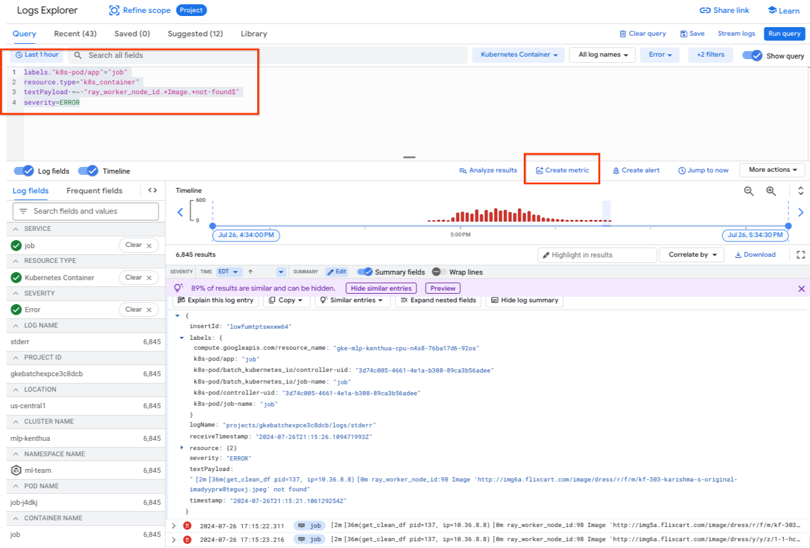
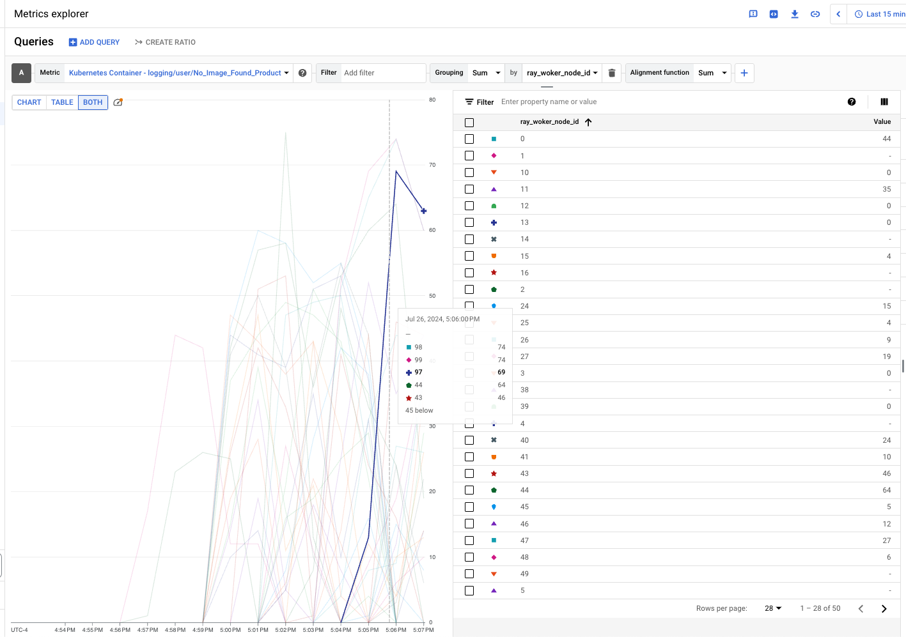

# Distributed Data Processing with Ray on GKE

## Dataset

[This](https://www.kaggle.com/datasets/PromptCloudHQ/flipkart-products) is a pre-crawled public dataset, taken as a subset of a bigger dataset (more than 5.8 million products) that was created by extracting data from [Flipkart](https://www.flipkart.com/), a leading Indian eCommerce store.

## Architecture


## Prerequisites

- This guide was developed to be run on the [playground machine learning platform](/best-practices/ml-platform/examples/platform/playground/README.md). If you are using a different environment the scripts and manifest will need to be modified for that environment.

## Data processing steps

The dataset has product information such as id, name, brand, description, image urls, product specifications.

The `preprocessing.py` file does the following:

- Read the csv from Cloud Storage
- Clean up the product description text
- Extract image urls, validate and download the images into cloud storage
- Cleanup & extract attributes as key-value pairs

The data processing step takes approximately 18-20 minutes.

## How to use this repo

- Clone the repository and change directory to the guide directory

  ```
  git clone https://github.com/GoogleCloudPlatform/ai-on-gke && \
  cd ai-on-gke/best-practices/ml-platform/examples/use-case/data-processing/ray
  ```

- Set `CLUSTER_NAME` to the name of your GKE cluster

  ```
  CLUSTER_NAME=
  ```

- Set `PROJECT_ID` to the project ID of the project where your GKE cluster and other resources will reside

  ```
  PROJECT_ID=
  ```

- Set `DATA_BUCKET` to the name of your Google Cloud Storage (GCS) bucket where the data will be stored

  ```
  DATA_BUCKET=
  ```

- Set `DOCKER_IMAGE_URL` to the URL for the container image that will be created

  ```
  DOCKER_IMAGE_URL="us-docker.pkg.dev/${PROJECT_ID}/data-processing/dp:v1.0.0"
  ```

- Create a Cloud Storage bucket to store the data

  ```
  gcloud storage buckets create gs://${DATA_BUCKET} --project ${PROJECT_ID} --uniform-bucket-level-access
  ```

- Download the raw data csv file from [Kaggle][kaggle] and store it into the bucket created in the previous step.

  - You will need kaggle cli to download the file. The kaggle cli can be installed using the following [instructions](https://github.com/Kaggle/kaggle-api#installation).
  - To use the cli you must create an API token. To create the token, register on kaggle.com if you already don't have an account. Go to kaggle.com/settings > API > Create New Token, the downloaded file should be stored in $HOME/.kaggle/kaggle.json. Note, you will have to create the dir $HOME/.kaggle.
  - Alternatively, it can be [downloaded](https://www.kaggle.com/datasets/atharvjairath/flipkart-ecommerce-dataset) from the kaggle website.

  ```
  kaggle datasets download --unzip atharvjairath/flipkart-ecommerce-dataset && \
  gcloud storage cp flipkart_com-ecommerce_sample.csv \
  gs://${DATA_BUCKET}/flipkart_raw_dataset/flipkart_com-ecommerce_sample.csv && \
  rm flipkart_com-ecommerce_sample.csv
  ```

- Provide respective GCS bucket access rights to GKE Kubernetes Service Accounts.
  Ray head with access to read the raw source data in the storage bucket and
  Ray worker(s) with the access to write data to the storage bucket.

  ```
  gcloud projects add-iam-policy-binding ${PROJECT_ID} \
  --condition None \
  --member "serviceAccount:${PROJECT_ID}.svc.id.goog[ml-team/ray-head]" \
  --role roles/storage.objectViewer

  gcloud projects add-iam-policy-binding ${PROJECT_ID} \
  --condition None \
  --member "serviceAccount:${PROJECT_ID}.svc.id.goog[ml-team/ray-worker]" \
  --role roles/storage.objectAdmin
  ```

- Create Artifact Registry repository for your docker image

  ```
  gcloud artifacts repositories create data-processing \
  --repository-format=docker \
  --location=us \
  --project=${PROJECT_ID} \
  --async
  ```

- Enable the Cloud Build APIs

  ```
  gcloud services enable cloudbuild.googleapis.com --project ${PROJECT_ID}
  ```

- Build container image using Cloud Build and push the image to Artifact Registry

  ```
  cd src
  gcloud builds submit --config cloudbuild.yaml \
  --project ${PROJECT_ID} \
  --substitutions _DESTINATION=${DOCKER_IMAGE_URL}
  cd ..
  ```

- Update respective variables in the Job submission manifest to reflect your configuration.

  - Image is the docker image that was built in the previous step
  - Processing bucket is the location of the GCS bucket where the source data and results will be stored
  - Ray Cluster Host - if used in this example, it should not need to be changed, but if your Ray cluster service is named differently or in a different namespace, update accordingly.

  ```
  sed \
  -i -e "s|V_IMAGE|${DOCKER_IMAGE_URL}|" manifests/job.yaml \
  -i -e "s|V_DATA_BUCKET|${DATA_BUCKET}|" manifests/job.yaml
  ```

- Get credentials for the GKE cluster

  ```
  gcloud container fleet memberships get-credentials ${CLUSTER_NAME} --project ${PROJECT_ID}
  ```

- Create the Job in the “ml-team” namespace using kubectl command

  ```
  kubectl --namespace ml-team apply -f manifests/job.yaml
  ```

- Monitor the execution in Ray Dashboard. See how to launch [Ray Dashboard][ray-dashboard]

  - Jobs -> Running Job ID
    - See the Tasks/actors overview for Running jobs
    - See the Task Table for a detailed view of task and assigned node(s)
  - Cluster -> Node List
    - See the Ray actors running on the worker process

- Once the Job is completed, both the prepared dataset as a CSV and the images are stored in Google Cloud Storage.

  ```
  gcloud storage ls gs://${DATA_BUCKET}/flipkart_preprocessed_dataset/flipkart.csv
  gcloud storage ls gs://${DATA_BUCKET}/flipkart_images
  ```

> For additional information about developing using this codebase see the [Developer Guide](DEVELOPER.md)

> For additional information about converting you code from a notebook to run as a Job on GKE see the [Conversion Guide](CONVERSION.md)

## Observability

By default, both GKE and the workloads you run expose metrics and logs in Google Cloud's Observability suite. You can view that information either from the Cloud Observability console or the GKE Observability page.

For more information about infrastructure and application metrics, see [View observability metrics](https://cloud.google.com/kubernetes-engine/docs/how-to/view-observability-metrics).

Specifically for the data processing use case described in this example, you can perform additional analysis based on the workload logs.

### Log query sample

In the Google Cloud console, go to the [Logs Explorer](https://console.cloud.google.com/logs) page to run your queries.

- Find when the data preparation job started and finished:

  ```
  labels."k8s-pod/app"="data-processing"
  resource.type="k8s_container"
  jsonPayload.message: "Started" OR jsonPayload.message: "Finished"
  severity=INFO
  ```

- Find all error logs for the job:

  ```
  labels."k8s-pod/app"="data-processing"
  resource.type="k8s_container"
  severity=ERROR
  ```

- Search for specific errors from the `textPayload` using a regex expression:

  ```
  labels."k8s-pod/app"="data-processing"
  resource.type="k8s_container"
  textPayload =~ "ray_worker_node_id.+Image.+not found$"
  severity=ERROR
  ```

You can narrow down the results by adding extra filters, such as using additional labels. For more GKE query samples, you can read [Kubernetes-related queries](https://cloud.google.com/logging/docs/view/query-library#kubernetes-filters).

### Log-based Metrics

To gain insight into your workload status, you can also utilize [log-based metrics](https://cloud.google.com/logging/docs/logs-based-metrics). Several methods exist for their creation. The most straightforward approach involves modifying your log queries to locate the relevant logs. Subsequently, you can generate a custom metric by clicking the `Create metric` link and defining it as per your requirements. For example:



For this example, the following query is used, utilizing a more specific regular expression to search the error logs. With the log entries found, you can create log-based metrics.

```
labels."k8s-pod/app"="data-processing"
resource.type="k8s_container"
textPayload =~ "ray_worker_node_id.+Image.+not found$"
severity=ERROR
```

The following is a definition for a metric such as `No_Image_found_Product`. Notice both the GKE node and Ray worker node id are added as labels.

```yaml
filter: |-
  labels."k8s-pod/app"="data-processing"
  resource.type="k8s_container"
  textPayload =~ "ray_worker_node_id.+Image.+not found$"
  severity=ERROR
labelExtractors:
  gke_node: EXTRACT(labels."compute.googleapis.com/resource_name")
  ray_woker_node_id: REGEXP_EXTRACT(textPayload, "ray_worker_node_id:(.+) Image")
metricDescriptor:
  labels:
    - key: gke_node
    - key: ray_woker_node_id
  metricKind: DELTA
  name: projects/xxxxx/metricDescriptors/logging.googleapis.com/user/No_Image_Found_Product
  type: logging.googleapis.com/user/No_Image_Found_Product
  unit: "1"
  valueType: INT64
name: No_Image_Found_Product
resourceName: projects/xxxxx/metrics/No_Image_Found_Product
```

Once the metrics are defined, the next time you run your workloads, you will be able to use them. For example, the following chart visualizes the metric defined above:



### Log Analytics

You can also use [Log Analytics](https://cloud.google.com/logging/docs/analyze/query-and-view) to analyze your logs. After it is enabled, you can run SQL queries to gain insight from the logs. The result can also be charted. For example, the following query extracts the product type from the log text payload and count the numbers of them:

```sql
SELECT
 ARRAY_REVERSE(SPLIT(text_payload, '>>'))[2] AS clothing_type,
 COUNT(*) AS number
FROM
 `gkebatchexpce3c8dcb.global._Default._Default`
WHERE
 text_payload LIKE '%Clothing >> Women\'s Clothing >> Western Wear%'
GROUP BY
 clothing_type
LIMIT 1000
```

You should see output like the following:

| clothing_type         | number |
| --------------------- | ------ |
| Skirts                | 5      |
| Shirts, Tops & Tunics | 485    |
| Western Wear          | 2      |
| Fashion Jackets       | 3      |
| Polos & T-Shirts      | 12     |
| Jeans                 | 19     |
| Dresses & Skirts      | 361    |
| Tops                  | 38     |
| Leggings & Jeggings   | 22     |
| Shorts                | 1      |
| Sports Jackets        | 1      |
| Shrugs                | 7      |
| Shirts                | 1      |

[kaggle]: https://kaggle.com
[ray-dashboard]: ../../../platform/playground/README.md#software-installed-via-reposync-and-rootsync
