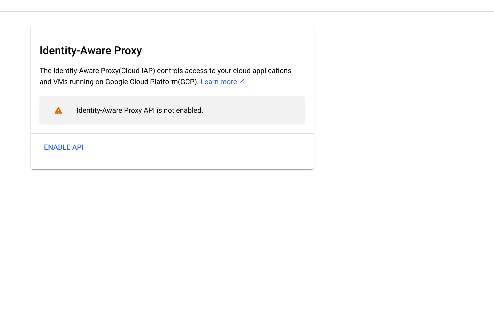
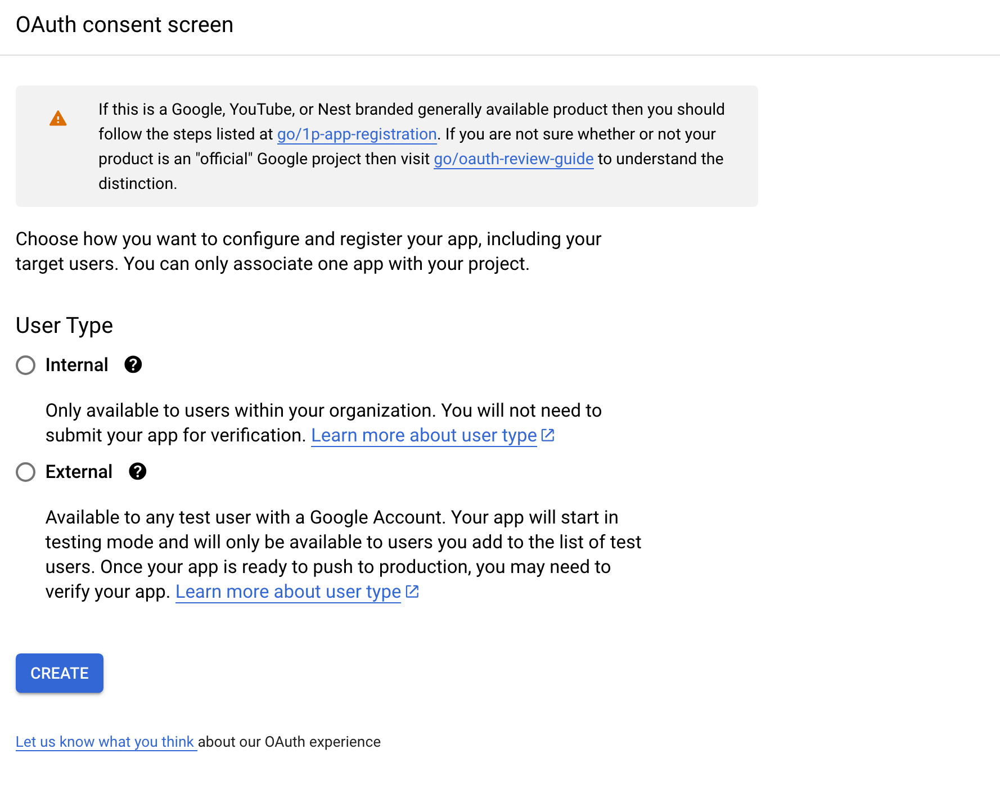

# JupyterHub on GKE

This repository contains a Terraform template for running [JupyterHub](https://jupyter.org/hub) on Google Kubernetes Engine.

This module assumes you already have a functional GKE cluster. If not, follow the instructions under `ai-on-gke/gke-platform/README.md`
to install a Standard or Autopilot GKE cluster, then follow the instructions in this module to install JupyterHub.

We've also included some example notebooks (`ai-on-gke/ray-on-gke/example_notebooks`), including one that serves a GPT-J-6B model with Ray AIR (see
[here](https://docs.ray.io/en/master/ray-air/examples/gptj_serving.html) for the original notebook). To run these, follow the instructions at
`ai-on-gke/ray-on-gke/README.md` to install a Ray cluster.

This module deploys the following resources, once per user:
* JupyterHub deployment
* User namespace
* Kubernetes service accounts

## Installation

Preinstall the following on your computer:
* Kubectl
* Terraform
* Helm
* Gcloud

> **_NOTE:_** Terraform keeps state metadata in a local file called `terraform.tfstate`. Deleting the file may cause some resources to not be cleaned up correctly even if you delete the cluster. We suggest using `terraform destory` before reapplying/reinstalling.

### JupyterHub

> **_NOTE:_** Currently the there are 3 preset profiles that uses the same jupyter images, this can be changed in the yaml files in /jupyter_config, as well as the description of these profiles.

> **_NOTE:_** To enable/disable GCP IAP authentication, set the `add_auth` boolean in variables.tf to `true` or `false` and update the [image field](https://github.com/GoogleCloudPlatform/ai-on-gke/blob/main/jupyter-on-gke/jupyter_config/config-selfauth.yaml#L12) within the config. It is highly recommanded to **NOT** turn off Authentication.

1. If needed, git clone https://github.com/GoogleCloudPlatform/ai-on-gke

2. Build the Jupyterhub Image following [README](https://github.com/GoogleCloudPlatform/ai-on-gke/blob/main/jupyter-on-gke/authentication/README.MD). This is an important step for Authentication. (Currently Enabled By Default)

3. Once the image is built, navigate to `ai-on-gke/jupyter-on-gke/`

4. Edit `variables.tf` with your GCP settings. The `<your user name>` that you specify will become a K8s namespace for your Jupyterhub services. For more information about what the variabls do visit [here](https://github.com/GoogleCloudPlatform/ai-on-gke/blob/main/jupyter-on-gke/variable_definitions.md)
**Important Note:**
If using this with the Ray module (`ai-on-gke/ray-on-gke/`), it is recommended to use the same k8s namespace
for both i.e. set this to the same namespace as `ai-on-gke/ray-on-gke/user/variables.tf`.
If not, set `enable_create_namespace` to `true` so a new k8s namespace is created for the Jupyter resources.

5. If you have not enabled the IAP API before or created a Brand for your project, you can proceed to the next step. If not, ensure that the following variables within `variables.tf` are set:

    * enable_iap_service - Enables the IAP service API. Leave as false if IAP is enabled before.
    * brand - creates a brand for the project, only one is currently allowed per project. If there is already a brand, leave the variable empty.
    * support_email - used by brand, required field.

    **Note:**
    We allow user to set their own domains, in the `variables.tf` file. Since we are also using an Ingress Object, it is required for the Ingress to also have specifiy the name of the global static address.
    Visit the [GCloud UI](https://pantheon.corp.google.com/security/iap) to see if it's enabled. If it's enabled, you will be able to see the page and will not prompt you to enable API:

    

    And the `brand` page, if there is not brand created yet, will have:

    

5. Run `terraform init`

6. Edit the `./allowlist` file to set the application users allowlist for Jupyterhub. These are the kinds of principals you can have:

    * allUsers
    * allAuthenticatedUsers
    * user:{emailid}
    * serviceAccount:{emailid}
    * group:{emailid}
    * domain:{domain}
    * projectOwner:projectid
    * projectEditor:projectid
    * projectViewer:

    **Note:** Seperate each principals with a new line

7. Find the name and location of the GKE cluster you want to use.
   Run `gcloud container clusters list --project=<your GCP project> to see all the available clusters.

   Note: If you created the GKE cluster via the ai-on-gke/gke-platform repo, you can get the cluster info from `ai-on-gke/gke-platform/variables.tf`

8. Run `gcloud container clusters get-credentials %gke_cluster_name% --location=%location%`
   Configuring `gcloud` [instructions](https://cloud.google.com/sdk/docs/initializing)

9. Run `terraform apply`

## Securing your Jupyter Endpoint

To secure the Jupyter endpoint, this example enables IAP by default. It is _strongly recommended_ to keep this configuration. If you wish to disable it, do the following: set the `add_auth` flag to false in the `variable.tf` file.

10. After installing Jupyterhub, you will need to retrieve the name of the backend-service from GCP using the following command:

    ```cmd
    gcloud compute backend-services list --project=%PROJECT_ID%
    ```

    You can describe the service to check which service is connected to `proxy-public` using:

    ```cmd
    gcloud compute backend-services describe SERVICE_NAME --project=%PROJECT_ID% --global
    ```

11. Once you get the name of the backend-service, replace the variable in the [variables.tf](https://github.com/GoogleCloudPlatform/ai-on-gke/blob/main/jupyter-on-gke/variables.tf) file.

12. Re-run `terraform apply`

13. Navigate to the [GCP IAP Cloud Console](https://pantheon.corp.google.com/security/iap) and select your backend-service checkbox.

14. Click on `Add Principal`, insert the new principle and select under `Cloud IAP` with role `IAP-secured Web App User`

> **_NOTE:_** Your managed certificate may take some time to finish provisioning. On average around 10-15 minutes. 

## Using Jupyterhub

### If Auth is disabled

1. Run `kubectl get services -n <namespace>`. The namespace is the user name that you specified above.

2. Copy the external IP for the notebook. If there isn't an external IP for `proxy-public`, is it most likely due to authencation being enabled.

Continue to Step 3 of [below](#if-auth-is-enabled).

### If Auth is enabled

1. Run `kubectl describe managedcertificate managed-cert -n <namespace>`. The namespace is the user name that you specified above.

2. Copy the domain under `Domains`

3. Open the external IP in a browser and login. The default user names and
   passwords can be found in the [Jupyter
   settings](https://github.com/GoogleCloudPlatform/ai-on-gke/blob/main/jupyter-on-gke/jupyter_config/jupyter_config/config.yaml) file.

4. Select profile and open a Jupyter Notebook

## Running GPT-J-6B

This example is adapted from Ray AIR's examples [here](https://docs.ray.io/en/master/ray-air/examples/gptj_serving.html).

1. Open the `gpt-j-online.ipynb` notebook under `ai-on-gke/ray-on-gke/example_notebooks`.

2. Open a terminal in the Jupyter session and install Ray AIR:

    ```cmd
    pip install ray[air]
    ```

3. Run through the notebook cells. You can change the prompt in the last cell:

    ```jupyter
    prompt = (
        ## Input your own prompt here
    )
    ```

4. This should output a generated text response.

## Additional Information

For more information about Jupyterhub profiles and the preset profiles visit [here](https://github.com/GoogleCloudPlatform/ai-on-gke/blob/main/jupyter-on-gke/profiles.md)

For more information about the variables used in this Terraform template visit [here](https://github.com/GoogleCloudPlatform/ai-on-gke/blob/main/jupyter-on-gke/variable_definitions.md)
