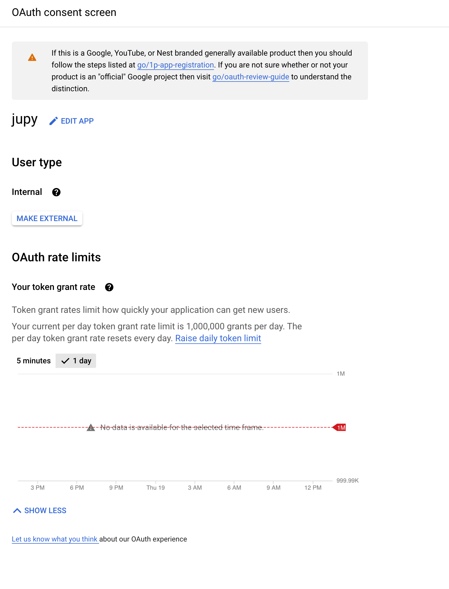
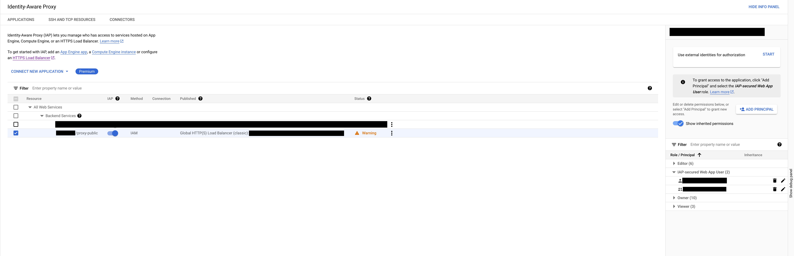

# GCP IAP Authentication

- [Creating Image with Authentication for Jupyterhub](#creating-image)
- [Authentication class and handler](#iapuserloginhandler-and-gcpiapauthenticator-class)
- [Configuration details for jupyter config yaml](#configuration)
- [Terraform variables and resources](#terraform-variables-and-resources)
- [Allowlist for IAP](#allowlist-for-iap)

## Creating Image

We combine the Jupyterhub image and our own authenticator. By default, the JupyterHub images already have pre-installed authenticator classes such as GitHub, Auth0, and Globus. In order to specify our own class for JupyterHub, our class must also live in the JupyterHub image.

> **_NOTE:_** An Artifact Registry Repo for this docker image is required. Create an AR Repo following [this guide](https://cloud.google.com/artifact-registry/docs/repositories/create-repos)

1. Setup gcloud to point to your project.

2. Navigate to the `docker_image` directory. `cd docker_image`

3. Edit the `cloudbuild.yaml` file and replace the repository with your own repository.

4. Run `gcloud builds submit --config cloudbuild.yaml .` to upload it to your repository.

5. Change the hub image name and tag in the [Jupyterhub config yaml](https://github.com/GoogleCloudPlatform/ai-on-gke/blob/main/jupyter-on-gke/jupyter_config/config-selfauth.yaml#L13).

## Configuration

To use the image once the it's uploaded to GCR/AR, edit the jupyterhub values `config.yaml` to use the image. Ex:

```yaml
hub:
  image: 
    name: gcr.io/aaronliang-agones-gke-dev/k8s-hub
    tag: latest
```

And set the authenticator class within the same file. Ex:

```yaml
...
    config: 
    JupyterHub:
      authenticator_class: 'gcpiapjwtauthenticator.GCPIAPAuthenticator'
...
```

This will tell Jupyterhub to use the specified authenticator class.

Pass the required fields needed by 'gcpiapjwtauthenticator.GCPIAPAuthenticator'. Ex:

```yaml
...
    GCPIAPAuthenticator: 
      header_name: 'X-Goog-IAP-JWT-Assertion'
      # This config option should match the aud field of the JSONWebToken. Required. 
      expected_audience: '/projects/1085966111635/global/backendServices/8415836356342891701'
...
```

Fortuantely, few of these steps are already done for you if you follow the Jupyter-on-gke instructions.

## IAPUserLoginHandler and GCPIAPAuthenticator class

There are two classes within `gcpiapjwtauthenticator.py`, IAPUserLoginHandler and GCPIAPAuthenticator.
IAPUserLoginHandler is the python class that only has the JWT handler. It is used by the GCPIAPAuthenticator and therefore by Jupyterhub.
GCPIAPAuthenticator contains the `get_handler()` method that Jupyterhub requires for a custom authenticator. When Jupyterhub uses the GCPIAPAuthenticator by calling `get_handler()`, it will receieve the `IAPUserLoginHandler.get()` handler method.

## Terraform Variables and Resources

There are a few variables required when enabling IAP Authentication:

* [`add_auth`](#add_auth)
* [`enable_iap_service`](#enable_iap_service)
* [`brand`](#brand-and-support_email)
* [`support_email`](#brand-and-support_email)

### `add_auth`

The `add_auth` variable enables IAP on the cluster and will trigger the creation of the following resources:

* [Reserved IP address](#reserved-ip-address)
* [Backend Config](#backend-config)
* [Managed Certificate](#managed-certificate)
* [Ingress](#ingress)
* [Kubernetes Secret](#kubernetes-secret)

#### Reserved IP address

Reserves a Global IP Address for IAP. Used in the Ingress and the domain associated with the IP is used in the managed certificate

#### Backend Config

This deployment associates the IAP with the K8s secret and acts as the trigger that will enable the IAP service on the application.
[Link to deployment](https://github.com/GoogleCloudPlatform/ai-on-gke/blob/main/jupyter-on-gke/iap_module/deployments/backend-config.yaml)

#### Managed Certificate

Google managed SSL certificate. Associates the IAP service with a doamin.
[Link to deployment](https://github.com/GoogleCloudPlatform/ai-on-gke/blob/main/jupyter-on-gke/iap_module/deployments/managed-cert.yaml)

#### Ingress

Ingress for the Jupyterhub proxy-public application. Has the annotations:

- kubernetes.io/ingress.global-static-ip-name
- networking.gke.io/managed-certificates

Both of which associates to the other deployments/resources created
[Link to deployment](https://github.com/GoogleCloudPlatform/ai-on-gke/blob/main/jupyter-on-gke/iap_module/deployments/static-ingress.yaml)

#### Kubernetes Secret

Contains the OAuth Client information used by the Backend Config.

### `enable_iap_service`

By default, the IAP service is not enabled on the project. If this variable is set to `true` it will enable the IAP Service on the project

### `brand` and `support_email`

To create an OAuth client, a brand is required. The brand is essentially the app show on the [OAuth consent screen](https://pantheon.corp.google.com/apis/credentials/consent). Ex:



The `support_email` variable will not be used if the `brand` variable is not filled in and is left empty. It is a required field for creating a `brand` and acts as a point of contact for users to contact with questions about consent.

## Allowlist for IAP

There are 2 ways to add users to the IAP allowlist so users can access Jupyterhub.

1. Manually on the GCloud UI
2. Add users to the allowlist file

### Manually

Navigate to [IAP](https://pantheon.corp.google.com/security/iap) and select the Backend Service associated with Jupyterhub.

Click on `Add Principal`. Add the email of the user/group and select the `IAP-secured Web App User` role to give access to that user/group



### With Allowlist file

We use terraform to automatically add principals to IAP. By filling out the `allowlist` file [here](https://github.com/GoogleCloudPlatform/ai-on-gke/blob/main/jupyter-on-gke/allowlist), terraform will give the principals the appropriate roles to access Jupyterhub. The file must follow the format of 1 principal per line.

Example:

```unset
user:exampleuser@google.com
user:exampleuser2@google.com
serviceAccount:serviceaccount-compute@gserviceaccount.com
group:jupyter-group@google.com
serviceAccount:serviceaccount1234-compute@gserviceaccount.com
```
