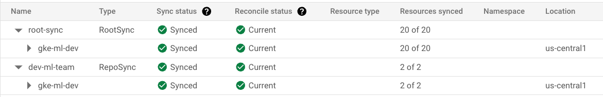

# Machine learning platform (MLP) on GKE reference architecture for enabling Machine Learning Operations (MLOps)

## Platform Principles

This reference architecture demonstrates how to build a GKE platform that facilitates Machine Learning. The reference architecture is based on the following principles:

- The platform admin will create the GKE platform using IaC tool like [Terraform][terraform]. The IaC will come with re-usuable modules that can be referred to create more resources as the demand grows.
- The platform will be based on [GitOps][gitops].
- After the GKE platform has been created, cluster scoped resources on it will be created through [Config Sync][config-sync] by the admins.
- Platform admins will create a namespace per application and provide the application team member full access to it.
- The namespace scoped resources will be created by the Application/ML teams either via [Config Sync][config-sync] or through a deployment tool like [Cloud Deploy][cloud-deploy]

## CUJ and Personae addressed in the reference architecture

### Persona : Platform Admin

**CUJ 1** : Provide templates with built-in standard practices to stamp out GKE platforms to be used by ML Engineers, Data Scientists and Application teams.

**CUJ 2** : Provide GKE clusters.

**CUJ 2** : Provide space for the teams on GKE cluster to run their workloads and the permissions following the principle of least privilege.

**CUJ 3** : Provide secure methods to the ML Engineers, Data Scientist, Application teams and the Operators to connect to the private GKE clusters.

**CUJ 4** : Enforcing security policies on the underlying platform.

### Persona : ML Engineers

**CUJ 1** : Use ML tools like `ray` to perform their day to day tasks like data pre-processing, ML training etc.

**CUJ 2** : Use a development environment like Jupyter Notebook for faster inner loop of ML development. **[TBD]**

### Persona : Operators

**CUJ 1**: Act as a bridge between the Platform admins and the ML Engineers by providing and maintaining software needed by the ML engineers so they can focus on their job.

**CUJ 2**: Deploying the models. **[TBD]**

**CUJ 3**: Building observability on the models. **[TBD]**

**CUJ 4**: Operationalizing the models. **[TBD]**

## Prerequistes

1. This tutorial has been tested on [Cloud Shell](https://shell.cloud.google.com) which comes preinstalled with [Google Cloud SDK](https://cloud.google.com/sdk) is required to complete this tutorial.
2. Familiarity with [Google Kubernetes Engine][gke], [Terraform][terraform], [root-sync][root-sync] , [repo-sync][repo-sync] , [Git][git], [GitHub][github]

# Workflow

This reference architecture can be implemented in one of the following ways:

- Deploy a single env reference architecture.
- Deploy a multi env reference architecture in single [GCP project][gcp-project]
- Deploy a multi env reference architecture with each env in its own [GCP project][gcp-project]

## Deploy a single env reference architecture

This is the quick-start deployment. It can be used to quickly set up an environment and start playing with it to get an understanding of the flow. Single env reference architecture can be deployed with the provided default values.

### Configuration

- You can either create a new GCP project or use an existing one. Skip this step if you choose to use an already existing project.
  - To create a new project, open `cloudshell` and run the following command:
    ```
    gcloud projects create <PROJECT_ID>
    ```
  - Associate billing account to the project:
    ```
    gcloud beta billing projects link <PROJECT_ID> \
    --billing-account <BILLING_ACCOUNT_ID>
    ```
- Set up PROJECT_ID in environment variable in `cloudshell` :

  ```
  export PROJECT_ID="<PROJECT_ID>" >> ~/.bashrc
  ```

  Replace <PROJECT_ID> with the id of the project that you created in the previous step or the id of an already existing project that you want to use.

  **If you are using an already existing project, get `roles/owner` role on the project**

- Update ~/bashrc to automatically point to the required project when a new instance of the `cloudshell` is created:

  ```
  echo gcloud config set project $PROJECT_ID >> ~/.bashrc && source ~/.bashrc
  ```

- Create a GCS bucket in the project for storing TF state.

  - To create a new bucket, run the following command in `cloudshell` :

    ```
    export STATE_BUCKET="${PROJECT_ID}-tf-state" >> ~/.bashrc  && source ~/.bashrc

    gcloud storage buckets create gs://${STATE_BUCKET}
    ```

- Store github configurations in environment variables:
  ```
  export GITHUB_USER=<GITHUB_USER>  >> ~/.bashrc
  export GITHUB_ORG=<GITHUB_ORGANIZATION>  >> ~/.bashrc
  export GITHUB_EMAIL=<GITHUB_EMAIL>  >> ~/.bashrc
  source ~/.bashrc
  ```
- Create a [Personal Access Token][personal-access-token] in [GitHub][github]:

  Note: It is recommended to use a [machine user account][machine-user-account] for this but you can use a personal user account just to try this reference architecture.

  - Go to https://github.com/settings/tokens and login using your credentials
  - Click "Generate new token" >> "Generate new token (classic)".
  - You will be directed to a screen to created the new token. Provide the note and expiration.
  - Choose the following two access:
    - [x] repo - Full control of private repositories
    - [x] delete_repo - Delete repositories
  - Click "Generate token"
  - Store the token in a secure file.

    ```
    # Create a secure directory
    mkdir -p ${HOME}/secrets/
    chmod go-rwx ${HOME}/secrets

    # Create a secure file
    touch ${HOME}/secrets/mlp-github-token
    chmod go-rwx ${HOME}/secrets/mlp-github-token

    # Put the token in the secure file using your prefered editor
    nano ${HOME}/secrets/mlp-github-token
    ```

### Run Terraform

- Clone the repository and change directory to the `ml-platform` directory

  ```
  git clone https://github.com/GoogleCloudPlatform/ai-on-gke
  cd ml-platform
  ```

- Set environment variables

  ```
  export MLP_BASE_DIR=$(pwd) && \
  echo "export MLP_BASE_DIR=${MLP_BASE_DIR}" >> ${HOME}/.bashrc
  ```

- Set the configuration variables

  ```
  sed -i "s/YOUR_STATE_BUCKET/${STATE_BUCKET}/g" ${MLP_BASE_DIR}/terraform/backend.tf
  sed -i "s/YOUR_GITHUB_EMAIL/${GITHUB_EMAIL}/g" ${MLP_BASE_DIR}/terraform/mlp.auto.tfvars
  sed -i "s/YOUR_GITHUB_ORG/${GITHUB_ORG}/g" ${MLP_BASE_DIR}/terraform/mlp.auto.tfvars
  sed -i "s/YOUR_GITHUB_USER/${GITHUB_USER}/g" ${MLP_BASE_DIR}/terraform/mlp.auto.tfvars
  sed -i "s/YOUR_PROJECT_ID/${PROJECT_ID}/g" ${MLP_BASE_DIR}/terraform/mlp.auto.tfvars
  ```

- Create the resources

  ```
  cd ${MLP_BASE_DIR}/terraform && \
  terraform init && \
  terraform plan -input=false -var github_token="$(tr --delete '\n' < ${HOME}/secrets/mlp-github-token)" -out=tfplan && \
  terraform apply -input=false tfplan && \
  rm tfplan
  ```

### Review the resources

#### GKE clusters and ConfigSync

- Go to Google Cloud Console, click on the navigation menu and click on Kubernetes Engine > Clusters. You should see three clusters.

- Go to Google Cloud Console, click on the navigation menu and click on Kubernetes Engine > Config. If you haven't enabled GKE Enterprise in the project earlier, Click `LEARN AND ENABLE` button and then `ENABLE GKE ENTERPRISE`. You should see a RootSync and RepoSync object.
  

#### Software installed via RepoSync and Reposync

Open `cloudshell` to execute the following commands:

- Store your GKE cluster name in env variable:

  `export GKE_CLUSTER=<GKE_CLUSTER_NAME>`

- Get cluster credentials:

  ```
  gcloud container fleet memberships get-credentials ${GKE_CLUSTER}
  ```

- Fetch kuberay operator CRDs

  ```
  kubectl get crd | grep ray
  ```

  The output will be similar to the following:

  ```
  rayclusters.ray.io   2024-02-12T21:19:06Z
  rayjobs.ray.io       2024-02-12T21:19:09Z
  rayservices.ray.io   2024-02-12T21:19:12Z
  ```

- Fetch kuberay operator pod

  ```
  kubectl get pods
  ```

  The output will be similar to the following:

  ```
  NAME                                READY   STATUS    RESTARTS   AGE
  kuberay-operator-56b8d98766-2nvht   1/1     Running   0          6m26s
  ```

- Check the namespace `ml-team` created:

  ```
  kubectl get ns | grep ml-team
  ```

- Check the RepoSync object created `ml-team` namespace:
  ```
  kubectl get reposync -n ml-team
  ```
- Check the `raycluster` in `ml-team` namespace

  ```
  kubectl get raycluster -n ml-team
  ```

  The output will be similar to the following:

  ```
  NAME                  DESIRED WORKERS   AVAILABLE WORKERS   STATUS   AGE
  ray-cluster-kuberay   1                 1                   ready    29m
  ```

- Check the head and worker pods of kuberay`in`ml-team` namespace
  ```
  kubectl get pods -n  -n ml-team
  ```
  The output will be similar to the following:
  ```
  NAME                                           READY   STATUS    RESTARTS   AGE
  ray-cluster-kuberay-head-sp6dg                 2/2     Running   0          3m21s
  ray-cluster-kuberay-worker-workergroup-rzpjw   2/2     Running   0          3m21s
  ```

### Cleanup

- Destroy the resources

  ```
  cd ${MLP_BASE_DIR}/terraform && \
  terraform init && \
  terraform destroy -auto-approve -var github_token="$(tr --delete '\n' < ${HOME}/secrets/mlp-github-token)"
  ```

[gitops]: https://about.gitlab.com/topics/gitops/
[repo-sync]: https://cloud.google.com/anthos-config-management/docs/reference/rootsync-reposync-fields
[root-sync]: https://cloud.google.com/anthos-config-management/docs/reference/rootsync-reposync-fields
[config-sync]: https://cloud.google.com/anthos-config-management/docs/config-sync-overview
[cloud-deploy]: https://cloud.google.com/deploy?hl=en
[terraform]: https://www.terraform.io/
[gke]: https://cloud.google.com/kubernetes-engine?hl=en
[git]: https://git-scm.com/
[github]: https://github.com/
[gcp-project]: https://cloud.google.com/resource-manager/docs/creating-managing-projects
[personal-access-token]: https://docs.github.com/en/authentication/keeping-your-account-and-data-secure/managing-your-personal-access-tokens
[machine-user-account]: https://docs.github.com/en/get-started/learning-about-github/types-of-github-accounts
