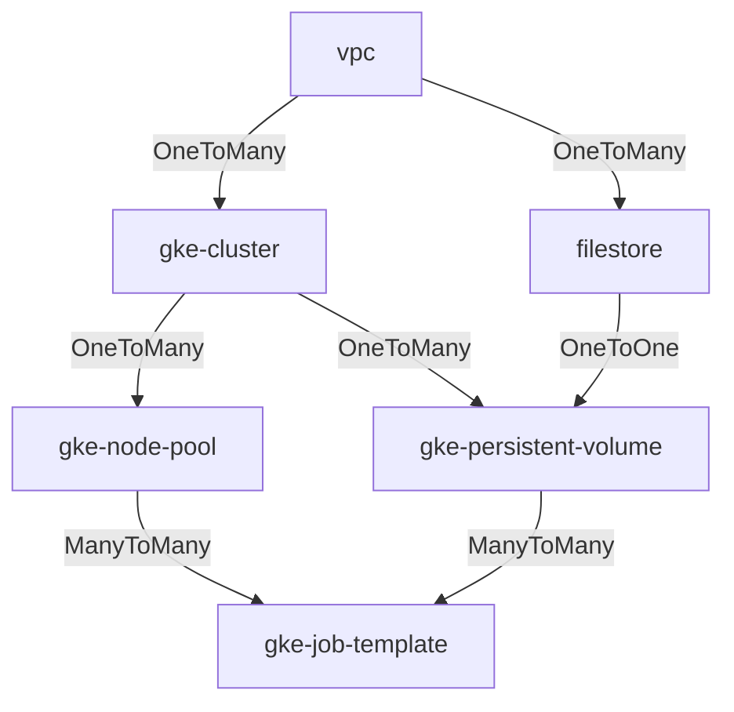

## Description

This module creates Kubernetes Persistent Volumes (PV) and Persistent Volume
Claims (PVC) that can be used by a [gke-job-template].

`gke-persistent-volume` works with Filestore and Google Cloud Storage. Each
`gke-persistent-volume` can only be used with a single file system so if multiple
shared file systems are used then multiple `gke-persistent-volume` modules are
needed in the blueprint.

> **_NOTE:_** This is an experimental module and the functionality and
> documentation will likely be updated in the near future. This module has only
> been tested in limited capacity.

### Example

The following example creates a Filestore and then uses the
`gke-persistent-volume` module to use the Filestore as shared storage in a
`gke-job-template`.

```yaml
  - id: gke_cluster
    source: modules/scheduler/gke-cluster
    use: [network1]
    settings:
      master_authorized_networks:
      - display_name: deployment-machine
        cidr_block: <your-ip-address>/32

  - id: datafs
    source: modules/file-system/filestore
    use: [network1]
    settings:
      local_mount: /data

  - id: datafs-pv
    source: modules/file-system/gke-persistent-volume
    use: [datafs, gke_cluster]

  - id: job-template
    source: modules/compute/gke-job-template
    use: [datafs-pv, compute_pool]
```

The following example creates a GCS bucket and then uses the
`gke-persistent-volume` module to use the bucket as shared storage in a
`gke-job-template`.

```yaml
  - id: gke_cluster
    source: modules/scheduler/gke-cluster
    use: [network1]
    settings:
      master_authorized_networks:
      - display_name: deployment-machine
        cidr_block: <your-ip-address>/32

  - id: data-bucket
    source: community/modules/file-system/cloud-storage-bucket
    settings:
      local_mount: /data

  - id: datafs-pv
    source: modules/file-system/gke-persistent-volume
    use: [data-bucket, gke_cluster]

  - id: job-template
    source: modules/compute/gke-job-template
    use: [datafs-pv, compute_pool, gke_cluster]
```

See example
[storage-gke.yaml](../../../../examples/README.md#storage-gkeyaml--) blueprint
for a complete example.

### Authorized Network

Since the `gke-persistent-volume` module is making calls to the Kubernetes API
to create Kubernetes entities, the machine performing the deployment must be
authorized to connect to the Kubernetes API. You can add the
`master_authorized_networks` settings block, as shown in the example above, with
the IP address of the machine performing the deployment. This will ensure that
the deploying machine can connect to the cluster.

### Connecting Via Use

The diagram below shows the valid `use` relationships for the GKE Cluster Toolkit
modules. For example the `gke-persistent-volume` module can `use` a
`gke-cluster` module and a `filestore` module, as shown in the example above.



## License

<!-- BEGINNING OF PRE-COMMIT-TERRAFORM DOCS HOOK -->
Copyright 2023 Google LLC

Licensed under the Apache License, Version 2.0 (the "License");
you may not use this file except in compliance with the License.
You may obtain a copy of the License at

     http://www.apache.org/licenses/LICENSE-2.0

Unless required by applicable law or agreed to in writing, software
distributed under the License is distributed on an "AS IS" BASIS,
WITHOUT WARRANTIES OR CONDITIONS OF ANY KIND, either express or implied.
See the License for the specific language governing permissions and
limitations under the License.

## Requirements

| Name | Version |
|------|---------|
| <a name="requirement_terraform"></a> [terraform](#requirement\_terraform) | >= 1.0 |
| <a name="requirement_google"></a> [google](#requirement\_google) | >= 4.42 |
| <a name="requirement_kubectl"></a> [kubectl](#requirement\_kubectl) | >= 1.7.0 |
| <a name="requirement_local"></a> [local](#requirement\_local) | >= 2.0.0 |

## Providers

| Name | Version |
|------|---------|
| <a name="provider_google"></a> [google](#provider\_google) | >= 4.42 |
| <a name="provider_kubectl"></a> [kubectl](#provider\_kubectl) | >= 1.7.0 |
| <a name="provider_local"></a> [local](#provider\_local) | >= 2.0.0 |

## Modules

No modules.

## Resources

| Name | Type |
|------|------|
| [kubectl_manifest.pv](https://registry.terraform.io/providers/gavinbunney/kubectl/latest/docs/resources/manifest) | resource |
| [kubectl_manifest.pvc](https://registry.terraform.io/providers/gavinbunney/kubectl/latest/docs/resources/manifest) | resource |
| [local_file.debug_file](https://registry.terraform.io/providers/hashicorp/local/latest/docs/resources/file) | resource |
| [google_client_config.default](https://registry.terraform.io/providers/hashicorp/google/latest/docs/data-sources/client_config) | data source |
| [google_container_cluster.gke_cluster](https://registry.terraform.io/providers/hashicorp/google/latest/docs/data-sources/container_cluster) | data source |

## Inputs

| Name | Description | Type | Default | Required |
|------|-------------|------|---------|:--------:|
| <a name="input_capacity_gb"></a> [capacity\_gb](#input\_capacity\_gb) | The storage capacity with which to create the persistent volume. | `number` | n/a | yes |
| <a name="input_cluster_id"></a> [cluster\_id](#input\_cluster\_id) | An identifier for the GKE cluster in the format `projects/{{project}}/locations/{{location}}/clusters/{{cluster}}` | `string` | n/a | yes |
| <a name="input_filestore_id"></a> [filestore\_id](#input\_filestore\_id) | An identifier for a filestore with the format `projects/{{project}}/locations/{{location}}/instances/{{name}}`. | `string` | `null` | no |
| <a name="input_gcs_bucket_name"></a> [gcs\_bucket\_name](#input\_gcs\_bucket\_name) | The gcs bucket to be used with the persistent volume. | `string` | `null` | no |
| <a name="input_labels"></a> [labels](#input\_labels) | GCE resource labels to be applied to resources. Key-value pairs. | `map(string)` | n/a | yes |
| <a name="input_network_storage"></a> [network\_storage](#input\_network\_storage) | Network attached storage mount to be configured. | <pre>object({<br/>    server_ip             = string,<br/>    remote_mount          = string,<br/>    local_mount           = string,<br/>    fs_type               = string,<br/>    mount_options         = string,<br/>    client_install_runner = map(string)<br/>    mount_runner          = map(string)<br/>  })</pre> | n/a | yes |

## Outputs

| Name | Description |
|------|-------------|
| <a name="output_persistent_volume_claims"></a> [persistent\_volume\_claims](#output\_persistent\_volume\_claims) | An object that describes a k8s PVC created by this module. |
<!-- END OF PRE-COMMIT-TERRAFORM DOCS HOOK -->
