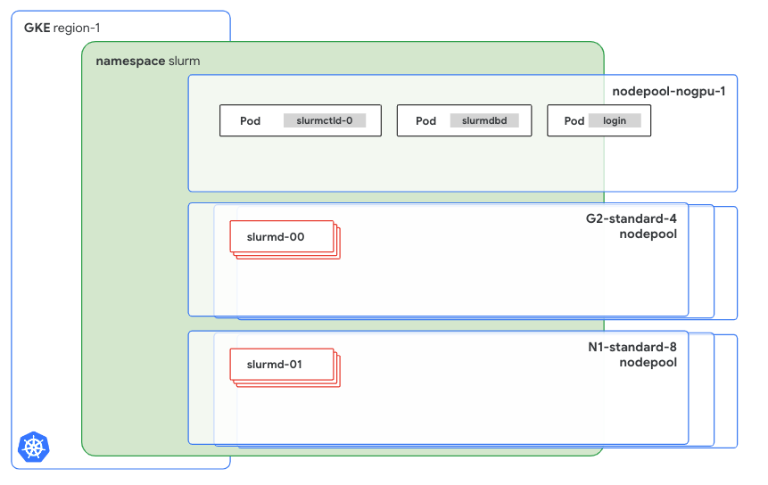

# Slurm on GKE

## Introduction

This guide shows you how to deploy [Slurm](https://slurm.schedmd.com/documentation.html) on a Google Kubernetes Engine (GKE) cluster.

Slurm (formerly known as Simple Linux Utility for Resource Management) is a powerful open-source workload manager that’s designed for Linux and Unix-like systems. It's used extensively in high performance computing (HPC) environments, including many of the world's supercomputers and large computer clusters.

Slurm uses a centralized manager (`slurmctld`) to monitor resources and work, with an optional backup manager for fault tolerance. Each compute server (node) runs a `slurmd` daemon to execute work. An optional `slurmdbd` can record accounting information for multiple Slurm-managed clusters. More information about the Slurm architecture can be found on the [SchedMD documentation website](https://slurm.schedmd.com/overview.html#architecture).

This guide is intended for platform administrators in an enterprise environment who are already managing Kubernetes or GKE clusters, and who need to set up Slurm clusters for AI/ML teams on Kubernetes. This guide is also for AI/ML startups that already use Kubernetes or GKE to run their workloads, such as inference workloads or web apps, and want to use their existing infrastructure to run training workloads with a Slurm interface. AI/ML teams that are already use Slurm can continue to use a familiar interface while onboarding on to Kubernetes or GKE.

## Benefits

Because Slurm is a workload orchestrator, it might seem counterintuitive to run it on Kubernetes–and this scenario is not a common practice. However, a team in an enterprise or an AI startup might run Slurm on Kubernetes for the following reasons:

* To avoid the sparse allocation of scarce resources, such as GPUs, between different infrastructures–for instance, splitting GPUs between Kubernetes clusters and Slurm clusters running on VMs.
* To help teams that are familiar with Slurm, and less familiar with Kubernetes, learn how to use Kubernetes more quickly. These teams typically already use Kubernetes to run other types of workloads, such as inference workloads, web apps, or stateful apps.
  
This solution lets a platform administrator team with previous Kubernetes experience, or an AI/ML team with little-to-no Kubernetes experience, set up the cluster with ready-to-use Terraform modules.

## Document scope

This solution, and the Slurm setup presented here, does not support all the Slurm features, and is not intended to be used outside the AI/ML domain. This guide is also not a recommendation document about how or when to use Slurm for HPC workloads.

The following topics are also out of scope for this guide:

* How to integrate the various combinations of the Google Cloud VM types.  
* How to dynamically split Kubernetes nodes between two orchestrators.
* How to do any advanced configuration that’s different from the one that’s presented in the introduction.

If you are searching for a guide or an automation tool that can help you set up Slurm on Google Cloud, with a focus on HPC workloads, we recommend that you use the [Google Cloud Cluster Toolkit](https://cloud.google.com/cluster-toolkit/docs/overview).

## Solution architecture

The implemented architecture is composed of multiple StatefulSets and Deployments in order to cover the different Slurm components. The following diagram shows a Slurm control plane and a data plane that are running in GKE.



Although the function of each component won’t be described in detail, it’s important to highlight how each component is configured and how it can be customized. The previous diagram identifies two main components: the Slurm control plane and the data plane.

* The Slurm control pane is hosted on `nodepool-nogpu-1`, and it contains at least three services:  
  * `The` `slurmctld-0` Pod runs `slurmctld`, which is piloted by the `slurmctld` StatefulSet.  
  * The `slurmdbd` Pod, which is controlled by a Deployment.  
  * The login Pod.  
* The data plane consists of two different `slurmd-X` instances:  
  * The first instance, called `slurmd-00`, is hosted on the `G2-standard-4` node pool.  
  * The second instance, called `slurmd-01`, is hosted on the `N1-standard-8` node pool.

### Control plane

Before proceeding further, review the Terraform module configuration for this part of the Cluster.

```HCL
module "slurm-cluster-001" {
  source           = "../modules/slurm-cluster/"
  namespace        = "slurm"
  namespace_create = true

  cluster_config = {
    name  = "linux"
    image = "IMAGE_URL_FROM_ARTIFACT_REGISTRY"
    database = {
      create          = true
      storage_size_gb = 1
      host            = "mysql"
      password        = "SET_HERE_A_BASE64_ENCODED_PASSWORD"
    }
    storage = {
      size_gb    = 100
      type       = "filestore"
      mount_path = "/home"
    }
    munge = {
      key = "PUT_HERE_YOUR_KEY"
    }
}
```

By using `namespace` and `namespace_create`, you can specify where to run the control plane. Creating the namespace can be automatic if `namespace_create` is set to `true`.

The `cluster_config` block, which the previous example code passes directly in the module for readability, specifies the following:

* All the customizable options of the solution.  
* The container image to use to run the cluster.  
* The database.  
* The storage.  
* Munge parameters.

The `database` block can auto-create a new MariaDB instance, which will be hosted on the cluster with an external volume. Alternatively, you can provide credentials to connect to a compatible external MySQL service, such as [CloudSQL](https://cloud.google.com/sql?hl=en).

The `storage` block specifies where to mount the shared filesystem in the data plane pods (`slurmd`) that will execute the jobs. The configuration of all the Slurm components, except for the database, will auto-mount on the specified shared filesystem.

The `munge` block specifies the Munge key that’s used for the secure communication between the cluster nodes. If you’re not familiar with it or with any previous Slurm setup, and you want to create a new one, the Munge key must be 32 kB. The Munge client has a [specific command](https://manpages.ubuntu.com/manpages/focal/man8/create-munge-key.8.html) to create a Munge key, and the SchedMD documentation also describes [another approach](https://slurm.schedmd.com/authentication.html#munge_setup) to creating a Munge key by using `dd`.

For more information related to the image, see the Image section of this document.

### Data plane and worker nodes

The following streamlined configuration for a new set of worker nodes requires only a few parameters:

```HCL
# example - 1
module "slurm-workers-001" {
  source = "../modules/slurm-nodeset"
  name   = "slurmd"
  config = {
    type      = "g2-standard-4"
    instances = 2
    namespace = module.slurm-cluster-001.namespace
    image     = var.config.image
  }
}

# example - 2
module "slurm-workers-002" {
  source = "../modules/slurm-nodeset"
  name   = "slurmd1"
  config = {
    type      = "n1-standard-8"
    instances = 1
    namespace = module.slurm-cluster-001.namespace
    image     = var.config.image
    accelerator = {
      type  = "nvidia-tesla-t4"
      count = 2
    }
  }
}
```

The `config` block specifies nodeset names. To name nodesets, we recommend that you use names such as `slurmd`, `slurmd1`, or `slurmd2`. For more information about this topic, see the Limitations section of this document.

In addition to nodeset names, you can use the `config` block to configure the following:

* The type of the instance, which includes all the instance types that GKE supports. For example, N1, C2, A2, or A3.  
* The number of instances to dedicate to Slurm.  
* The namespace.  
* The address of the Slurm image.

The previous example creates two nodesets: the first nodeset is created on the `g2-standard-4` instances, and the second one is created on the `n1-standard-8 instance`s. Although the configurations for both instance types are similar, N1 instances require some additional parameters because they are machines that [are not bound to a specific GPU version](https://cloud.google.com/compute/docs/gpus). Because you can choose the GPU before the machine is created–for example, when you choose the `n1-standard` machine type–the Terraform module requires you to specify the number of GPUs and the related type.

## Limitations

Because Slurm is a workload orchestrator, it overlaps with some of the components, scope, and features of Kubernetes. For example, both Slurm and Kubernetes can scale up a new node to accommodate requested resources, or allocate resources within each single node.

Although Kubernetes shouldn’t limit the number of StatefulSets that can be added to the Slurm cluster, this solution addresses DNS names and pointing by injecting the names of the StatefulSets directly into the manifests. This type of injection supports up to five static names, which include the three StatefulSets and two additional system domains.

Because of this limitation, we recommend that you have no more than three nodesets per cluster and to always use nodeset names such as `slurmd`, `slurmd-1,` or `slurmd-2`.

## Image

The provided image configuration files, which are available in the `image` directory of the repository, contain all the needed Slurm binaries. It's a best practice to have one container image for each purpose, and Google recommends that you create different images for each purpose before you put this architecture in production.

The provided Dockerfile and the `docker-entrypoint.sh` file  are used to create the base Ubuntu-based image for the setup. Although it can be used, it's not maintained and should be considered only for use in experimentation and testing.

Another best practice is to tag your images with the NVIDIA driver version that you will install. Doing so will help you manage different images because the tags match the NVIDIA driver that’s installed onto your GKE cluster.

## Notes and requirements

The current version of this guide does **not** address running the login pod with users different from root.  
The following are required to be present, configured or available:

* terraform v1.9.3 or newer  
* docker 20.10.21 or newer  
* kubectl  
* A Google Cloud organization

## Infrastructure and GKE

This section describes the steps for creating and storing the container image.

### Set up your environment

In this tutorial, you use [Cloud Shell](https://cloud.google.com/shell) to manage resources that are hosted on Google Cloud. Cloud Shell is preinstalled with the software that you need for this tutorial, including [`kubectl`](https://kubernetes.io/docs/reference/kubectl/), the [Google Cloud CLI](https://cloud.google.com/sdk/gcloud), [Helm](https://helm.sh/), and [Terraform](https://cloud.google.com/docs/terraform).

To set up your environment with Cloud Shell, follow these steps:

1\. In the [Google Cloud console](http://console.cloud.google.com), launch a Cloud Shell session by clicking *Activate Cloud Shell*. This launches a session in the bottom pane of the Google Cloud console.

2\. Set environment variables.

```bash
export PROJECT_ID=YOUR_PROJECT_ID
export REGION=europe-west3 
```

Replace *YOUR_PROJECT_ID* with your Google Cloud [project ID](https://cloud.google.com/resource-manager/docs/creating-managing-projects#identifying_projects).

3\. Set the default environment variables.

```bash
gcloud config set project ${PROJECT_ID}
```

4\. Clone the code repository.

```bash
git clone https://github.com/GoogleCloudPlatform/ai-on-gke
```

### Create your cluster infrastructure

In this section, you run a Terraform script to create a private, highly available, regional GKE cluster.

The Terraform module will also create a new project and anything that might be needed to set up the environment described in this guide. If you already have a GKE cluster where you can test the Slurm installation, you can skip this step.

5\. Initialize Terraform.

```bash
cd ai-on-gke/slurm-on-gke/infrastructure 
terraform init
```

6\. Create the `terraform.tfvars` file with your own values.

A `terraform.tfvars` file should be provided with all the values for the required variables. In the file, enter your own values as follows:

```HCL
impersonate_service_account = "YOUR_SERVICE_ACCOUNT_ID" <-- if you are using one
region                      = "europe-west3"
project_id                  = "YOUR_PROJECT_ID"
billing_account_id          = "YOUR_BILLING_ACCOUNT_ID"
folder_id                   = "folders/FOLDER_ID"
```

Retrieve your billing account ID with `gcloud billing projects describe ${PROJECT_ID} --format="value(billingAccountName)"` and your folder ID with `gcloud projects describe ${PROJECT_ID} --format="value(parent.id)"`.

**Note:** Ensure your selected region or zone offers GPU availability. Consult the [Google Cloud documentation for a complete list](https://cloud.google.com/compute/docs/gpus/gpu-regions-zones).

7\. After you fill out the file, use the following command to apply the Terraform configuration and create the infrastructure.

```bash
terraform apply
```

When you are prompted, type `yes`. It might take several minutes for this command to complete and for the cluster to show a ready status.

Terraform creates the following resources:

* A Google Cloud project.  
* A VPC network, a private subnet for the Kubernetes nodes, and a proxy-only subnet for the load balancers.  
* A firewall rule to open the SSH protocol from the Identity-Aware Proxy (IAP) ranges.  
* A router to access the internet through NAT.  
* An Artifact Registry repository to host the Slurm image.  
* A private GKE cluster in the `europe-west3` region.  
* One node pool with autoscaling enabled (1-2 nodes per zone, 1 node per zone minimum)  
* One node pool with enabled autoscaling and GPUs (1-2 nodes per zone, 1 node per zone minimum)  
* Two ServiceAccount with logging, monitoring permissions, and Artifact Registry read permissions.  
* Google Cloud Managed Service for Prometheus configuration for cluster monitoring.

The output is similar to the following:

```bash
...
Apply complete! Resources: 39 added, 0 changed, 0 destroyed.
```

An additional, commented-out Terraform configuration is already written over the `infrastructure/slurm.tf` file. The additional configuration is an example configuration for a  `g2-standard-4 node` pool.

### Create the image

In this section, you build and store the container image that you will use to deploy Slurm over the newly created or provided GKE cluster.

To build the container image, use the following commands:

```bash
cd .. # (you were in the infrastructure directory) 
cd image
docker build -t europe-west3-docker.pkg.dev/$PROJECT_ID/slurm/slurmd:535 .  
docker push europe-west3-docker.pkg.dev/$PROJECT_ID/slurm/slurmd:535
```

The output is similar to the following:

```bash
...
The push refers to repository [europe-west3-docker.pkg.dev/YOUR_PROJECT_ID/slurm/slurmd] 
df1644670bb2: Pushed  
74f700e9690e: Pushed  
676e6ba12678: Pushed  
578df7510db0: Pushed  
6551dcc8d929: Pushed  
ddcaaa531045: Pushed  
98c2ee5d21b6: Pushed  
866b7df6f372: Pushed  
139722e64731: Pushed  
87c242b383a9: Pushed  
1b9b7340fee7: Pushed  
535: digest: sha256:ced97f7cb5d0eba7114a1909c2he2e2ke21a6db1b36669a41f34a3 
size: 2632
```

Note the address of your container image because it will be requested in the following  steps.t The address should be similar to the following:

```bash
europe-west3-docker.pkg.dev/$PROJECT_ID/slurm/slurmd:535
```

### Deploy Slurm

In this section, you deploy the Slurm cluster over the newly created or provided GKE cluster.

1\. Return to the repository root directory.

```bash
cd .. # (we were in the image directory)
```

2\. Create the `terraform.tfvars` file with your own values.

A `terraform.tfvars` file should be provided with all the values for the required variables. In the file, enter your own values as follows:

```HCL
region       = "europe-west3"
project_id   = "YOUR_PROJECT_ID"
cluster_name = "cluster-1"

config = {
  name  = "linux"
  image = "europe-west3-docker.pkg.dev/YOUR_PROJECT_ID/slurm/slurmd:535"
  database = {
    create          = true
    storage_size_gb = 1
    host            = "mysql"
    password        = "SET_HERE_A_BASE64_ENCODED_PASSWORD"
  }
  storage = {
    size_gb    = 100
    type       = "filestore"
    mount_path = "/home"
  }
  munge = {
    key = "PUT_HERE_YOUR_KEY"
  }
}

impersonate_service_account = "YOUR_SERVICE_ACCOUNT_ID" <-- if you are using one

```

3\. Gather the credentials for the GKE cluster.

```bash
gcloud container clusters get-credentials cluster-1 --region europe-west3
```

4\. Initialize the Terraform configuration and apply it.

```bash
terraform init 
terraform apply 
```

When you are prompted, type `yes`. It might take several seconds for this command to complete and for the cluster to show a ready status.

The output is similar to the following:

```bash
...
Apply complete! Resources: 17 added, 0 changed, 0 destroyed.
```

5\. Check that the Slurm cluster is being deployed.

```bash
kubectl get pods -n slurm -w 
NAME                        READY   STATUS              RESTARTS   AGE
login-96bffd678-nbqwp       0/1     Pending             0          32s
mysql-746bcd47c6-mxd4f      1/1     Running             0          2m28s
slurmctld-0                 0/1     Pending             0          2m29s
slurmd1-0                   0/1     Pending             0          2m27s
slurmdbd-7b67cf9b54-dj7p4   0/1     ContainerCreating   0          31s
```

After deployment is complete, the output is similar to the following:

```bash
kubectl get pods -n slurm 
NAME                        READY   STATUS    RESTARTS   AGE
login-96bffd678-nbqwp       1/1     Running   0          4m12s 
mysql-746bcd47c6-mxd4f      1/1     Running   0          6m8s 
slurmctld-0                 1/1     Running   0          4s
slurmd1-0                   0/1     Running   0          19s 
slurmdbd-7b67cf9b54-dj7p4   1/1     Running   0          4m11s
```

6\. Verify that the Slurm cluster is working properly by logging in to the login pod.

```bash
kubectl -n slurm exec -it login-96bffd678-nbqwp -- bash 
root@login:/opt# sinfo 
PARTITION AVAIL  TIMELIMIT  NODES  STATE NODELIST 
all\*         up   infinite     79  idle~ slurmd-[0-39],slurmd1-[1-39] 
all\*         up   infinite      1   idle slurmd1-0 
1gpunodes    up   infinite     40  idle slurmd-[0-39] 
2gpunodes    up   infinite     39  idle~ slurmd1-[1-39] 
2gpunodes    up   infinite      1   idle slurmd1-0 root@login:/opt
```

## Clean up

To avoid incurring charges to your Google Cloud account for the resources that you used in this tutorial, either delete the project that contains the resources, or keep the project and delete the individual resources.

### Delete the project

The easiest way to avoid billing is to delete the project that you created for the tutorial.

Caution: Deleting a project has the following effects:

* Everything in the project is deleted. If you used an existing project for the tasks in this document, deleting the project also deletes any other work that you've done in the project.  
* Custom project IDs are lost. When you created this project, you might have created a custom project ID that you want to use in the future. To preserve the URLs that use the project ID, such as an appspot.com URL, delete selected resources inside the project instead of deleting the whole project.

If you plan to explore multiple architectures, tutorials, or quickstarts, reusing projects can help you avoid exceeding project quota limits.

1. In the Google Cloud console, go to the **Manage resources** page.  
    [Go to Manage resources](https://console.cloud.google.com/iam-admin/projects).  
2. In the project list, select the project that you want to delete, and then click **Delete**.  
3. In the dialog, type the project ID, and then click **Shut down** to delete the project.

### Delete the individual resources

If you used an existing project and you don't want to delete it entirely, delete the  
individual resources.

1\. Run the terraform destroy command to delete all the Slurm resources that you created in the previous steps:

```bash
cd slurm-on-gke terraform destroy
```

If you used an existing cluster, you can skip the following step.

2\. Run the terraform destroy command on the infrastructure directory:

```bash
cd infrastructure
terraform  destroy
```

This step deletes all the resources that you created previously: the GKE cluster, the VPC network, the firewall rules, and the Google Cloud project.

## License

* The use of the assets contained in this repository is subject to compliance with [Google's AI Principles](https://ai.google/responsibility/principles/)  
* See [LICENSE](https://github.com/GoogleCloudPlatform/ai-on-gke/blob/main/LICENSE)  
* This project is adapted from the [Stack HPC \- slurm k8s cluster project](https://github.com/stackhpc/slurm-k8s-cluster) by Giovanni Torres. Copied or derived files from the original repository, as specified within their headers, are licensed under the original MIT license and copyrighted by [Giovanni Torres](https://github.com/stackhpc/slurm-k8s-cluster/blob/main/LICENSE).
