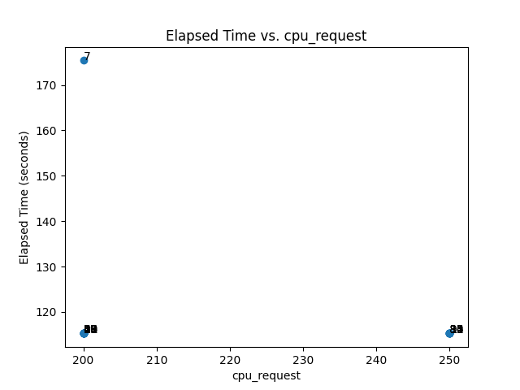
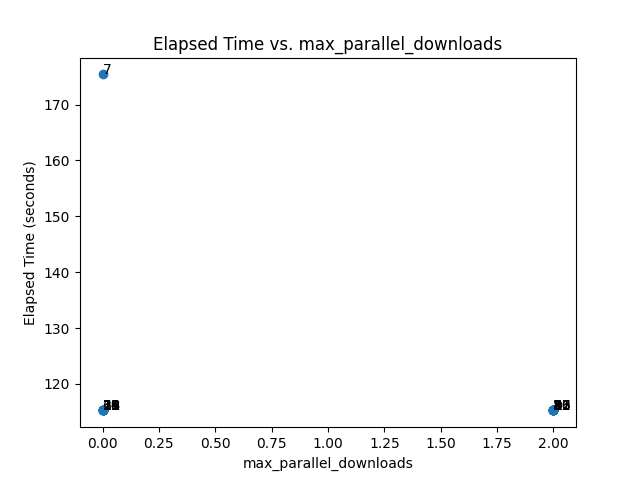

# Benchmarker CLI
This tool is to help user iterate over different configurations for GCSFuse and benchmark the data downloading time. [More details on available options for gcsfuse mount options in GKE](https://cloud.google.com/kubernetes-engine/docs/how-to/persistent-volumes/cloud-storage-fuse-csi-driver#mounting-flags)

## Table of Contents
- [Installation](#installation)
  - [From Source](#from-source)
  - [As a Go Package](#as-a-go-package)
- [Usage](#usage)
  - [Commands](#commands)
- [Examples](#examples)

## Installation

### From Source
1. **Clone the repository**:

2. **Build the CLI tool**:
   ```bash
   go build -o benchmarker
   ```

3. **Move the executable** (optional):
   ```bash
   mv benchmarker /usr/local/bin/
   ```
   This allows you to use the `benchmarker` command globally.

## Setup
```bash
gcloud container clusters get-credentials
``` 
Ensure cluster credentials are configured in kubeconfig with gcloud credential helper. 
The cluster must be able to scale up nodes or have existing nodes. 

## Usage

The Benchmarker CLI provides commands to set configurations and run benchmarks.

### Commands

#### `config`
Manage configurations for benchmarks.

- **Usage**: `benchmarker config [subcommand]`
- **Subcommands**:
  - `set`: Set a configuration file for benchmarks.

#### `run`
Run the benchmark with the current configuration.

- **Usage**: `benchmarker run`
- **Description**: Executes the benchmark process based on the specified configuration file.

## Examples

### Have a pod spec for benchmarking
Create a pod spec you want to benchmark data loading time for, 
make sure to configure Readiness probes to ensure that data expected is loaded by fuse.
Also add necessary node selectors to ensure benchmarking pods are run on preferred nodes.
[Example pod spec](example-pod.yaml)

### Set a Configuration File 
To set a configuration file named `config.yaml`, use:
```bash
benchmarker config set -f config.yaml
```
[Example config](base-config.yaml). Set limits higher than base, 
ensure the units are consistent in base and max value. Cases with Bool fields set to false and true are both generated. When file cache is not enabled, other settings are not applied. Some cases may result in failure, due to pod scheduling. Required field in configuration
- `basePodSpec`
- `volumeAttributes.bucketName`
- `volumeAttributes.mountOptions.only-dir`
Available [SidecarResource](https://cloud.google.com/kubernetes-engine/docs/how-to/persistent-volumes/cloud-storage-fuse-csi-driver#sidecar-container-resources) and [VolumeAttribute configuration fields](https://cloud.google.com/kubernetes-engine/docs/how-to/persistent-volumes/cloud-storage-fuse-csi-driver#mounting-flags)


### Run a Benchmark
After setting the configuration, run the benchmark with:
```bash
benchmarker run
```

## Plotting Results

The Benchmarker CLI includes a result visualization feature to help analyze benchmark performance across different configurations. This feature loads YAML result files, extracts key metrics, and generates scatter plots for elapsed time against various configuration parameters.

### Prerequisites
Ensure you have the following Python packages installed:
```bash
pip install -r requirements.txt
```

### Results directory
The YAML result files should be stored in a directory named `results`, with filenames following the format `case_<number>.yaml` (e.g., `case_1.yaml`, `case_2.yaml`).

### Running the Plotting Script

1. **Generate YAML result files** by running your benchmarks and saving the results in the `results` directory.
2. **Run the plotting script** to generate scatter plots:
   ```bash
   python plot_results.py
   ```

This script will:
**Generate Plots**: Scatter plots showing elapsed time versus each parameter, saved as PNG files in the `results` directory.
Each point on the scatter plots is labeled with the **case number** and its configuration is saved in `case_**case_number**.yaml`

## Example Plots
### Elapsed Time vs Max Parallel Downloads


