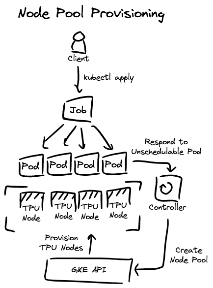

# TPU Provisioner

This [controller](https://kubernetes.io/docs/concepts/architecture/controller/) manages the lifecycle of TPU Node Pools on GKE.

## Description

The provisioning process starts with an unschedulable Pod.

</img>

Node Pools are cleaned up when no Pods are currently running on them. NOTE: System Pods will not block cleanup.

</img>

## Setup

### Permissions

Create Service Account.

```sh
gcloud iam service-accounts create tpu-provisioner
export PROVISIONER_SERVICE_ACCOUNT=tpu-provisioner@${PROJECT_ID}.iam.gserviceaccount.com
```

Give the Service Account permissions to administer GKE clusters.

```bash
gcloud projects add-iam-policy-binding $PROJECT_ID --member="serviceAccount:${PROVISIONER_SERVICE_ACCOUNT}" --role='roles/container.clusterAdmin'
```

Bind the GCP Service Account to the Kubernetes Service Account that will be attached to the controller Pod.

```sh
gcloud iam service-accounts add-iam-policy-binding ${PROVISIONER_SERVICE_ACCOUNT} \
    --role roles/iam.workloadIdentityUser \
    --member "serviceAccount:${PROJECT_ID}.svc.id.goog[tpu-provisioner-system/tpu-provisioner-controller-manager]"
```

### Building and Deploying the Controller

Build and push your image. For example:

```bash
export PROJECT_ID=example-project
export CLUSTER_NAME=ray-cluster
```

```bash
export CONTAINER_IMAGE=us-docker.pkg.dev/${PROJECT_ID}/default/tpu-provisioner:$(git rev-parse --short HEAD)
make docker-build docker-push IMG=${CONTAINER_IMAGE}
```

Set the container image in the manifests.

```bash
cd ./deploy/${PROJECT_ID}/${CLUSTER_NAME}
kustomize edit set image controller=${CONTAINER_IMAGE}
cd -
```

Edit the settings in the `./deploy/${PROJECT_ID}/${CLUSTER_NAME}/` directory to match your project (ConfigMap values and ServiceAccount annotation).

Deploy controller.

```sh
kubectl apply --server-side -k ./deploy/${PROJECT_ID}/${CLUSTER_NAME}
```

## Development

This project is written in Go and uses the [Kubebuilder](https://book.kubebuilder.io/) tool.

You’ll need a Kubernetes cluster to run against.

Impersonate the Service Account created above, for example:

```bash
# Assuming you have PROJECT_ID set in your environment...
gcloud config set auth/impersonate_service_account ${PROVISIONER_SERVICE_ACCOUNT}
```

Run the controller (this will run in the foreground, so switch to a new terminal if you want to leave it running), for example:

```bash
GCP_PROJECT_ID=your-project \
GCP_CLUSTER_LOCATION=your-cluster-region \
GCP_ZONE=your-tpu-zone \
GCP_CLUSTER=your-cluster \
GCP_NODE_SERVICE_ACCOUNT=YOUR_PROJECT_NUMBER-compute@developer.gserviceaccount.com \
make run
```

**Note:** When using `make run`, your controller will automatically use the current context in your kubeconfig file (i.e. whatever cluster `kubectl cluster-info` shows).

Test that you can apply a TPU Job.

```bash
kubectl apply -f ./examples/v4-2x2x4/
```
