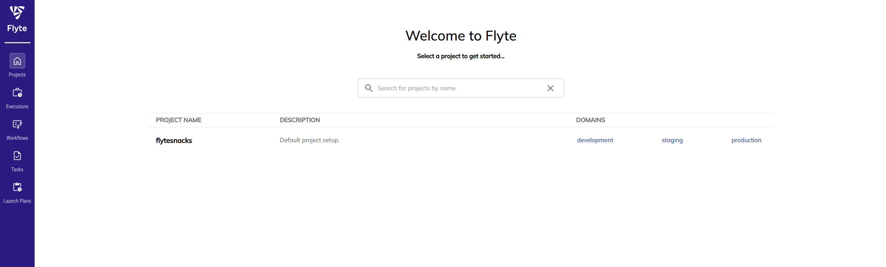

# Running Flyte on GKE


## Overview
This guide will show how to install  Flyte on GKE using Helm. Deployment will use Google Cloud Storage bucket and Cloudsql Postgresql database.

## Before you begin
1. Ensure you have a gcp project with billing enabled and enabled the GKE API.
[How to enable billing](https://cloud.google.com/billing/v1/getting-started)
And for the GKE API
```
gcloud services enable container.googleapis.com
```

2. Ensure you have the following tools installed on your workstation
* [gcloud CLI](https://cloud.google.com/sdk/docs/install)
* [gcloud kubectl](https://cloud.google.com/kubernetes-engine/docs/how-to/cluster-access-for-kubectl#install_kubectl)
* [terraform](https://developer.hashicorp.com/terraform/tutorials/aws-get-started/install-cli)

## Setting up your GKE cluster with Terraform
We’ll use Terraform to provision:
- A GKE cluster ([Autopilot](https://cloud.google.com/kubernetes-engine/docs/concepts/autopilot-overview) or [Standard](https://cloud.google.com/kubernetes-engine/docs/how-to/creating-a-regional-cluster))
- GPU node pools (only for Standard clusters)

Create your environment configuration(.tfvar) file and edit based on  example_environment.tfvars. 
```
project_id = "flyte-project"
cluster_name = "flyte-tutorial"
autopilot_cluster = true  # Set to false for Standard cluster
```
1. Initialize the modules
```bash
terraform init
```
2. Apply while referencing the `.tfvar` file we created
```bash
terraform apply -var-file=your_environment.tfvar
```
And you should see your resources created:
```
Apply complete! Resources: 0 added, 0 changed, 0 destroyed.

Outputs:

cloudsql_ip = "10.59.0.3"
cloudsql_password = <sensitive>
cloudsql_user = "flytepg"
gke_cluster_location = "us-central1"
gke_cluster_name = "flyte-test"
bucket_name = "flyte-bucket"
project_id = "flyte-bucket"
service_account = "tf-gke-flyte-test-k3af@flyte-project.iam.gserviceaccount.com"
```
3. Get kubernetes access
Fetch the kubeconfig file by running:
```bash
gcloud container clusters get-credentials $(terraform output -raw gke_cluster_name) --region $(terraform output -raw gke_cluster_location) --project $(terraform output -raw project_id)
```
4. Get the deployed service account name by running
```
terraform output service_account
```
5. Use the service account name to create an IAM policy binding to enable workload identity.
```
gcloud iam service-accounts add-iam-policy-binding SERVICE_ACCOUNT \
          --role roles/iam.workloadIdentityUser \
          --member "serviceAccount:PROJECT_ID.svc.id.goog[default/flyte-backend-flyte-binary]"
```
Where `flyte-backend-flyte-binary` is the kubernetes service account that flyte helm chart deploys by default.
6. Change all instances of `<FLYTE_IAM_SA_EMAIL>` in the included flyte.yaml helm value file to the same service account from the step 4.
```
  inline: 
    #This section automates the IAM Role annotation for the default KSA on each project namespace to enable IRSA
    #Learn more: https://docs.aws.amazon.com/eks/latest/userguide/iam-roles-for-service-accounts.html
    cluster_resources:
      customData:
      - production:
        - defaultIamServiceAccount:
            value: <FLYTE_IAM_SA_EMAIL>
      - staging:
        - defaultIamServiceAccount:
            value: <FLYTE_IAM_SA_EMAIL>
      - development:
        - defaultIamServiceAccount:
            value: <FLYTE_IAM_SA_EMAIL>
...
# serviceAccount Configure Flyte ServiceAccount
serviceAccount:
  # create Create ServiceAccount for Flyte
  create: true
  #Automates annotation of default flyte-binary KSA. Make sure to bind the KSA to the GSA: https://cloud.google.com/kubernetes-engine/docs/how-to/workload-identity#authenticating_to
  annotations:
    iam.gke.io/gcp-service-account: <FLYTE_IAM_SA_EMAIL> 
```
7. Get the cloudsql username and password
```
terraform output cloudsql_ip 
"10.59.0.3"
terraform output cloudsql_user
"flytepg"
terraform output cloudsql_password
"password"
```
and replace the values inside of flyte.yaml values file:
```
configuration:
  # database Specify configuration for Flyte's database connection
  database:
    # username Name for user to connect to database as
    username: flytepg
    # password Password to connect to database with
    # If set, a Secret will be created with this value and mounted to Flyte pod
    password: "password"
    # host Hostname of database instance
    host: 10.59.0.3
    # dbname Name of database to use
    dbname: flytepg
```
8. Get the bucket name
```
terraform output bucket_name
"flyte-bucket"
```
and replace the values in the values file
```
storage:
    # metadataContainer Bucket to store Flyte metadata
    metadataContainer: "flyte_bucket"
    # userDataContainer Bucket to store Flyte user data
    userDataContainer: "flyte_bucket"
    # provider Object store provider (Supported values: s3, gcs)
    provider: gcs
    # providerConfig Additional object store provider-specific configuration
    providerConfig:
      # gcs Provider configuration for GCS object store
      gcs:
        # project Google Cloud project in which bucket resides
        project: "flyte_project"
```
9. Add the flyte helm repo
```
helm repo add flyteorg https://flyteorg.github.io/flyte
```
10. Install flyte using Helm and the flyte.yaml values file
```
helm install flyte-backend flyteorg/flyte-binary  --namespace default --values flyte.yaml
```
And wait for helm to complete the installation

## Access the Flyte Dashboard
To access the dashboard we will use kubernetes port forwarding. 
1. Get the service name and port 
```
❯ k get svc
NAME                                 TYPE        CLUSTER-IP       EXTERNAL-IP   PORT(S)    AGE
flyte-backend-flyte-binary-grpc      ClusterIP   34.118.237.187   <none>        8089/TCP   4h17m
flyte-backend-flyte-binary-http      ClusterIP   34.118.226.45    <none>        8088/TCP   4h17m
flyte-backend-flyte-binary-webhook   ClusterIP   34.118.237.19    <none>        443/TCP    4h17m
kubernetes                           ClusterIP   34.118.224.1     <none>        443/TCP    5h17m
```
2. Use kubectl port-forward to do the actual forwarding
```
k port-forward svc/flyte-backend-flyte-binary-http 8088:8088
Forwarding from 127.0.0.1:8088 -> 8088
Forwarding from [::1]:8088 -> 8088
```
3. Access http://localhost:8088/console


## Cleanup
Remove the flyte helm installation
```
helm delete flyte-backend
```
Finally destroy the provisioned infrastructure.
```bash
terraform destroy -var-file=your_environment.tfvars
```