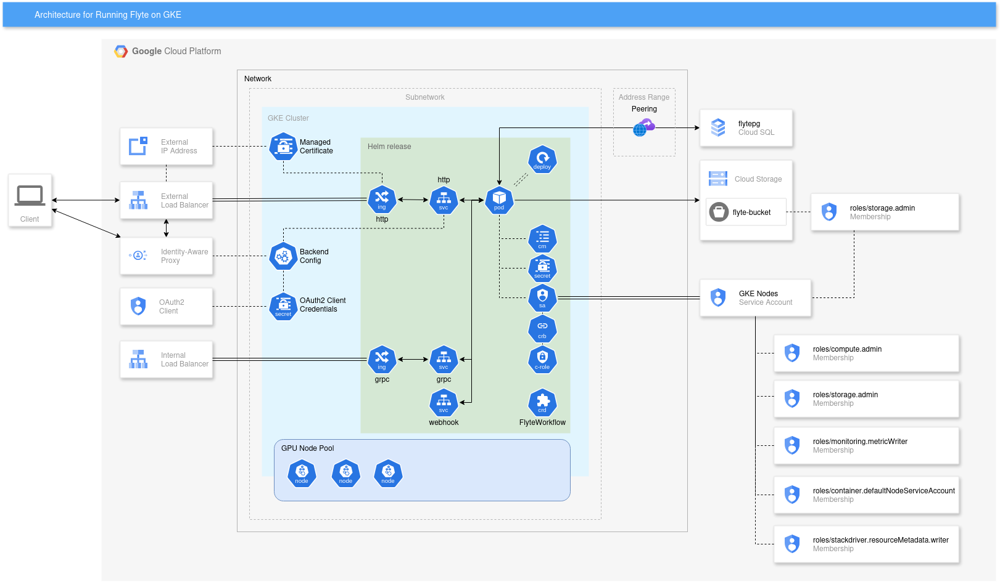

# Running Flyte on GKE

## Overview

This guide will show how to install Flyte on GKE using Helm. Deployment will use Google Cloud Storage bucket and Cloud SQL PostgreSQL database.

## Before you begin

1. Ensure you have a GCP project with billing enabled and have enabled the GKE API.

   * Follow [this link](https://cloud.google.com/billing/v1/getting-started) to learn how to enable billing for your project.

   * GKE API can be enabled by running:

     `gcloud services enable container.googleapis.com`

1. Ensure you have the following tools installed on your workstation:

   * [gcloud](https://cloud.google.com/sdk/docs/install)
   * [kubectl](https://cloud.google.com/kubernetes-engine/docs/how-to/cluster-access-for-kubectl#install_kubectl)
   * [terraform](https://developer.hashicorp.com/terraform/tutorials/aws-get-started/install-cli)
   * [helm](https://helm.sh/docs/intro/install/)

## Architecture overview



## Setting up your GKE cluster with Terraform

Let's start with setting up the infrastructure using Terraform. The Terraform configuration will create an [Autopilot](https://cloud.google.com/kubernetes-engine/docs/concepts/autopilot-overview) or [Standard](https://cloud.google.com/kubernetes-engine/docs/how-to/creating-a-regional-cluster) GKE cluster with GPU node pools (only for Standard clusters).

1. Create variables file for Terraform.

   Copy the `example_environment.tfvars` file to a new file, e.g., `your_environment.tfvars`, and fill `project_id` and `cluster_name` with your values. You can also adjust any other parameters as you need.

   ```hcl
   project_id = "flyte-project"
   cluster_name = "flyte-tutorial"
   autopilot_cluster = true  # Set to false for Standard    cluster
   ```

2. Initialize and apply the Terraform configuration.

   ```bash
   terraform init
   terraform apply -var-file=your_environment.tfvars
   ```

   After the Terraform apply finishes, you should see output similar to the following:

   ```text
   Apply complete! [...]

   Outputs:

   cloudsql_ip = "10.59.0.3"
   cloudsql_password = <sensitive>
   cloudsql_user = "flytepg"
   gke_cluster_location = "us-central1"
   gke_cluster_name = "flyte-test"
   bucket_name = "flyte-bucket"
   project_id = "flyte-project"
   service_account = "tf-gke-flyte-test-k3af@flyte-project.iam.gserviceaccount.com"
   ```

3. Get Kubernetes access.

   Run the following command to get the credentials for the GKE cluster:

   ```bash
   gcloud container clusters get-credentials $(terraform output -raw gke_cluster_name) \
     --region $(terraform output -raw gke_cluster_location) \
     --project $(terraform output -raw project_id)
   ```

4. Configure Flyte Helm values.

   Make a copy of the `flyte.yaml.tpl` file and name it `flyte.yaml`. Open the `flyte.yaml` file and replace the placeholders with the values from the Terraform output:

   * replace `${FLYTE_IAM_SA_EMAIL}` with the service account email (4 occurrences)
   * replace `${PROJECT_ID}` with the project ID (3 occurrences)
   * replace `${BUCKET_NAME}` with the bucket name (2 occurrences)
   * replace `${CLOUDSQL_IP}`, `${CLOUDSQL_DBNAME}`, `${CLOUDSQL_USERNAME}` and `${CLOUDSQL_PASSWORD}` with corresponding values (1 occurrence each; use `terraform output cloudsql_password` to get the password)

5. Install Flyte to the GKE cluster using Helm.

   ```bash
   helm install flyte-backend flyte-binary \
     --repo https://flyteorg.github.io/flyte \
     --namespace default \
     --values flyte.yaml
   ```

   After Helm finishes deploying the resources, wait for the pods to be in the `Running` state. Note that in the case of an Autopilot cluster, it may take significant time. You can use this command to track the progress:

   ```bash
   kubectl get pods -n default -w
   ```

   In case of any issues, you can check the logs of the pods using `kubectl logs <pod-name> -n default`. Then, after changing the values, you can update the Helm release using `helm upgrade` command with the same arguments as the `helm install` command.

## Access the Flyte Dashboard

At this point, the Flyte dashboard is not exposed to the internet. Let's access it using Kubernetes port forwarding.

1. List the services and find the service name for the Flyte HTTP service:

   ```bash
   $ kubectl get svc
   NAME                                 TYPE        CLUSTER-IP       PORT(S)
   flyte-backend-flyte-binary-grpc      ClusterIP   34.118.237.187   8089/TCP
   flyte-backend-flyte-binary-http      ClusterIP   34.118.226.45    8088/TCP
   flyte-backend-flyte-binary-webhook   ClusterIP   34.118.237.19    443/TCP
   ```

2. Use `kubectl port-forward` command to forward the Flyte HTTP service to your local machine:

   ```bash
   $ kubectl port-forward svc/flyte-backend-flyte-binary-http 8088:8088
   Forwarding from 127.0.0.1:8088 -> 8088
   Forwarding from [::1]:8088 -> 8088
   ```

   We recommend running this command in a separate terminal window or tab.

3. Open <http://localhost:8088/console> in your browser to access the Flyte dashboard.
   You should see the following screen:
   

   If you experience issues accessing the dashboard, make sure the pods are running and the port forwarding is set up correctly.

## Install Flyte CLI and run a sample workflow

1. First, create a virtual environment. The following commands will create a virtual environment in the `venv` directory and activate it:

   ```bash
   python3 -m virtualenv venv
   source venv/bin/activate
   ```

2. Install Flytekit using pip:

   ```bash
   pip install flytekit
   ```

3. Install flytectl.
   Go to the [releases page](https://github.com/flyteorg/flyte/releases), find the latest release for the `flytectl` binary, and download the one for your operating system. Unpack the archive, move the binary to a directory in your PATH, and make it executable. The actual commands may vary depending on the operating system and the version of the binary.

   For example, on Linux x86_64:

   ```bash
   curl -L -o /tmp/flytectl.tar.gz https://github.com/flyteorg/flyte/releases/download/${VERSION}/flytectl_Linux_x86_64.tar.gz
   tar -xvf /tmp/flytectl.tar.gz
   sudo install flytectl /usr/local/bin/flytectl
   ```

   In the above commands, replace `${VERSION}` with the actual release tag.

4. Start port forwarding for the Flyte GRPC service:

   ```bash
   kubectl port-forward svc/flyte-backend-flyte-binary-grpc 8089:8089
   ```

   We recommend running this command in a separate terminal window or tab.

5. Configure Flyte CLI to use backend running on the GKE cluster through port forwarding:

   ```bash
   flytectl config init --insecure --host localhost:8089
   ```

   If you get a connection error, make sure the port forwarding is set up correctly.

   If you see the message `Init flytectl config file at ...`, the configuration was successful.

6. Initialize a new Flyte project using the hello-world template:

   ```bash
   pyflyte init --template hello-world hello-world
   cd hello-world
   ```

7. Run the sample workflow in the Flyte cluster:

   ```bash
   pyflyte run --remote example.py hello_world_wf
   ```

   By default it runs the workflow in the `flytesnacks` project, in the `development` domain. You can change the project and domain using the `--project` and `--domain` flags.

8. Now Flyte will run the workflow on the GKE cluster. You can check the status of the workflow in the Flyte dashboard (ensure that port forwarding for the HTTP service is still active).
   You can also check the status using the `flytectl` CLI:

   ```bash
   flytectl get execution -p flytesnacks -d development
   ```

   Note the execution ID and wait for the execution to complete. If it fails, check the logs of the pod running the workflow:

   ```bash
   kubectl get pods -n flytesnacks-development
   kubectl logs -n flytesnacks-development <pod-name>
   ```

   In the second command above, replace `<pod-name>` with the actual name of the pod obtained from the first command.

9. To view the details of the workflow execution, including inputs and outputs, run:

   ```bash
   flytectl get execution -p flytesnacks -d development --details <execution-id>
   ```

   Replace `<execution-id>` with the actual execution ID.

## Publish service to the Internet

The following section will guide you through exposing Flyte dashboard and gRPC service to the Internet. As gRPC protocol works over HTTP/2 that in turn requires TLS, we will also need to create a certificate for flyte-backend itself. We will use a self-signed certificate for this purpose. So the steps are:

1. Create a static IP address for the Ingress and configure DNS.
2. Create a managed certificate for the Ingress.
3. Create a self-signed certificate for flyte-backend.
4. Update Helm configuration to use the self-signed certificate.
5. Create Ingress resource for Flyte.

### 1. Create a static IP address for the Ingress and configure DNS

Run the following command to create a global static IP address:

```bash
gcloud compute addresses create flyte --global --ip-version=IPV4
```

Get details about the created IP address and note the IP address value:

```bash
gcloud compute addresses describe flyte --global
```

If you have a domain you want to use, go to your domain registrar and create an A record pointing to the IP address you just created. If you don't have a domain, but you want to test this setup, you can use the `sslip.io` service. In that case, use the domain `<cloud-ip-address>.sslip.io` where `<cloud-ip-address>` is the IP address you just created. The other advantage of using `sslip.io` is that you don't have to manage DNS records nor wait for them to propagate.

### 2. Create a managed certificate

To create a managed certificate, you need to create a `ManagedCertificate` resource in the cluster. Put the following content in a file named `managed-certificate.yaml` and replace `<your-domain>` with the domain you want to use:

```yaml
# managed-certificate.yaml
---
apiVersion: networking.gke.io/v1
kind: ManagedCertificate
metadata:
  name: flyte
spec:
  domains:
    - <your-domain>
```

Then, apply the configuration:

```bash
kubectl apply -f managed-certificate.yaml
```

### 3. Create a self-signed certificate for flyte-backend

Now, let's create a self-signed certificate for flyte-backend. If you have `openssl` installed, you can generate a self-signed certificate using the following command:

```bash
openssl req -newkey rsa:2048 -nodes -keyout private_key.pem -x509 -days 3650 -out public_certificate.pem -subj /CN=flyte-backend/ -addext "subjectAltName = IP:127.0.0.1,DNS:0.0.0.0:8088,DNS:localhost,DNS:flyte-backend"
```

Alternatively, you can use any other tool you like to generate the certificate. It's important to include the `subjectAltName` (`SAN`) extension with the `DNS:0.0.0.0:8088` value (though it's not a valid domain name) because the flyte binary uses that address internally and the certificate must be valid for it. All other values are optional and can be adjusted to your needs or left as they are. The CN value is not important and can be anything.

Next, create a Kubernetes secret with the certificate:

```bash
kubectl create secret tls flyte-backend-grpc-tls --cert=public_certificate.pem --key=private_key.pem
```

### 4. Update Flyte configuration

Now, update the `flyte.yaml` file to configure Flyte to use the self-signed certificate. First, insert the following configuration to configure the deployment to mount the secret with the self-signed certificate and configure the probes to use HTTPS:

```yaml
deployment:
  # Mount the secret with the self-signed certificate
  extraVolumes:
    - name: tls-certs
      secret:
        secretName: flyte-backend-grpc-tls
  extraVolumeMounts:
    - name: tls-certs
      mountPath: /etc/flyte/tls
      readOnly: true
  # Configure probe to use HTTPS
  livenessProbe:
    failureThreshold: 3
    httpGet:
      path: /healthcheck
      port: http
      scheme: HTTPS
    initialDelaySeconds: 30
    periodSeconds: 10
    successThreshold: 1
    timeoutSeconds: 1
  readinessProbe:
    failureThreshold: 3
    httpGet:
      path: /healthcheck
      port: http
      scheme: HTTPS
    initialDelaySeconds: 30
    periodSeconds: 10
    successThreshold: 1
    timeoutSeconds: 1
service:
  commonAnnotations:
    cloud.google.com/app-protocols: '{"http":"HTTP2"}'
```

Then, insert the following configuration to adjust the configuration of the Flyte binary to enable TLS using the self-signed certificate:

```yaml
configuration:
  # ...
  # Other configuration here
  # ...

  inline:
    # ...
    # Other configuration here
    # ...

    # Fix admin server endpoint configuration
    admin:
      endpoint: localhost:8088
      insecure: false
      caCertFilePath: /etc/flyte/tls/tls.crt
    # Enable TLS
    server:
      security:
        secure: true
        ssl:
          certificateFile: /etc/flyte/tls/tls.crt
          keyFile: /etc/flyte/tls/tls.key
```

Finally, apply the updated configuration by upgrading the Helm release:

```bash
helm upgrade flyte-backend flyte-binary \
  --repo https://flyteorg.github.io/flyte \
  --namespace default \
  --values flyte.yaml
```

### 5. Create Ingress resource for Flyte

Finally, create an Ingress resource to expose the Flyte dashboard and gRPC service to the Internet. Put the following content in a file named `ingress.yaml` and apply the configuration:

```yaml
# ingress.yaml
---
apiVersion: networking.k8s.io/v1
kind: Ingress
metadata:
  annotations:
    kubernetes.io/ingress.class: gce
    kubernetes.io/ingress.global-static-ip-name: flyte
    networking.gke.io/managed-certificates: flyte
  name: flyte-backend-flyte-binary-http
spec:
  defaultBackend:
    service:
      name: flyte-backend-flyte-binary-http
      port:
        number: 8088
```

```bash
kubectl apply -f ingress.yaml
```

Wait some time for the certificate to be provisioned and the Load Balancer to be created. You can check the status of the certificate by running:

```bash
kubectl get managedcertificate flyte
```

When the status is `Active`, you should be able to access the Flyte dashboard via the domain you specified, the link would look like `https://<your-domain>/console`. If you get an SSL error, wait for a couple of minutes more and try again.

Also, you should be able to use the `flytectl` CLI without port forwarding and `insecure` flag. To do that, update the `flytectl` configuration:

```bash
flytectl config init --host https://<your-domain>
```

Try sheduling a new execution using the `pyflyte` CLI as we did before and check the status using the `flytectl` CLI (`flytectl get execution -p flytesnacks -d development`) or the Flyte dashboard (`https://<your-domain>/console`).

## Enable authentication using Google OAuth

### 1. Register OAuth 2.0 client

Visit the [Credentials page](https://console.cloud.google.com/apis/credentials) and select "Create OAuth client ID" on the top of the page.

When asked to choose the application type, select "Web application". In the "Authorized redirect URIs" section, add the following URI: `https://<your-domain>` (replace `<your-domain>` with the actual domain you are using).

Note the client ID and client secret values. You will need them in the next step.

### 2. Generate a random internal secret

To enable authentication you also need to generate a random secret to be used internally by flytepropeller. You can use any password generator you like or run the following command:

```bash
openssl rand -base64 32
```

Also, you need a bcrypt hash of the secret. You can generate it using the following command, replacing `<random-secret>` with the secret you generated:

```bash
pip install bcrypt && python -c 'import bcrypt; import base64; print(base64.b64encode(bcrypt.hashpw("<random-secret>".encode("utf-8"), bcrypt.gensalt(6))))'
```

### 3. Update Flyte configuration

Now, update the `flyte.yaml` file. Add the `configuration.auth` section, providing the OAuth 2.0 client ID and secret, and the internal secret and its bcrypt hash you just generated. Also, add the domain you are using to the `authorizedUris` list:

```yaml
configuration:
  # ...
  # Other configuration here
  # ...

  auth:
    enabled: true
    oidc:
      baseUrl: https://accounts.google.com
      clientId: <oauth-client-id>
      clientSecret: <oauth-client-secret>
    internal:
      clientSecret: <random-secret>
      clientSecretHash: <random-secret-bcrypt-hash>

    authorizedUris: [ https://<your-domain> ]
```

Finally, apply the updated configuration by upgrading the Helm release:

```bash
helm upgrade flyte-backend flyte-binary \
  --repo https://flyteorg.github.io/flyte \
  --namespace default \
  --values flyte.yaml
```

Now, when you access the Flyte dashboard, you should be prompted to log in using your Google account. After successful authentication, you should be able to access the Flyte dashboard. Note that in the bottom left corner, you should see the button with your initials, which indicates that you are logged in.

Authentication for CLI tools will be handled automatically, so you don't need to do anything else to enable it.

And that's it! You have successfully deployed Flyte on GKE, exposed the dashboard and gRPC service to the Internet, and enabled authentication using Google OAuth.

## Cleanup

Remove the Flyte Helm installation:

```bash
helm delete flyte-backend
```

Delete the static IP address:

```bash
gcloud compute addresses delete flyte --global
```

Go to the [Credentials page](https://console.cloud.google.com/apis/credentials) and delete the OAuth 2.0 client.

Finally, destroy the provisioned infrastructure:

```bash
terraform destroy -var-file=your_environment.tfvars
```
