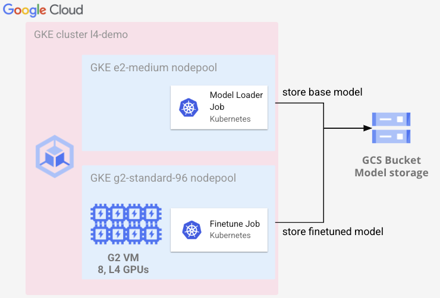

# Tutorial: Finetuning Llama 7b on GKE using L4 GPUs

We’ll walk through fine-tuning a Llama 2 7B model using GKE using 8 x L4 GPUs. L4 GPUs are suitable for many use cases beyond serving models. We will demonstrate how the L4 GPU is a great option for fine tuning LLMs, at a fraction of the cost of using a higher end GPU.

Let’s get started and fine-tune Llama 2 7B on the [dell-research-harvard/AmericanStories](https://huggingface.co/datasets/dell-research-harvard/AmericanStories) dataset using GKE.
Parameter Efficient Fine Tuning (PEFT) and LoRA is used so fine-tuning is posible
on GPUs with less GPU memory. 

As part of this tutorial, you will get to do the following:

*   Create a GKE cluster with an autoscaling L4 GPU nodepool
*   Run a Kubernetes Job to download Llama 2 7B and fine-tune using L4 GPUs




## Prerequisites
*   A terminal with `kubectl` and `gcloud` installed. Cloud Shell works great!
*   L4 GPUs quota to be able to run additional 8 L4 GPUs
*   Request access to Meta Llama models by submitting the [request access form](https://ai.meta.com/resources/models-and-libraries/llama-downloads/)
*   Agree to the Llama 2 terms on the [Llama 2 7B HF](https://huggingface.co/meta-llama/Llama-2-7b-hf) model in HuggingFace


## Creating the GKE cluster with L4 nodepools
Let’s start by setting a few environment variables that will be used throughout this post. You should modify these variables to meet your environment and needs. 

Download the code and files used throughout the tutorial:
```bash
git clone https://github.com/GoogleCloudPlatform/ai-on-gke
cd ai-on-gke/tutorials-and-examples/genAI-LLM/finetuning-llama-7b-on-l4
```

Run the following commands to set the env variables and make sure to replace `<my-project-id>`:

```bash
gcloud config set project <my-project-id>
export PROJECT_ID=$(gcloud config get project)
export REGION=us-central1
export BUCKET_NAME=${PROJECT_ID}-llama-l4
export SERVICE_ACCOUNT="l4-demo@${PROJECT_ID}.iam.gserviceaccount.com"
```

> Note: You might have to rerun the export commands if for some reason you reset your shell and the variables are no longer set. This can happen for example when your Cloud Shell disconnects.

Create the GKE cluster by running:
```bash
gcloud container clusters create l4-demo --location ${REGION} \
  --workload-pool ${PROJECT_ID}.svc.id.goog \
  --enable-image-streaming --enable-shielded-nodes \
  --shielded-secure-boot --shielded-integrity-monitoring \
  --enable-ip-alias \
  --node-locations=${REGION}-a \
  --workload-pool=${PROJECT_ID}.svc.id.goog \
  --labels="ai-on-gke=l4-demo" \
  --addons GcsFuseCsiDriver
```

(Optional) In environments where external IP addresses are not allowed you can add the following arguments to the create GKE cluster command:
```bash
  --no-enable-master-authorized-networks \
  --enable-private-nodes  --master-ipv4-cidr 172.16.0.32/28
```

Let’s create a nodepool for our finetuning which will use 8 L4 GPUs per VM.
Create the `g2-standard-96` nodepool by running:
```bash
gcloud container node-pools create g2-standard-96 --cluster l4-demo \
  --accelerator type=nvidia-l4,count=8,gpu-driver-version=latest \
  --machine-type g2-standard-96 \
  --ephemeral-storage-local-ssd=count=8 \
  --enable-autoscaling --enable-image-streaming \
  --num-nodes=0 --min-nodes=0 --max-nodes=3 \
  --shielded-secure-boot \
  --shielded-integrity-monitoring \
  --node-locations ${REGION}-a,${REGION}-b --region ${REGION}
```

> Note: The `--node-locations` flag might have to be adjusted based on which region you choose. Please check which zones the [L4 GPUs are available](https://cloud.google.com/compute/docs/gpus/gpu-regions-zones) if you change the region to something other than `us-central1`.

The nodepool has been created and is scaled down to 0 nodes. So you are not paying for any GPUs until you start launching Kubernetes Pods that request GPUs.

## Run a Kubernetes job to fine-tune Llama 2 7B

Finetuning requires a base model and a dataset. For this post, the [dell-research-harvard/AmericanStories](https://huggingface.co/datasets/dell-research-harvard/AmericanStories) dataset will be used to fine-tune the [Llama 2 7B](https://huggingface.co/meta-llama/Llama-2-7b-hf) base model. GCS will be used for storing the base model. GKE with GCSFuse is used to transparently save the fine-tuned model to GCS. This provides a cost efficient way to store and serve the model and only pay for the storage used by the model.


### Configuring GCS and required permissions

Create a GCS bucket to store our models:
```bash
gcloud storage buckets create gs://${BUCKET_NAME}
```

The model loading Job will write to GCS. So let’s create a Google Service Account that has read and write permissions to the GCS bucket. Then create a Kubernetes Service Account named `l4-demo` that is able to use the Google Service Account.

To do this, first create a new Google Service Account:
```bash
gcloud iam service-accounts create l4-demo
```

Assign the required GCS permissions to the Google Service Account:
```bash
gcloud storage buckets add-iam-policy-binding gs://${BUCKET_NAME} \
  --member="serviceAccount:${SERVICE_ACCOUNT}" --role=roles/storage.admin
```

Allow the Kubernetes Service Account `l4-demo` in the `default` namespace to use the Google Service Account:
```bash
gcloud iam service-accounts add-iam-policy-binding ${SERVICE_ACCOUNT} \
  --role roles/iam.workloadIdentityUser \
  --member "serviceAccount:${PROJECT_ID}.svc.id.goog[default/l4-demo]"
```

Create a new Kubernetes Service Account:
```bash
kubectl create serviceaccount l4-demo
kubectl annotate serviceaccount l4-demo iam.gke.io/gcp-service-account=l4-demo@${PROJECT_ID}.iam.gserviceaccount.com
```

Hugging face requires authentication to download the[ Llama 2 7B HF](https://huggingface.co/meta-llama/Llama-2-7b-hf) model, which means an access token is required to download the model.

You can get your access token from [huggingface.com > Settings > Access Tokens](https://huggingface.co/settings/tokens). Make sure to copy it and then use it in the next step when you create the Kubernetes Secret.

Create a Secret to store your HuggingFace token which will be used by the Kubernetes job:
```bash
kubectl create secret generic l4-demo \
  --from-literal="HF_TOKEN=<paste-your-own-token>"
```

Let's use Kubernetes Job to download the Llama 2 7B model from HuggingFace.
The file `download-model.yaml` in this repo shows how to do this:

[embedmd]:# (download-model.yaml)
```yaml
apiVersion: batch/v1
kind: Job
metadata:
  name: model-loader
  namespace: default
spec:
  template:
    metadata:
      annotations:
        kubectl.kubernetes.io/default-container: loader
        gke-gcsfuse/volumes: "true"
        gke-gcsfuse/memory-limit: 400Mi
        gke-gcsfuse/ephemeral-storage-limit: 30Gi
    spec:
      restartPolicy: OnFailure
      containers:
      - name: loader
        image: python:3.11
        command:
        - /bin/bash
        - -c
        - |
          pip install huggingface_hub
          mkdir -p /gcs-mount/llama2-7b
          python3 - << EOF
          from huggingface_hub import snapshot_download
          model_id="meta-llama/Llama-2-7b-hf"
          snapshot_download(repo_id=model_id, local_dir="/gcs-mount/llama2-7b",
                            local_dir_use_symlinks=False, revision="main",
                            ignore_patterns=["*.safetensors", "model.safetensors.index.json"])
          EOF
        imagePullPolicy: IfNotPresent
        env:
        - name: HUGGING_FACE_HUB_TOKEN
          valueFrom:
            secretKeyRef:
              name: l4-demo
              key: HF_TOKEN
        volumeMounts:
        - name: gcs-fuse-csi-ephemeral
          mountPath: /gcs-mount
      serviceAccountName: l4-demo
      volumes:
      - name: gcs-fuse-csi-ephemeral
        csi:
          driver: gcsfuse.csi.storage.gke.io
          volumeAttributes:
            bucketName: ${BUCKET_NAME}
            mountOptions: "implicit-dirs"
```

Run the Kubernetes Job to download the the Llama 2 7B model to the bucket created previously:
```bash
envsubst < download-model.yaml | kubectl apply -f -
```
> Note: `envsubst` is used to replace `${BUCKET_NAME}` inside `download-model.yaml` with your own bucket.

Give it a minute to start running, once up you can watch the logs of the job by running:
```bash
kubectl logs -f -l job-name=model-loader
```

Once the job has finished you can verify the model has been downloaded by running:
```bash
gcloud storage ls -l gs://$BUCKET_NAME/llama2-7b/
```

Let’s write our finetuning job code by using the HuggingFace library for training.

The `fine-tune.py` file in this repo will be used to do the finetuning. Let's take
a look what's inside:

[embedmd]:# (fine-tune.py)
```py
from pathlib import Path
from datasets import load_dataset, concatenate_datasets
from transformers import AutoTokenizer, AutoModelForCausalLM, Trainer, TrainingArguments, DataCollatorForLanguageModeling
from peft import get_peft_model, LoraConfig, prepare_model_for_kbit_training
import torch

# /gcs-mount will mount the GCS bucket created earlier
model_path = "/gcs-mount/llama2-7b"
finetuned_model_path = "/gcs-mount/llama2-7b-american-stories"

tokenizer = AutoTokenizer.from_pretrained(model_path, local_files_only=True)
model = AutoModelForCausalLM.from_pretrained(
            model_path, torch_dtype=torch.float16, device_map="auto", trust_remote_code=True)

dataset = load_dataset("dell-research-harvard/AmericanStories",
    "subset_years",
    year_list=["1809", "1810", "1811", "1812", "1813", "1814", "1815"]
)
dataset = concatenate_datasets(dataset.values())

if tokenizer.pad_token is None:
    tokenizer.add_special_tokens({'pad_token': '[PAD]'})
    model.resize_token_embeddings(len(tokenizer))

data = dataset.map(lambda x: tokenizer(
    x["article"], padding='max_length', truncation=True))

lora_config = LoraConfig(
 r=16,
 lora_alpha=32,
 lora_dropout=0.05,
 bias="none",
 task_type="CAUSAL_LM"
)

model = prepare_model_for_kbit_training(model)

# add LoRA adaptor
model = get_peft_model(model, lora_config)
model.print_trainable_parameters()

training_args = TrainingArguments(
        per_device_train_batch_size=1,
        gradient_accumulation_steps=4,
        warmup_steps=2,
        num_train_epochs=1,
        learning_rate=2e-4,
        fp16=True,
        logging_steps=1,
        output_dir=finetuned_model_path,
        optim="paged_adamw_32bit",
)

trainer = Trainer(
    model=model,
    train_dataset=data,
    args=training_args,
    data_collator=DataCollatorForLanguageModeling(tokenizer, mlm=False),
)
model.config.use_cache = False  # silence the warnings. Please re-enable for inference!

trainer.train()

# Merge the fine tuned layer with the base model and save it
# you can remove the line below if you only want to store the LoRA layer
model = model.merge_and_unload()

model.save_pretrained(finetuned_model_path)
tokenizer.save_pretrained(finetuned_model_path)
# Beginning of story in the dataset
prompt = """
In the late action between Generals


Brown and Riall, it appears our men fought
with a courage and perseverance, that would
"""
input_ids = tokenizer(prompt, return_tensors="pt").input_ids
gen_tokens = model.generate(
    input_ids,
    do_sample=True,
    temperature=0.8,
    max_length=100,
)
print(tokenizer.batch_decode(gen_tokens)[0])
```

Let’s review the high level of what we’ve included in `fine-tune.py`. First we load the base model from GCS using GCS Fuse. Then we load the dataset from HuggingFace. The finetuning uses PEFT which stands for Parameter-Efficient Fine-Tuning. It is a technique that allows you to fine tune an LLM using a smaller number of parameters, which makes it more efficient, flexible and less computationally expensive.

The fine-tuned model initially are saved as separate LoRA weights. In the `fine-tune.py` script, the base model and LoRA weights are merged so the fine-tuned model can be used as a standalone model. This does utilize more storage than needed, but in return you get better compatibility with different libraries for serving.

Now we need to run the `fine-tune.py`` script inside a container that has all the depdencies. The container image at `us-docker.pkg.dev/google-samples/containers/gke/llama-7b-fine-tune-example` includes the `fine-tune.py` script and all required depencies. Alternatively, you can build and publish the image yourself by using the `Dockerfile` in this repo.

Verify your environment variables are still set correctly:
```bash
echo "Bucket: $BUCKET_NAME"
```

Let's use a Kubernetes Job to fine-tune the model.
The file `fine-tune.yaml` in this repo already has the following content:
[embedmd]:# (fine-tune.yaml)
```yaml
apiVersion: batch/v1
kind: Job
metadata:
  name: finetune-job
  namespace: default
spec:
  backoffLimit: 2
  template:
    metadata:
      annotations:
        kubectl.kubernetes.io/default-container: finetuner
        gke-gcsfuse/volumes: "true"
        gke-gcsfuse/memory-limit: 400Mi
        gke-gcsfuse/ephemeral-storage-limit: 30Gi
    spec:
      terminationGracePeriodSeconds: 60
      containers:
      - name: finetuner
        image: us-docker.pkg.dev/google-samples/containers/gke/llama-7b-fine-tune-example
        resources:
          limits:
            nvidia.com/gpu: 8
        volumeMounts:
        - name: gcs-fuse-csi-ephemeral
          mountPath: /gcs-mount
      serviceAccountName: l4-demo
      volumes:
      - name: gcs-fuse-csi-ephemeral
        csi:
          driver: gcsfuse.csi.storage.gke.io
          volumeAttributes:
            bucketName: $BUCKET_NAME
            mountOptions: "implicit-dirs"
      nodeSelector:
        cloud.google.com/gke-accelerator: nvidia-l4
      restartPolicy: OnFailure
```

Run the fine-tuning Job:
```bash
envsubst < fine-tune.yaml | kubectl apply -f -
```

Verify that the file Job was created and that `$IMAGE` and `$BUCKET_NAME` got replaced with the correct values. A Pod should have been created, which you can verify by running:
```bash
kubectl describe pod -l job-name=finetune-job
```

You should see a `pod triggered scale-up` message under Events after about 30 seconds. Then it will take another 2 minutes for a new GKE node with 8 x L4 GPUs to spin up. Once the Pod gets into running state you can watch the logs of the training:
```bash
kubectl logs -f -l job-name=finetune-job
```

You can watch the training steps and observe the loss go down over time. The training took 22 minutes and 10 seconds for me when I ran it, your results might differ. 

Once Job completes, you should see a fine-tuned model in your GCS bucket under the `llama2-7b-american-stories` path. Verify by running:
```bash
gcloud storage ls -l gs://$BUCKET_NAME/llama2-7b-american-stories
```

Congratulations! You have now successfully fine tuned a Llama 2 7B model on old American Stories from 1809 to 1815. Stay tuned for a follow up blog post on how to serve a HuggingFace model from GCS using GKE and GCSfuse. In the meantime you can take a look at the [Basaran project](https://github.com/hyperonym/basaran) for serving HuggingFace models interactively with a Web UI.
