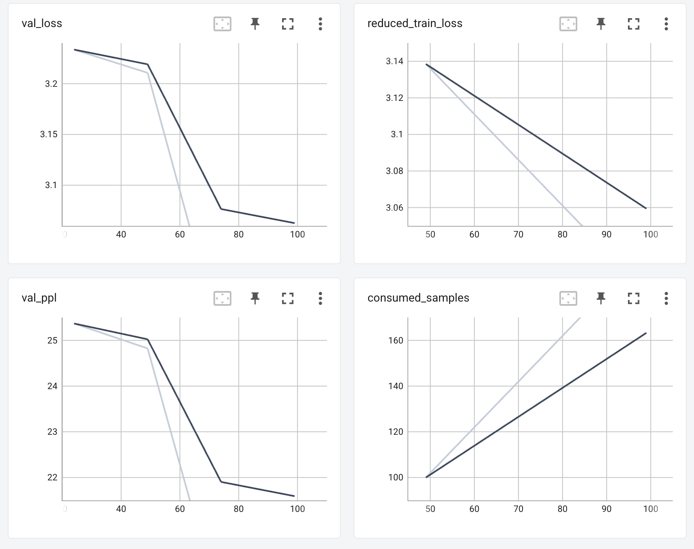

# Pretraining and Fine-tuning ESM-2 LLM on GKE using BioNeMo Framework 2.0

This repo walks through setting up a Google Cloud GKE environment to pretrain ESM-2 (Evolutionary Scale Modeling) using NVIDIA BioNeMo Framework 2.0

## Table of Contents

- [Prerequisites](#prerequisites)
- [Setup](#setup)
  - [Pretraining](#pretraining)
  - [Fine-tuning](#fine-tuning)
- [Cleanup](#cleanup)

## Prerequisites

- **GCloud SDK:** Ensure you have the Google Cloud SDK installed and configured.
- **Project:**  A Google Cloud project with billing enabled.
- **Permissions:**  Sufficient permissions to create GKE clusters and other related resources.
- **kubectl:** kubectl command-line tool installed and configured.
- **NVIDIA GPUs:** One of the below GPUs should work
  - [NVIDIA L4 GPU (2)](https://cloud.google.com/compute/docs/gpus#l4-gpus)
  - [NVIDIA A100 80GB (1) GPU](https://cloud.google.com/compute/docs/gpus#a100-gpus)
  - [NVIDIA H100 80GB (1) GPU or higher](https://cloud.google.com/compute/docs/gpus#a3-series)

Clone the repo before proceeding further:

  ```bash

  git clone https://github.com/GoogleCloudPlatform/ai-on-gke
 
  cd ai-on-gke/tutorials-and-examples/nvidia-bionemo/esm2

  ```

## Setup

1. Set Project:

   ```bash

   gcloud config set project "your-project-id"

   ```

Replace "your-project-id" with your actual project ID.

2. Set Environment Variables:

   ```bash

   export CLUSTER_NAME="gke-bionemo"
   export ZONE="your-zone"  # e.g., us-east5-b

   export NP_CPU_MACHTYPE="e2-standard-2" # e.g., e2-standard-2

   export NP_NAME="gpu-bionemo-np"
   export NP_GPU_MACHTYPE="your-gpu-machine-type"    # e.g., g2-standard-24 (L4) or a2-ultragpu-1g (A100 80GB)
   export ACCELERATOR_TYPE="your-accelerator-type" # e.g., nvidia-l4 (L4) OR nvidia-a100-80gb (A100 80GB)
   export ACCELERATOR_COUNT="1" # e.g., 2 (L4) OR 1 (A100 80GB)
   export NODE_POOL_NODES=1

   ```

Adjust the zone, machine type, accelerator type, count, and number of nodes as per your requirements. Refer to Google Cloud documentation for available options. Consider smaller machine types for development to manage costs.

3. Create a GKE Cluster

   ```bash

   gcloud container clusters create "${CLUSTER_NAME}" \
   --num-nodes="1" \
   --location="${ZONE}" \
   --machine-type="${NP_CPU_MACHTYPE}" \
   --addons=GcpFilestoreCsiDriver

   ```

4. Create GPU Node Pool:

   ```bash

   gcloud container node-pools create "${NP_NAME}" \
    --cluster="${CLUSTER_NAME}" \
    --location="${ZONE}" \
    --node-locations="${ZONE}" \
    --num-nodes="${NODE_POOL_NODES}" \
    --machine-type="${NP_GPU_MACHTYPE}" \
    --accelerator="type=${ACCELERATOR_TYPE},count=${ACCELERATOR_COUNT},gpu-driver-version=LATEST" \
    --placement-type="COMPACT" \
    --disk-type="pd-ssd" \
    --disk-size="300GB"
  
   ```

This creates a node pool specifically for GPU workloads.

5. Get Cluster Credentials:

   ```bash

   gcloud container clusters get-credentials "${CLUSTER_NAME}" \
     --location="${ZONE}"

   ```

6. Create and mount Google cloud Filestore for storage

   ```bash
   alias k=kubectl

   k apply -f create-mount-fs.yaml
   ```

7. The Filestore instance can take 5 mins before its ready for use. Check its status using the following command:

    ```bash

    k get persistentvolumeclaim fileserver -o yaml | grep phase:

    ```

The output should show `phase: Bound` when the instance is ready.

## Pretraining

8. Kickoff the pretraining job. The job will automatically create `./results` and store the checkpoints under esm2 in the Filestore instance mounted earlier under `/mnt/data`.

   ```bash

   k apply -f esm2-pretraining.yaml

   ```

   Check progress using

   ```bash

   k get pods
   k logs -f <pod-name>

   ```

9. The dataset used in the walkthrough is a small sampling. It could take 8-10 minutes for data to be downloaded and all the steps to be completed. Upon successful completion of pre-training job, below message will be displayed.

   ```bash

   Trainer.fit stopped: `max_steps=100` reached.

   ```

   After completion, you could enable port forwarding to view the logs in TensorBoard:

   > NOTE:
   > It is assumed that the local port 8000 is available. If the post is unavailable, update below to an available port.

   ```bash

   POD_BIONEMO_TRAINING=$(k get pods -o go-template --template '{{range .items}}{{.metadata.name}}{{"\n"}}{{end}}' | grep '^bionemo-training')

   k port-forward pod/$POD_BIONEMO_TRAINING 8000:6006 &

   ```

10. View TensorBoard logs

On your local machine: Browse to localhost:8000/#timeseries and see the loss curves as show below

[](HighLevelArch)

11. Upon viewing logs, you could delete the pretraining job

    ```bash

    k delete -f esm2-pretraining.yaml

    ```

## Fine-tuning

In this step you will be fine-tuning and subsequently inferencing using the generated .pt file.

12. Start the fine-tuning job. The results will be written to a .pt file. The location of the file will be displayed and copied to the mounted filestore.

    ```bash

    k apply -f esm2-finetuning.yaml
    k get pods
    k exec -it <pod-name> -- bash

    # Create a file for finetuning job
    touch finetuning.py

    #Copy contents of finetuning.py from local folder into the pod
    vi finetuning.py

    #paste contents into the file
    python3 finetuning.py

    ```

13. View the output

    ```bash

    Inference completed successfully.
    Inference result: tensor([...], dtype=torch.bfloat16)
    Result .pt file copied to /mnt/data/esm2/results/predictions__rank_0.pt

    ```

## Cleanup

   To delete the cluster and all associated resources:

   ```bash

    k delete -f esm2-finetuning.yaml
    k delete -f create-mount-fs.yaml

    gcloud container clusters delete "${CLUSTER_NAME}" --location="${ZONE}" --quiet

   ```
