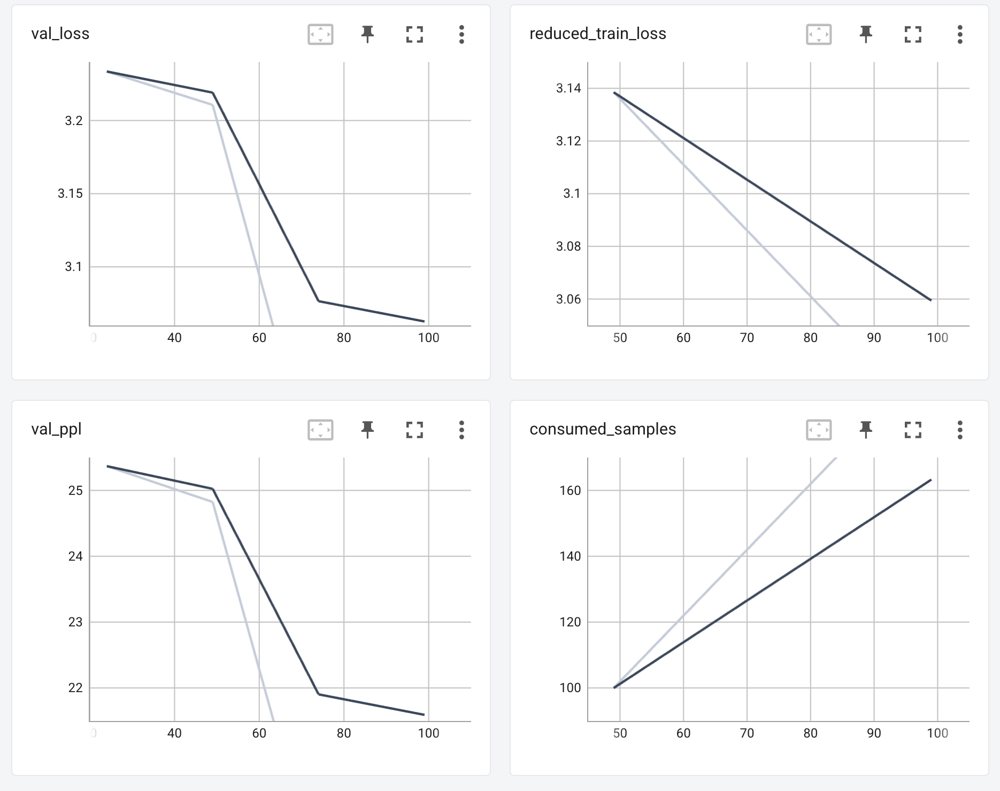

# Training ESM2 LLM on GKE using BioNeMo Framework 2.0

This samples walks through setting up a Google Cloud GKE environment to train ESM2 (Evolutionary Scale Modeling) using NVIDIA BioNeMo Framework 2.0

## Table of Contents

- [Prerequisites](#prerequisites)
- [Setup](#setup)
- [Cleanup](#cleanup)

## Prerequisites

- **GCloud SDK:** Ensure you have the Google Cloud SDK installed and configured.
- **Project:**  A Google Cloud project with billing enabled.
- **Permissions:**  Sufficient permissions to create GKE clusters and other related resources.
- **kubectl:** kubectl command-line tool installed and configured.
- **NVIDIA GPUs:** One of the below GPUs should work
  - [NVIDIA L4 GPU (2)](https://cloud.google.com/compute/docs/gpus#l4-gpus)
  - [NVIDIA A100 40GB (1) GPU or higher](https://cloud.google.com/compute/docs/gpus#a100-gpus)
  - [NVIDIA H100 80GB (1) GPU or higher](https://cloud.google.com/compute/docs/gpus#a3-series)

Clone the repo before proceeding further:

  ```bash
  git clone https://github.com/GoogleCloudPlatform/ai-on-gke
  cd ai-on-gke/tutorials-and-examples/nvidia-bionemo
  ```

## Setup

1. Set Project:

```bash
gcloud config set project "your-project-id"
```

Replace "your-project-id" with your actual project ID.

2. Set Environment Variables:

```bash

export REGION=us-central1
export ZONE=us-central1-a
export CLUSTER_NAME=bionemo-demo
export NODE_POOL_MACHINE_TYPE=a2-highgpu-1g # e.g., g2-standard-24 (L4) or a2-ultragpu-1g (A100 80GB)
export CLUSTER_MACHINE_TYPE=e2-standard-2
export GPU_TYPE=nvidia-tesla-a100 # e.g., nvidia-l4 (L4) OR nvidia-tesla-a100 for A100 40GB OR nvidia-a100-80gb (A100 80GB)
export GPU_COUNT=1 # e.g., 2 (L4) OR 1 (A100 80GB)
export NETWORK_NAME="default" 
```

Adjust the zone, machine type, accelerator type, count, and number of nodes as per your requirements. Refer to [Google Cloud documentation](https://cloud.google.com/compute/docs/gpus) for available options. Consider smaller machine types for development to manage costs.

3. Enable the Filestore API

```bash
gcloud services enable file.googleapis.com
```

4. Create GKE Cluster

```bash
gcloud container clusters create ${CLUSTER_NAME} \
    --location=${ZONE} \
    --network=${NETWORK_NAME} \
    --addons=GcpFilestoreCsiDriver \
    --machine-type=${CLUSTER_MACHINE_TYPE} \
    --num-nodes=1
```

5. Create GPU Node Pool:

```bash
gcloud container node-pools create gpupool \
    --project=${PROJECT_ID} \
    --location=${ZONE} \
    --cluster=${CLUSTER_NAME} \
    --machine-type=${NODE_POOL_MACHINE_TYPE} \
    --num-nodes=1 \
    --accelerator type=${GPU_TYPE},count=${GPU_COUNT},gpu-driver-version=latest 
```

This creates a node pool specifically for GPU workloads.

6. Get Cluster Credentials:

```bash
gcloud container clusters get-credentials "${CLUSTER_NAME}" \
--location="${ZONE}"
```

7. Create namespace, training job, tensorboard microservice, and mount Google cloud Filestore for storage

```bash
alias k=kubectl
```

make sure you are in this directory

```bash
cd tutorials-and-examples/nvidia-bionemo/
```

then run:

```bash
k apply -k pretraining/
```

> NOTE:
> Wait for 10-15 minutes to complete the file store mouting and job training. The dataset used in the walkthrough is a small sampling. It could take 8-10 minutes for data to be downloaded and all the steps to be completed. Upon successful completion of pre-training job, below message will be displayed.

8. Port Forwarding (for TensorBoard):

List PODs and ensure tensorboard POD is under `Running` status

```bash
k get pods -n bionemo-training
```

```bash
k port-forward -n bionemo-training svc/tensorboard-service 8080:6006
```

9. View Tensorboard logs

On your local machine: Browse to <http://localhost:8080> port forward from above step timeseries and see the loss curves as show below.

>Note: tensorboard dashboards will take some time to show up as the bioenemo job takes a few minutes to kick off. Then, the full plots will show up once the job's POD is under `COMPLETED` status.

[](HighLevelArch)

## Cleanup

1. Delete all associated resources

```bash
k delete -k pretraining/
```

**Note**: This cluster can be used for fine-tuning. Feel free to skip the next step if you want to reuse it.

2. To delete the cluster

```bash
gcloud container clusters delete "${CLUSTER_NAME}" --location="${ZONE}" --quiet
```
