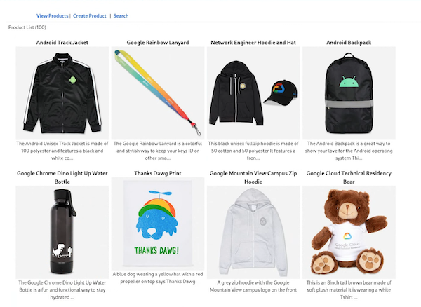
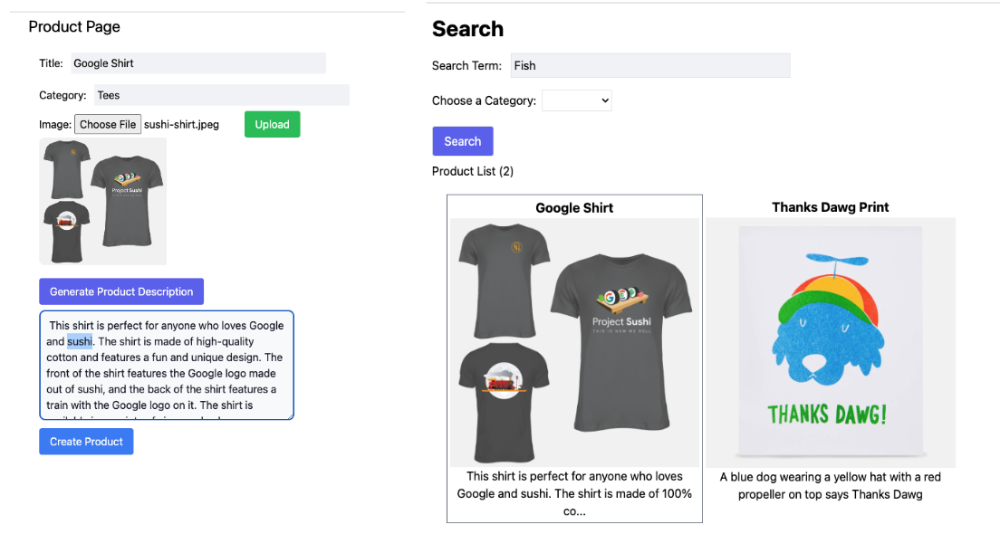
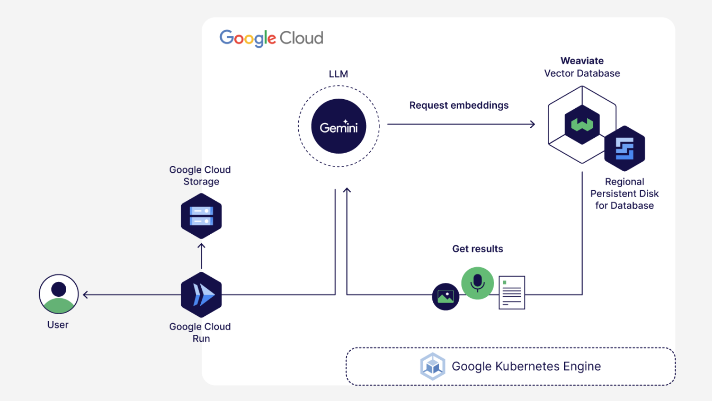

# From RAG to autonomous apps with Weaviate and Gemini on Google Kubernetes Engine

## [Video of this tutorial](https://www.youtube.com/watch?v=WORgeRAAN-4)


This demo application creates a product catalog that is stored in a [Weaviate](https://github.com/weaviate/weaviate) vector database and vectorized for semantic search. It is also integrated with the [Gemini Pro Vision](https://www.google.com/url?sa=t&source=web&rct=j&opi=89978449&url=https://console.cloud.google.com/vertex-ai/publishers/google/model-garden/gemini-pro-vision) API to automatically create product descriptions. The App is built with the NextJS framework. 




**Product Description Generation and Semantic Search**



**System Architecture**



## To Deploy this demo...

clone this git repo

```sh
git clone https://github.com/bkauf/next-store.git
cd next-store
```


### Setup the Weaviate Vector Database

#### Get your GEMINI API key
- Go to https://developers.generativeai.google/ to create a GEMINI API key. This is necessary to be able to run the demo.
- Set this API key as an environment variable

```sh
export GEMINI_API_KEY=<your Gemini API key>
```

#### Enable the necessary Google Cloud APIs
Set your project id

```sh
export PROJECT_ID=<your project id>
gcloud config set core/project $PROJECT_ID
```
Enable the necessary Google cloud APIs for your project. These APIs are necessary for installing the Weaviate database and to run the Demo app.

```sh

gcloud services enable \
cloudbuild.googleapis.com \
storage.googleapis.com \
serviceusage.googleapis.com \
cloudresourcemanager.googleapis.com \
compute.googleapis.com \
iam.googleapis.com \
container.googleapis.com \
artifactregistry.googleapis.com \
clouddeploy.googleapis.com \
run.googleapis.com
```

#### Deploy the GKE Cluster
1. Set environment varia1bles used in later steps.

    ```sh
    export CLUSTER_NAME=demo-cluster # A name for your cluster, you can change this if you want.
    export LOCATION=us-central1 # Google cloud region to host your infrastucture, you can change this if you want.
    ```

1. We will use the **default** VPC to deploy the GKE cluster into. In some environments, the autocreation of the default VPC is disabled by the administrator and default network will not be present. If your project doesn't have it, simply create a new VPC network named **default** and add the add the firewall rules mentioned [here](https://cloud.google.com/firewall/docs/firewalls#more_rules_default_vpc) to the VPC. You can check if the default network exists by running this command.

    ```sh
    gcloud compute networks list
    ```

1. Deploy a small regional GKE Cluster. This step can take several minutes to finish.

    ```sh 
    gcloud container clusters create $CLUSTER_NAME \
    --project=$PROJECT_ID \
    --region=$LOCATION \
    --enable-ip-alias \
    --num-nodes=1 \
    --scopes=https://www.googleapis.com/auth/logging.write,https://www.googleapis.com/auth/monitoring,https://www.googleapis.com/auth/cloud-platform

    ```


#### Install Weaviate 

1. Connect to the cluster
    ```sh
    gcloud container clusters get-credentials $CLUSTER_NAME --region $LOCATION --project $PROJECT_ID
    ```

1. We are going to use the regional persistant disk storage class for weaviate, so we'll install that storage class in the cluster.

    ```sh
    kubectl apply -f weaviate/storage-class.yaml
    ```

1. Let's create a secret API KEY for weaviate so we don't allow unauthenticated access.

    ```sh
    export WEAVIATE_API_KEY="next-demo349834" # you can choose another random string as the key.
    ```
1. Store the key as a kubernetes secret.

    ```sh
    kubectl create namespace weaviate

    kubectl create secret generic user-keys \
    --from-literal=AUTHENTICATION_APIKEY_ALLOWED_KEYS=$WEAVIATE_API_KEY \
    -n weaviate
    ```
1. Install Weaviate using a helm chart.

    ```sh
    helm repo add weaviate https://weaviate.github.io/weaviate-helm

    helm upgrade --install weaviate weaviate/weaviate \
    -f weaviate/demo-values.yaml \
    --set modules.text2vec-palm.apiKey=$GEMINI_API_KEY \
    --namespace weaviate
    ```

#### Get Weaviate Server IPs

1. Get the HTTP IP that the web server will use

    ```sh
    export WEAVIATE_SERVER=""
    while [[ -z "$WEAVIATE_SERVER" ]]; do
    WEAVIATE_SERVER=$(kubectl get service weaviate -n weaviate -o jsonpath='{.status.loadBalancer.ingress[0].ip}')
    sleep 2 
    done
    echo "External HTTP IP obtained: $WEAVIATE_SERVER"

    ```
1. Get the IP of the GRPC service that the database creation script will use

    ```sh
    export WEAVIATE_SERVER_GRPC=""
    while [[ -z "$WEAVIATE_SERVER_GRPC" ]]; do
    WEAVIATE_SERVER_GRPC=$(kubectl get service weaviate-grpc -n weaviate -o jsonpath='{.status.loadBalancer.ingress[0].ip}')
    sleep 2 
    done
    echo "External GRPC IP obtained: $WEAVIATE_SERVER_GRPC"
    ```

### Configure the Database

1. Install the Weaviate client

    ```sh
    pip3 install -U weaviate-client  # For beta versions: `pip install --pre -U "weaviate-client==4.*"`
    ```

1. Create the database schema and load the sample files
    by running the following script from the root directory of the repo where the first_99_objects.json file is located.


    ```sh
    python3 createdb.py 
    ```
    You should get an output similar to the below if the database was created successfully:
    ```
    Items added to the database: 99
    ```


## Setup the Demo application

The following steps will walk through adding the nessessary variables to the demo application, creating a container for it, then running it on Google Cloud Run.

1.  Create your storage bucket and allow public access to it.


    ```sh
    export GCS_BUCKET="$PROJECT_ID-next-demo"

    gcloud storage buckets create gs://$GCS_BUCKET --location=$LOCATION \
    --no-public-access-prevention
    ```

    Allow public access to the bucket

    ```sh

    gcloud storage buckets add-iam-policy-binding gs://$GCS_BUCKET --member=allUsers --role=roles/storage.objectViewer
    ```

1.  Create a .env file for the demo application.

    ```sh
    cd demo-website/
    touch .env
    ```

    Create a .env file in the demo-website directory for the NextJS build process and replace the variables below with your own. If you would like to run this demo app locally with *npm run dev* you will also need a [service account](https://cloud.google.com/iam/docs/service-accounts-create) that has GCS object admin permissions. See optional variable below. If you would like to run this on Cloud Run you do not need a local service account.

    **.env file** 
    ```sh
    GEMINI_API_KEY="The GEMINI api key you retrieved earlier"
    GCS_BUCKET="The name of the bucket you created earlier"
    WEAVIATE_SERVER="from weaviate install steps"
    WEAVIATE_API_KEY="next-demo349834" 
    #If you plan to run this locally use a sevice account file with GCS object admin permissions
    #GOOGLE_APPLICATION_CREDENTIALS="sa.json"
    ```

1. Create a artifact registry repo for your container.

    ```sh
    export REPO_NAME="next-demo"

    gcloud artifacts repositories create $REPO_NAME --repository-format=docker \
        --location=$LOCATION --description="Docker repository" \
        --project=$PROJECT_ID
    ```


1. Create a container image to store in the image repo.

    ```sh
    gcloud builds submit --tag $LOCATION-docker.pkg.dev/$PROJECT_ID/$REPO_NAME/next-demo:1.0
    ```

1. Create a service account for Cloud Run to use to connect to GCS for image uploads.

    ```sh
    export SERVICE_ACCOUNT_NAME="next-demo"

    gcloud iam service-accounts create $SERVICE_ACCOUNT_NAME \
    --display-name="Next Demo"

    gcloud projects add-iam-policy-binding $PROJECT_ID \
    --member="serviceAccount:$SERVICE_ACCOUNT_NAME@$PROJECT_ID.iam.gserviceaccount.com" \
    --role="roles/storage.objectAdmin"
    ```

1. Deploy the container image to Cloud Run.

    The following commands set your envorinemnt varaibles for Cloud Run and also the service account that allows uploads to your public Google Cloud Storage bucket.

    ```sh
    export CLOUD_RUN_NAME="next-store"

    gcloud run deploy $CLOUD_RUN_NAME \
        --image $LOCATION-docker.pkg.dev/$PROJECT_ID/$REPO_NAME/next-demo:1.0 \
        --port=3000 \
        --allow-unauthenticated \
        --region $LOCATION \
    --set-env-vars=GEMINI_API_KEY=$GEMINI_API_KEY, \
    --set-env-vars=GCS_BUCKET=$GCS_BUCKET, \
    --set-env-vars=WEAVIATE_SERVER=http://$WEAVIATE_SERVER, \
    --set-env-vars=WEAVIATE_API_KEY=$WEAVIATE_API_KEY \
    --service-account=$SERVICE_ACCOUNT_NAME
    ```

    Navigate to the demo application via the service URL returned. You can use the data below to create a new item and search for it:


    - Title: Project Sushi Tshirt
    - Category: tees Tshirts
    - Image: https://shop.googlemerchandisestore.com/store/20190522377/assets/items/images/GGCPGXXX1338.jpg

