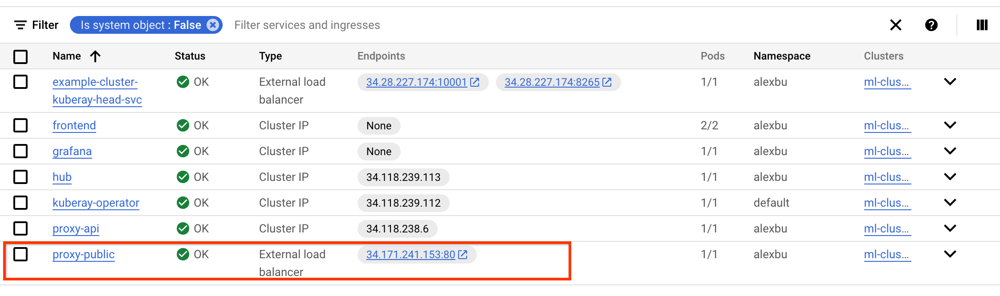
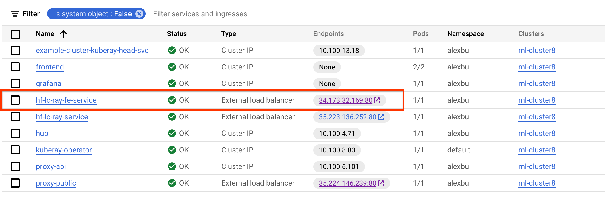
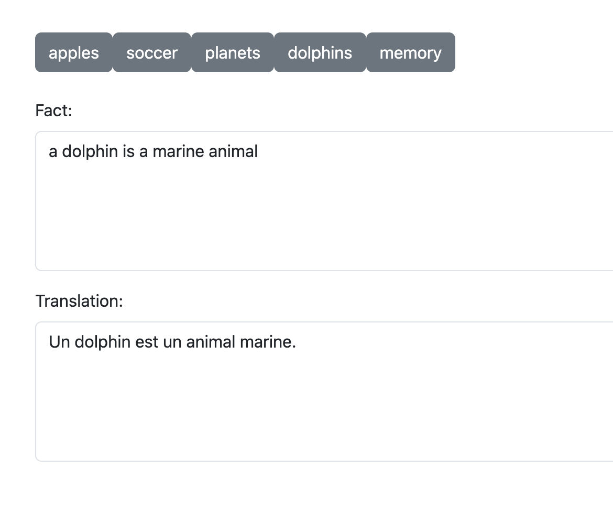

# E2E GenAI application with Langchain, Ray, Flask API backend, React frontend

In this tutorial you will deploy a end-to-end application that will use GenAI model from Hugging Face on the backend, Ray Serve for inference, Flask API backend, and simple React frontend.

## Before you begin

Create or select an existing GCP project and open Cloud Shell. You can use [these steps](https://cloud.google.com/kubernetes-engine/docs/deploy-app-cluster#before-you-begin)

## Infrastructure Installation

1. If needed, `git clone https://github.com/GoogleCloudPlatform/ai-on-gke.git`
1. Create a new GKE cluster and install the kuberay operator
    1. cd `gke-platform`
    1. Edit `variables.tf` with your GCP settings. Make sure you change `project_id` and `cluster_name`.
    1. Run `terraform init`
    1. Run `terraform apply`
1. Configure credentials to point to the cluster: `gcloud container clusters get-credentials <cluster-name> --location=<region>`
1. Install Ray on GKE
    1. cd `ray-on-gke/user`
    1. Edit variables.tf with your GCP settings. Make sure you set: `project_id`, `namespace`, `service_account`.
    1. Note the namespace setting. All microservices in this sample will be deployed to this same namespace for simplicity.
    1. Run `terraform init`
    1. Run `terraform apply`
1. Install Jupyter on GKE. These steps are needed to experimentation (see the section below). You can skip it if you want to go straight to building the application. 
    1. cd `jupyter-on-gke`
    1. Edit `variables.tf` with your GCP settings. Make sure that you set `project_id`, `project_number`, `namespace`. Use the same namespace as above.
    1. Configure higher resource limits and guarantees. In `jupyter_config/config.yaml` change the following:
        ```yaml
        singleuser:
        cpu:
            limit: 1
            guarantee: .5
        memory:
            limit: 4G
            guarantee: 1G
        ```
    1. Run terraform init
    1. Run terraform apply

## Experimentation

Experiment with the model in Jupyter Notebook:
1. Get the address of your Jupyter hub:

    ```
    kubectl get service proxy-public -n <namespace name> -o jsonpath='{.status.loadBalancer.ingress[0].ip}'
    ```
1. Configure IAP and open Jupyter Hub by following the steps in [here](../../jupyter-on-gke/README.md).
1. From JupyterHub open this notebook: `https://raw.githubusercontent.com/GoogleCloudPlatform/ai-on-gke/main/tutorials/langchain/nb1.ipynb` and run it step by step
1. The first section shows how to run the model directly
1. The second section shows how to do the same using `Ray Serve`.

## Build the end-to-end application

1. We used Jupyter Notebook to experiment, but now let's build the Flask backend that calls into `Ray Serve`.
    1. Observe `model.py`: it loads the model and creates `Ray.Serve` function that uses `Langchain` library to run two nested prompts.
    1. Observe `main.py`: it uses Flask framework to create API route that calls into `Ray.Serve` endpoint
    1. Containerize and deploy the backend image to the registry. Do these steps from `backend` directory:
        ```bash
        PROJECT_ID=<YOUR_PROJECT_ID>
        # configure GCR
        gcloud auth configure-docker
        # build the image
        docker build -t hf-lc-ray:latest .
        # tag the image for GCR
        docker tag hf-lc-ray:latest gcr.io/${PROJECT_ID}/hf-lc-ray:latest
        # push the image to GCR
        docker push gcr.io/${PROJECT_ID}/hf-lc-ray:latest
        ```
    1. Deploy backend to the cluster. Open `src/backend/deploy.yaml` and change `PROJECT_ID` to your project (you can also use `sed`:  `sed -i "s/YOUR_PROJECT/${PROJECT_ID}/" src/backend/deploy.yaml` ). Then run
        ```bash
        kubectl apply -f deploy.yaml -n <YOUR_NAMESPACE>
        ```
    1. Find backend IP on the services page: `hf-lc-ray-service`: 
        ```
        kubectl get service hf-lc-ray-service -n <namespace name> -o jsonpath='{.status.loadBalancer.ingress[0].ip}'
        ```
    1. To test that backend works you can run:
        ```
        ENDPOINT='http://<IP>/run'
        curl -XPOST "${ENDPOINT}?text=football"
        ```
        You will get a response similar to:
        ```
        ["a football player is a player who plays for a team","Un joueur de football est un player qui joue pour un \u00e9quipe."]
        ```

1. Finally, let's deploy React frontend. Note that in a production distributed application, you can use [K8s Ingress](https://kubernetes.io/docs/concepts/services-networking/ingress/) with routes for `backend` and `frontend` to avoid taking dependcy on the IP, this approach is provided for simplicity.
    1. Update the `API_ENDPOINT` in `src/frontend/src/index.tsx`
    1. Containerize and deploy the frontend image to the registry. Do these steps from `src/frontend` directory:
        ```bash
        PROJECT_ID=<YOUR_PROJECT_ID>
        # configure GCR
        gcloud auth configure-docker
        # build the image
        docker build -t hf-lc-ray-fe:latest .
        # tag the image for GCR
        docker tag hf-lc-ray-fe:latest gcr.io/${PROJECT_ID}/hf-lc-ray-fe:latest
        # push the image to GCR
        docker push gcr.io/${PROJECT_ID}/hf-lc-ray-fe:latest
        ```
    1. Deploy frontend to the cluster. Open `src/frontend/deploy.yaml` and change `PROJECT_ID` to your project (you can also use `sed`:  `sed -i "s/YOUR_PROJECT/${PROJECT_ID}/" src/frontend/deploy.yaml` ). Then run
        ```bash
        kubectl apply -f deploy.yaml -n <YOUR_NAMESPACE>
        ```
    1. Find frontend IP on the services page: `hf-lc-ray-fe-service`: 
    1. Click to navigate and give it a try! 
